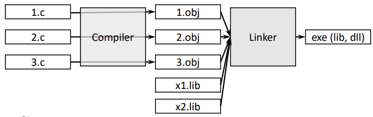

>참고 자료 [Fundamentals of C++ Programming](https://www.dbooks.org/fundamentals-of-c-programming-1201/), 
>
>[cppreference.com](https://en.cppreference.com/w/)
>
>교수님 강의자료

### Software

소프트웨어가 있다면 항상 같이 있는 것은 하드웨어다. 하드웨어가 기계장치라면 소프트웨어는 **기계를 동작시킬 수 있는 명령어**의 집합, 넓은의미로는 **컴퓨터에 저장 된 모든 내용이다**. 이 명령을 시키는 것을 프로그램이라 할 수 있다.

대표적인 소프트웨어로는 OS(Operationg system), Device driver, Firmware, Language translator, Utility software등의 **시스템 소프트웨어**가 있고, 이 외에 **어플리케이션 소프트웨어**가 있다. 

시스템 소프트웨어 중 Language Translator는 간단히 말해 사람말을 기계어로 번역을 해주는 것인데, 이를 **컴파일러**라고 한다.

프로그래밍 언어는 Low-level language와 High-level language로 나뉜다. 

**Low-level language**는 하드웨어에 직접 명령을 내릴 수 있고 종류로는 **기계어**(machine language)와 **어셈블리어**(assembly language)가 있다. 

기계어는 0과 1로만 이루어져 있고, opcode를 통해 CPU를 작동시킬 수 있다. 이 기계어를 어셈블러를 통해 어셈블리어로 변환할 수 있다. 어셈블리어는 0과 1로만 이루어진 기계어를 텍스트로 변환해 놓은 것이다. 

**High-level language**는 사람이 읽을 수 있는 수준의 언어이다. 

### Tools

소프트웨어 개발을 위해서는 다양한 도구를 사용할 수 있다.

- **Editors**

  사용자가 프로그램의 소스코드를 입력하고 파일로 저장할 수 있도록 해준다.

- **Compilers**

  컴파일러는 소스코드를 타겟코드로 변환하는 역할을 한다. 타겟코드는 특정 플랫폼이나 임베디드 장치의 기계어가 될 수도 있고, 다른 소스 언어가 될 수도 있다. 예를 들어, 초기 C++컴파일러는 C++코드를 C언어 코드로 변환한 후, 변환된 C코드가 다시 C 컴파일러에 의해 실행 가능한 프로그램으로 변환되었다. 하지만 현대의 C++ 컴파일러는 직접 기계어로 변환한다.

  C++의 빌드 도구는 일반적으로 전처리기(preprocessor), 컴파일러(compiler), 링커(linker)로 구성된다.

  - **전처리기(Preprocessor)** : 컴파일러가 코드를 처리하기 전에 소스 파일의 내용을 추가하거나 수정한다. 주로 `#include` 지시문을 사용하여 프로그램에서 필요한 라이브러리 루틴 정보를 포함하는 역할을 한다.
  - **컴파일러(Compiler)** : C++ **소스 코드** 를 **기계어 코드** 로 변환한다.
  - **링커(Linker)** : 컴파일러가 생성한 기계어 코드와 **미리 컴파일된 라이브러리 코드(precompiled library code)** 또는 **다른 소스에서 컴파일된 코드** 를 결합하여 실행 가능한 완전한 프로그램을 만든다. 대부분의 C++ 컴파일된 코드는 단독으로 실행할 수 없으며, 추가적인 기계어 코드가 필요하다. 이러한 추가 기계어 코드는 **라이브러리(library)** 라는 코드 저장소에 미리 컴파일된 형태로 저장된다. **링커(linker)** 라는 프로그램이 프로그래머가 작성한 컴파일된 코드와 라이브러리 코드를 결합하여 실행 가능한 완전한 프로그램을 생성한다.

다음은 컴파일러와 링커의 작동 과정을 나타낸 그림이다.

컴파일러가 c 코드들을 obj코드들로 바꾼다. 그 후 링커가 obj들을 뭉치고 외부에서 미리 만들어 둔 lib를 같이 묶어서 exe 실행파일로 만드는 것이다. 

이런 컴파일링과 링킹을 묶어 "**빌드(build)**" 라고 한다.

- Python

  high-level language면서 general-purpose이고 interpreted language(순서대로)이다.

- C++

  high-level language면서 general-purpose이고 compiled language(통째로)이다.

- **Library** 

  zip이나 tar 파일같이 0개에서 수 개의 객체파일을 포함한 아카이브이다. 라이브러리는 **정적 라이브러리인(static library) lib**와 동적 라이브러리(dynamic library)dll로 나뉘는데 dll은 **lib와 exe의 중간형태**로 동작하는 특별한 유형의 라이브러리이다.

- **Debuggers**

  코드에 에러가 있는지 확인하는 것.

- **Profilers**

이와 같은 에디터, 컴파일러, 링커, 디버거 등을 모아 합쳐놓은 것이 **IDE(Integrated Development Environment)**이다. 예로는 Visual studio, Xcode, Android Studio 등이 있다.

### Object-oriented programming(OPP)

그래서 내가 배우게 될 객체지향 프로그램이 뭘까?

**"객체를 기반으로 코딩하는것"**이라 말하지만 객체가 무엇인지는 모른다. 객체는 중간고사 이후에 알 수 있을 것이라 교수님이 말씀하셨다. 

객체는 **Attributes**와 **Behaviors**로 정의 할 수 있는다.

Attributes는 문자(characteristics), 상태(state), 값(values)이고 이를 **멤버 변수**라고 칭한다.

Behaviors는 데이터를 처리하는 어떤 동작(method)라 하는데 cpp에서는 **멤버 함수**라고 칭한다.

### Exercise

교재 1장 마지막에 있는 간단한 문제들을 풀어보려 한다.

1. What is a compiler?
   - 소스코드를 타겟 코드로 번역하는것. 여기서 타겟 코드는 기계어 혹은 다른 소스코드.
2. How is compiled code different from source code?
   - C++ code에서 machine code의 차이와 같이, 사람이 읽을 수 있는 소스 코드, 기계를 실행시킬 수 있는 컴파일된 코드의 차이이다.
3. What tool does a programmer use to produce C++ source code?
   - 에디터
4. What tool(s) does a programmer use to convert C++ source code into executable machine code?
   - 컴파일러와 링커
5. What does the linker do?
   - obj코드와 lib코드를 결합하여 실행파일 exe를 생성하는 역할
6. Does the linker deal with files containing source code or machine language code?
   - 링커는 컴파일된 오브젝트파일 ,즉, 기계어코드가 포함된파일을 처리한다. 
7. What does the preprocessor do to source code?
   - 컴파일 되기 전, 소스 코드에 대해 특정 작업을 수행하는 도구이다. #include지시문을 처리해 라이브러리 파일을 포함하거나, #define 매크로 처리로 코드를 치환해 단순화 하는 일 등을 한다.
8. List several advantages developing software in a higher-level language has over developing software in machine language.
  - high-level language는 C++를 예로 들면, C++ 소스코드는 다른 운영 체제 및 하드웨어 플랫폼에서 실행 가능하다. 물론 해당 플랫폼용 C++ 컴파일러가 필요하지만, 코드 수정에 있어 기계어로 직접 다시 작성하는 것보다 훨씬 적은 작업량이 필요하다. 이런 장점으로 프로그래머는 특정 프로세서의 기계어를 신경쓰지 않고, 오로지 문제 해결 로직에만 집중할 수 있다.
9. How can an IDE improve a programmer’s productivity?
   - 빌드, 디버깅, 프로파일링 등을 한 프로그램 내에서 사용 가능해 빠른 업무 처리가 가능하다.
10. Name a popular C++ IDE is used by programmers developing for Microsoft Windows.
    - Microsoft Visual Sutdio
11. Name a popular C++ IDE is used by programmers developing for Apple macOS.
    - Xcode
