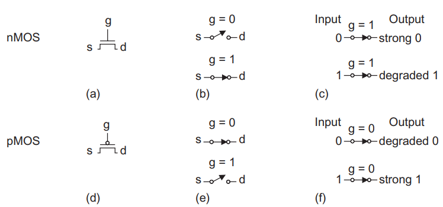

>참고 자료 [CMOS VLSI 설계원리 4판](https://archive.org/details/cmosvlsidesignacircuitsandsystemsperspective_201908/page/n5/mode/2up)
>
>교수님 강의 자료

tool 셋업은 다음주. X2go 다운로드만 완료.

VLSI를 시작하며, 집적회로에 대한 간단한 역사에 대해 이야기 하자면, 1958년 텍사스 인스트루먼트에서 최초의 집적회로를 만들었다. 그 이후 1965년 인텔의 창립자 고든 무어가 발견한 무어의 법칙으로 매년 반도체에 집적되는 트렌지스터의 수는 2배로 증가한다는 점이다. 이후에 18개월에 2배로 증가한다로 바뀌긴 했지만 2010년대 까지는 그 법칙이 적중했다. 

 이런 집적회로의 발전이 가능했던 이유는 바로 CMOS(Complementary MOS)덕분이다. CMOS의 등장으로 사이즈와 열, 에너지소모를 크게 줄일 수 있었다.

------

다음은 풀업과 풀다운 네트웤크를 갖는 일반적인 CMOS논리 게이트이다.

CMOS 논리 게이트는 pull-down network인 nMOS와 pull-up network인 pMOS로 구성된다. 논리구조는 다음과 같다.

|               | Pull-up OFF | Pull-up ON  |
| :-----------: | :---------: | :---------: |
| Pull-down OFF |  Z (float)  |      1      |
| Pull-down ON  |      0      | X (crowbar) |

그리고 nMOS와 pMOS를 직렬 또는 병렬시켜 조합하면 CMOS조합 논리회로를 만들 수 있다. 

다음은 nMOS: 1 = ON, pMOS: 0 = ON 일 때, 트렌지스터들의 동작이다.

다음은 2-input Nand gate의 개념도이다.

CMOS NAND 게이트는 Y와 GND 사이에 두 개의 직렬 nMOS와, Y와 $V_{DD}$ 사이에 pMOS로 구성된다. 입력 A와 B 둘 중 하나가 0이면 최소한 하나의 nMOS가 차단되고, Y에서 GND 사이로 가는 경로는 차단된다. 그러나 최소 하나 이상의 pMOS는 연결되기 때문에, Y와 $V_{DD}$로 가는 경로는 연결되고 출력은 '1'이 된다. 이에 NAND 게이트 진리표는 다음과 같다.

|  A   |  B   | pull-down network | pull-up network |  Y   |
| :--: | :--: | :---------------: | :-------------: | :--: |
|  0   |  0   |        OFF        |       ON        |  1   |
|  0   |  1   |        OFF        |       ON        |  1   |
|  1   |  0   |        OFF        |       ON        |  1   |
|  1   |  1   |        ON         |       OFF       |  0   |

합성 게이트(compound gate)는 직렬과 병렬 스위치 구조를 조합해서 구성한다.

예를들어 $Y= \overline{(A\bullet B) +(C\bullet D)}$는 다음과 같이 만들 수 있다.

하지만 컴파운드 게이트는 전류가 통과해야 할 게이트가 너무 많아서 느려진다. 그래서 기본 게이트를 쓰는게 더 낫다. 우리는 컴파운드 게이트는 안 쓸거라 한다.

------

신호의 강도는 이상적인 Voltage source와 가까운 정도로 측정된다. 일반적으로 신호가 강할수록 더 많은 전류를 발생시키거나 받아들일 수 있다. 전원(Power supply)혹은 레일(rail) ($V_{DD}$와 GND)은 가장 강력한 '1'과 '0'의 발생 소스이다.

nMOS는 0을 통과시킬 때 거의 완벽한 스위치기에 강력한 0을 통과시킨다 말한다. 반대로 1을 통과시킬 때는 불완전하고 약한 1을 통과시킨다 말한다. pMOS는 이와 반대로 약한 0과 강한 1을 통과시킨다.

nMOS혹은 pMOS 단독으로 사용되어 불완전한 스위치를 만들었을 때를 pass transistor라 부른다. 

다음은 Transmission Transistor의 강한 출력과 약한 출력의 모습이다. 도식의 g,s,d는 각각 게이트, 소스, 드레인을 의미한다.

 

다음은 nMOS와 pMOS를 병렬로 연결한 Transmission Gates의 모습이다.

(a)와 같이 nMOS와 pMOS를 병렬로 합성해 얻은 스위치는 (b)에서 g에 1이 입력되면 연결되는데, 이때 0과 1은 모두 강한 상태로 전달된다. 

------

다음은 tristate buffer의 모습이다.

tristate buffer의 진리표는 다음과 같다.

| EN/$\overline{EN}$ | A (input) | Y (output) |
| :----------------: | :-------: | :--------: |
|       0 / 1        |     0     |     Z      |
|       0 / 1        |     1     |     Z      |
|       1 / 0        |     0     |     0      |
|       1 / 0        |     1     |     1      |

이를 이용해 transmission gate로  나타낼 수 있는데, 이 transmission gate는 tristate buffer와 같은 진리표를 갖는다.

다음은 tristate buffer로 나타낸 transmission gate이다.

 

tristate buffer의 en의 기능을 활용해 if문의 역할을 할 수 있는 MUX를 만들 수 있다.

------

입력에 의해 출력이 결정되는 조합회로(combinational circuit)과 다르게 메모리를 가지고 현재와 과거의 입력 모두에 의해서 출력을 결정하는 것이 순차회로(sequential circuit)d이다. 순차회로를 다루려면 래치(latch)와 플립플랍(flip-flop)을 알아야한다.

다음은 D Latch의 작동 과정을 보여주고 있다.

D Latch는 CLK가 1일 때 정보를 저장하고, CLK가 0일때는 상태를 유지시킨다. 

다음은 D Latch의 내부 구조이다.

1개의 MUX와 2개의 인버터로 구성되어있다. 
