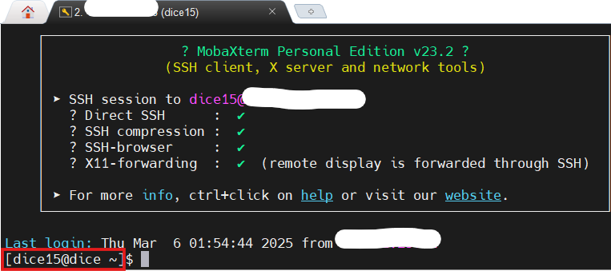
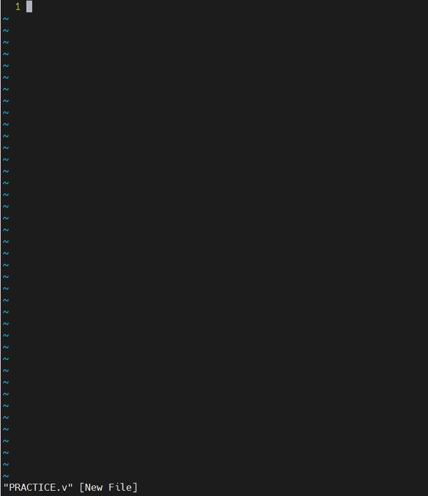
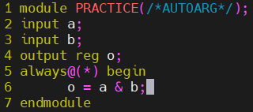
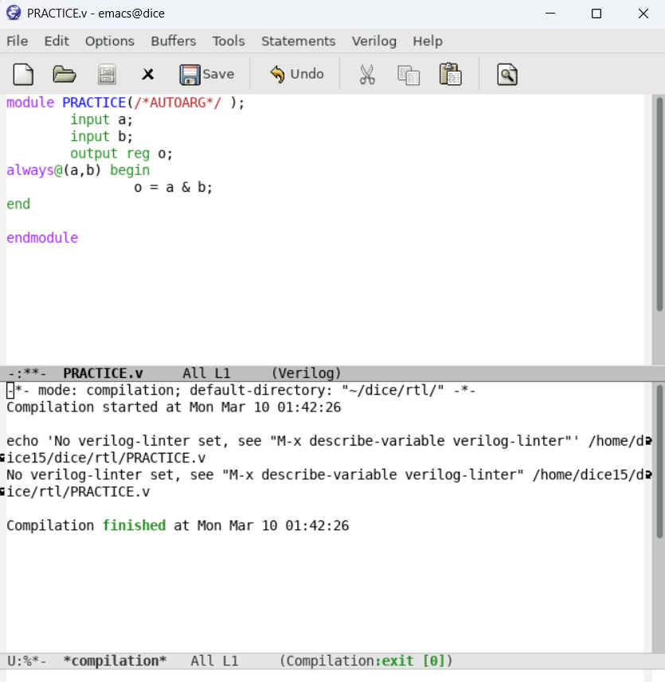
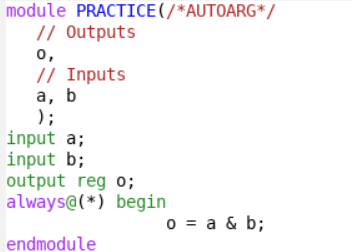
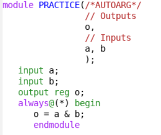
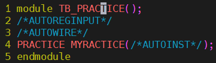
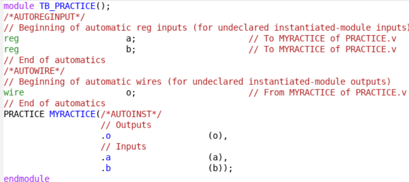
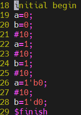
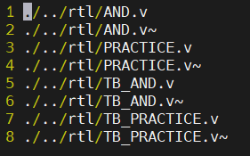

---


title:  "[공부] 디지털 회로 실험 1주차"
last_modified_at: 2025-03-07
categories:
    - 공부
tag: 
    - Digital Circuit
excerpt: ""
use_math: true
classes: wide
---


>참고 자료 : 교수님 강의 자료
>
>사용 툴 : Quartus, mobaxterm


디지털 회로 디자인 에디터로 Vim과 EMACS가 대표적. 우리는 Vim을 주로 다룰 예정

다음은 mobaxterm에서 서버에 들어가면 볼 수 있는 화면이다. 

<center></center>

빨간색 네모로 표시해둔 부분은 [아이디@그룹]이다.

주로 많이 쓰는 명령어들

```linux
ls (list segments)
ls -l (현재 파일에 있는 리스트를 리스팅형식으로 보기.)
ls -a (모든 파일 다 보기, 숨겨진 파일도 볼 수 있음.)
cd (change directories)
cd ~ (home으로 돌아옴)
mkdir (make directory)
cp (copy)
mv (move)
rm (remove)
pwd (present work directory)
vi (visual editor)
```

visual editor 사용하는 법.

vi PRACTICE.v 를 하면 v파일이 만들어지고 visual editor로 넘어간다. vi 화면은 다음과 같다. 

<center></center>

이제 vi editor를 사용할 때 쓰는 명령어이다.

```
I (INSERT가 아래 뜨면서 문서를 편집할 수 있다. default에서는 편집할 수 없음.)
```

주석만들기

//로 한 줄 씩 주석처리를 할 수 있고 /**/로 원하는 만큼 주석처리할 수 있다. 여러 줄 처리할 때 불편한 점이 있어, 이 방법을 쓰면 쉽게 처리 할 수 있다.

주석을 시작하려는 블락에 커서를 옮긴다.
**ctrl v**를 누르면 VISUAL BLOCK이라고 아래에 나오는데 주석 처리할 부분까지로 커서를 옮긴다.
**I**를 눌러 다시 INSTERT모드로 바꾼 후 **//입력**
이후 **esc 두번** 누르면 원하는 만큼 주석처리시킬 수 있다.
지우는 거는 똑같이 ctrl v누르고, 주석처리 부분 선택 후 **del**을 누르면 지워진다.

줄단위로 선택은 **shift v** 원하는 줄까지 지정한 후 **y**(yank)를 누르면 복사가 된다. 그 후 **p**를 누르면 붙여넣기가 된다.

코드를 다 입력한 후. esc를 누른 다음

```
:w (write 저장)
:wq (write quit 저장 후 종료)
:q! (저장 안 하고 종료) 
```

 EMACS 쓰는법 예시

만약 statement를 다 만들었는데  쓰기 귀찮으면

<center></center>

다음과 같이 auto를 써주고고

```
/*AUTOARG*/
```

auto를 입력한 후 명령어창에 

```
emacs PRACTICE.v
```

를 입력해주면 다음과 같은 UI가 나온다.

<center></center>

이상태에서 **ctrl c**, **ctrl s**를 누르게 되면 자동으로 리스트가 업데이트 된다.

 <center></center>

여기서 ctrl x, h(전체선택), ctrl i를 누르면 자동으로 정렬이 된다. 

<center></center>

 만약 코드 에러가 있다면, 여기서 이상하게 되어있는 부분이 있을 것이다. 이 과정에서 코드 에러를 찾을 수 있다.

다음은 Alt x를 누르게 되면 M-x가 좌측 최 하단에 뜨는 것을 볼 수 있다. 이 상태에서 untabify를 입력하면 탭을 스페이스로 바꿔준다. 

ctrl x, ctrl s를 하면 저장할 수 있다.

ctrl x, ctrl c를 하면 종료하고 나갈 수 있다.

emacs가 커맨드가 많아 힘들긴 하지만 auto기능이 강력해서 좋다.

<center></center>

다음과 같이 테스트밴치를 만든 후 PRACTICE.v 에 했던것 처럼 명령어를 입력하면 다음과 같이 정렬이 된다.

<center></center>

INST는 같은 폴더트리 안에 있는 파일들을 자동으로 확인해 내부 inst를 다 채운다. 이로써 TB를 자동으로 만들었다. 이 후 원하는 값들을 넣어 결과를 확인 해 볼 것이다. 

<center></center>

------

모두 저장한 후, 다시 명령어 창으로 돌아와서.

우리는 시뮬레이션은 sim 파일위치에서 돌릴예정이다. 

```
cd .. (상위 폴더의 위치로 이동)
cd sim/ (sim 폴더 위치로 이동)
ls ./../rtl/* (.현재위치에서/..상위폴더에서/rtl폴더의/*모든 파일의 리스트를 보여라)
ls ./../rtl/* > list.f (위 주소의 애들을 list.f폴더에 넣어라)
```

list.f 파일을 열어보면 다음과 같이 나온다.

<center></center>

여기서 파일이 실제로 여기에 위치하는지 확인하려면 **g**를 누른 후 **f**를 누르면 파일을 확인할 수 있고, 다시 리스트로 돌아오려면 **ctrl o**를 누르면 된다. 만약 파일이 없다면 can't find file이란 표시가 뜰 것이다.

시뮬레이터를 돌리려면 커맨드는 다음과 같이 친다.(교수님이 미리 래핑해 놓은 상태.)

```
vcs_sub -f list2.f -t TB_PRACTICE -o result2.fsdb
(-f file list는 list2.f)
(-t top module은 TB_PRACTICE)
(-o 덤프 파일은 result2.fsdb)
```

------

2025-03-10 fsdb 파일 생성 안 됨. 추후 추가 예정

------

dice위치에서 ww01 파일을 만들어 그 위치로 sim과 rtl을 옮기려고 하면 다음과 같은 순서로 하면 된다. 폴더 dice에서.

```
mkdir ww01
mv rtl/ ./ww01/
mv sim/ ./ww01/
```

여기서 뒤에 /를 입력하지 않으면 이름이 바뀌어 버리니 주의.


blaster setup한 후 수업 끝.

