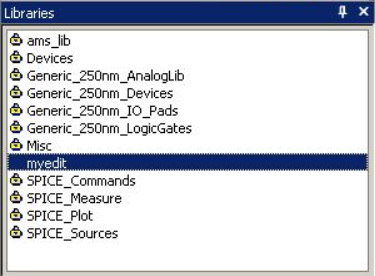
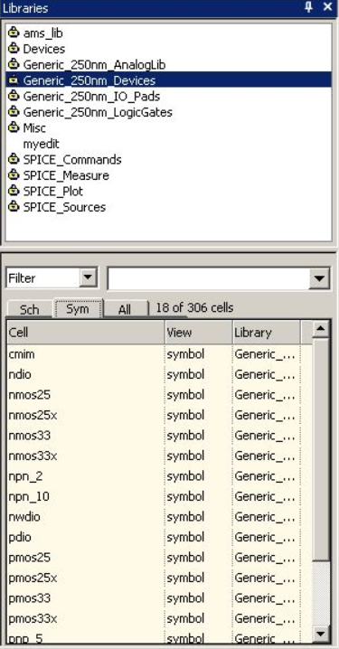
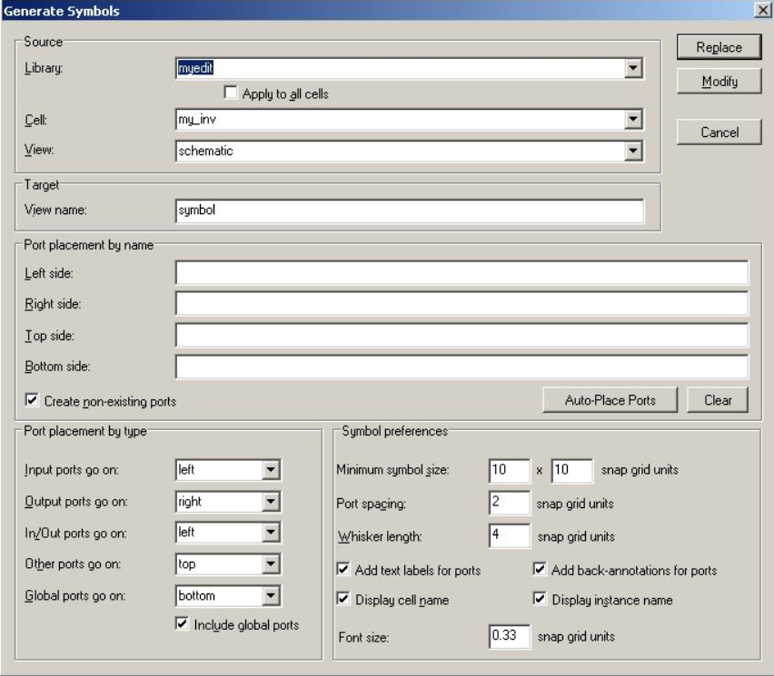
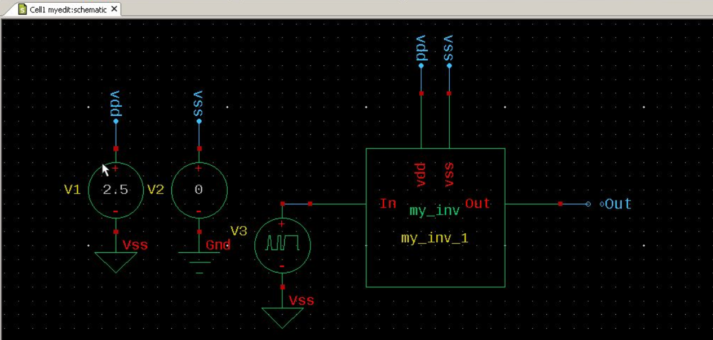
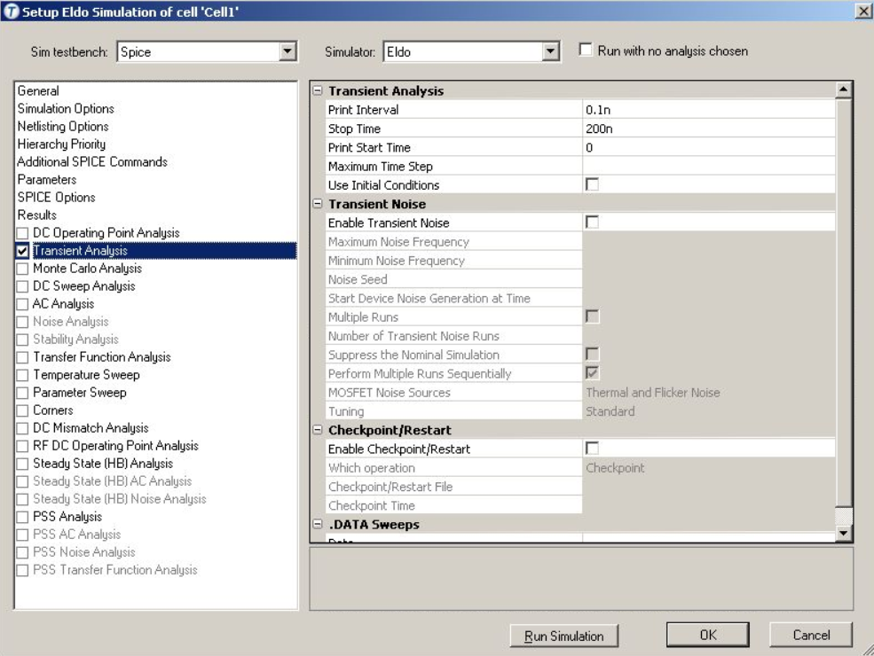
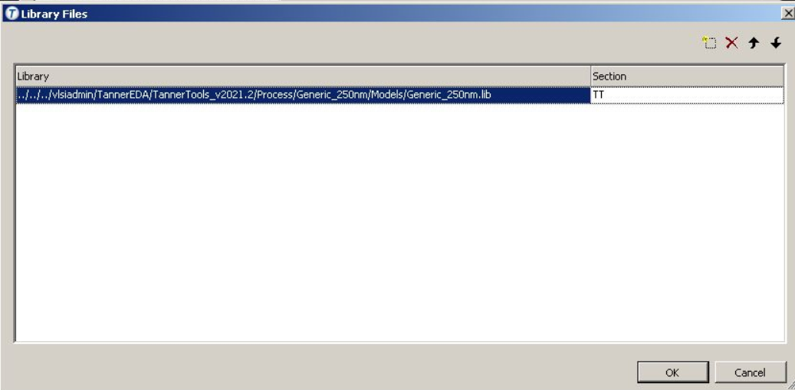
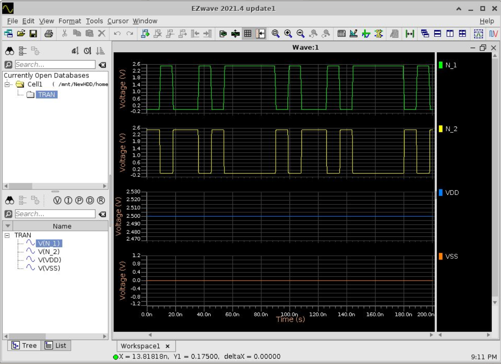

>참고 자료
>
>교수님 강의 자료

오늘은 기본 툴 셋업을 했다.

sedit이 있는 파일에 들어가서 

```cmd
sedit &
```

&을 해주는 이유는 cmd창과 sedit 독립적으로 돌아가도록.

File -> New -> New Library 실행 후 현재 폴더 선택

생성할 라이브러리 이름과 technology reference none으로 설정 후 OK

specify location of lib.def's file 창이 나오면 use this file의 vlsiadmin->TannerEDA->TannerTools_v2021.2->Process->Generic_250nm폴더 안의 lib.defs파일 선택

내 라이브러리가 만들어지면 schematic과 symbol은 내가 만든 라이브러리 안에 만들면 된다. 

왼쪽 창에 libraries에 우클릭해 include library definition filed에서 include 위 주소의 lib.defs를 선택하면 된다. 그러면 다음과 같이 된다.(내 라이브러리의 이름은 myedit으로 되어있다)

<center></center>

Generic_250nm_Devices파일에 nmos, pmos등 공정 디바이스들이 있다.

schematic view cell을 만드려면 cell -> new view실행 후 myedit밑에 my_inv라는 schematic을 만든다. 그러면 스케메틱 창이 나온다.

스케메틱과 레이아웃을 편하게 하기 위한 bindkey들이 있다. 이는 교수님 강의자료의 순서로 하면 셋업을 할 수 있다.

[bindkey list](https://www.mics.ece.vt.edu/ICDesign/Tutorials/Overview/5_Bindkeys.html)완벽히 일치는 아니지만 참고하기에 좋다.


스케메틱을 만드려고 한다면 Generic_250nm_Devices에서 찾아 끌어다 넣어 쓸 수 있따. pmos25x, nmos25x를 찾아 넣어 만들 수 있다. <center></center>

이후 세팅 후 in out 핀을 설정해 줄 수 있고 제일 왼쪽 아이콘으로 와이어링을 할 수 있다.

<center></center>

다 만든 후 이 스케메틱을 내가 만든 심볼로 저장할 수 있다. cell의 generate symbols를 클릭하면 다음과 같은 창이 뜬다.

<center></center>

여기서 바꿔줄 거는 심볼의 인아웃 확인이 편하도록 In/Out을 top으로 바꿔준다. Font size는 가시성을 위해 1로 바꿔준다. 다른 거는 거의 쓸 일이 없다고 한다. modify누르면 symbol이 myedit라이브러리에 생성된 것을 확인할 수 있다.

시뮬레이션을 돌리기 위해 새로운 셀에 이 심볼을 끌어다 올려 놓는다.

source심볼은 SPICE_source에 위치해있다. 현재 사용할 심볼은 vdc0와 vbit이다. q를 눌러 값을 설정해줄 수 있다. vss와 ground는 Misc에 위치해있다. 다음은 시뮬레이션을 위한 스케메틱이다.  <center></center>

이후 시뮬레이션을 돌리려면 Setup -> simulation을 클릭한다. 그러면 다음과 같은 창이 나온다.

<center></center>

현재 조건에서 시뮬레이션 돌리기 위해, Transient analysis에 들어간다. 이전에 vbit 설정에서 10n로 입력이 인가되는 것으로 설정되어있어, stop time 200n, print interval 0.1n, start time 0으로 설정해준다.<center></center>

이후 General에서 voltage probing을 true로 바꿔주고, library files를 누른다.

<center></center>

vlsi adimin->tanner eda->tanner tools_v2021.2->process->generic_250nm->models->generic_250nm.lib로 lib를 불러오고 section은 TT로 설정해준다. OK누른 후 전 창에서 Run simulation을 눌러주면 다음과 같은 창이 나온다.<center></center>

이것은 빈 시뮬레이션 창에 드레그 앤 드랍으로 그래프를 띄운 것이다.