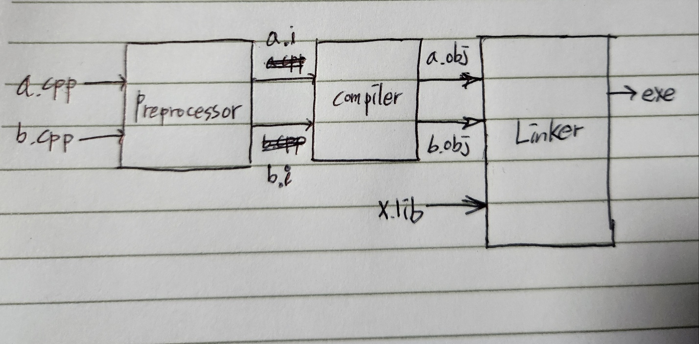
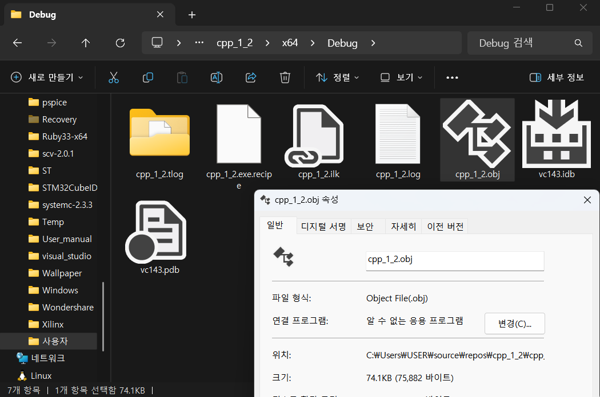
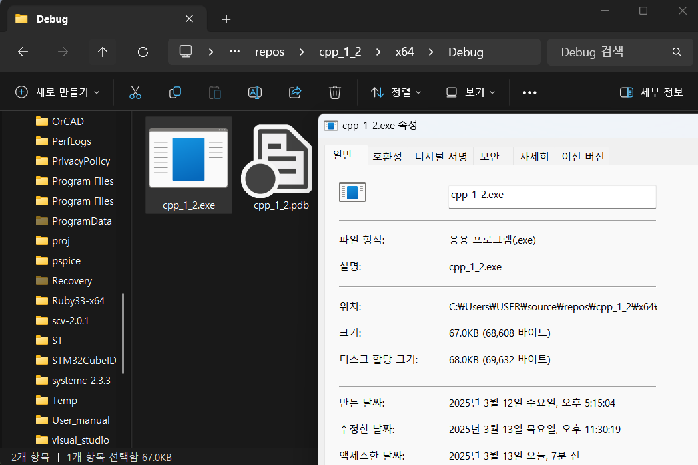

>참고 자료 [Fundamentals of C++ Programming](https://www.dbooks.org/fundamentals-of-c-programming-1201/), 
>
>[cppreference.com](https://en.cppreference.com/w/)
>
>교수님 강의자료

컴퓨터에서 소수를 다루는 방식은 두 가지가 있다. 첫번째는 어떤 위치에 소수점을 고정시키는 fixed point 방식이고 두번째는 소수점을 고정하지 않고 sign, exponent, significant로 나눠서 저장을 하는 방법이다. 두 방법에는 서로 장단점이 있다.

fixed point 방식은 정밀도(precision)가 높지만 아주 크거나 작은 수를 다르는 데에 한계가 있다. 반대로 floating point 방식은 정밀도가 낮은 대신 아주 크거나 작은 수를 계산할 수 있다. 대부분의 컴퓨터는 floating point를 사용한다. 


지금까지 배운것들에 대한 복습 겸 정리.

1. 코드 분석

```c++
#include <iostream>
int main() {
	std::cout << "C++ " << "Programm\n";
}
```

```c++
#include <iostream>
```

 여기서 #include는 전처리문으로, 컴파일 전에 작동해서 소스코드를 물리적으로 바꾸는 것이 아닌, 논리적으로 바꾸어 준다. 그리고 iostream은 Input/Output Stream의 약자로 표준 입출력 라이브러리이다. 아래줄의 cout은 iostream이 없다면 쓸 수 없다.

```c++
int main()
```

에서 int는 정수 자료형을 의미하고, 함수의 리턴값이 정수라는 의미이다. main()은 함수로, 프로그램을 실행시켜주는 함수이다. 하나의 솔루션 당 하나만 존재해야 한다.

```c++
{}
```

는 메인함수가 실행해야할 프로그램을 담고 있다. 프로그램이 시작하고 끝나는 것이 이 안에 있다.

```c++
std::cout << "C++ " << "Programm\n";
```

은 cout으로 C++를 출력하고 Programm을 출력하고 줄바꿈을 하라는 의미이다. std는 standard namespace라는 의미로, name collision을 방지하기 위해 존재하고, C++ 표준 라이브러리에 포함된 모든 클래스, 함수 등이 네임스페이스에 속해있고 cout이 표준라이브러에 있는 입출력 라이브러리이다. 여기서 <<는 삽입 연산자로 문자열을 cout으로 전달하는 것을 의미한다. 그리고 \n은 줄바꿈을 의미한다. 참고로 std::cout << "C++ " << "Programm\n";여기에서 std::cout << "C++ "의 결과는 cout이다. 그리고 마지막에 세미콜론은 문장이 끝났음을 의미한다.

결과는 

```cmd
C++Pogramm

```

으로 “”안의 단어와 줄바꿈 모두 나왔다.

------

2. 코드 분석

```c++
#include <iostream>
/* 
main function
*/
int main() {
	std::cout /*<< "C++ "*/ << "Code"; // prints a string (Code)
}

```

이 코드에서 봐야 할 부분은 주석이다. 주석처리 방법으로는 두가지가 있다.

/\*comment\*/

// comment

/\*\*/는 이 안에 위치한 문자 모두 주석처리 되도록 한다. 문장사이에 써도 그 부분만 주석처리 할 수 있다.

//는 표시된 부분 뒤의 줄이 주석처리 되도록 한다.
 그래서 위 코드의 /*main function*/과 /*<<”C++”*/두 comment와 //prints a string(Code) 부분은 주석처리 되었다.

결과는 

```cmd
Code
```

로 나온 것이다.

------

3. 코드 분석

```c++
#include <iostream>
int main() {
	std::cout << "A " << 'A' << ' ' // A A
        << "" // empty 
        << 'AB'; // 16706 (0x4142 → 16706)
}

```

이 코드에서 봐야 할 부분은 문자를 나타내는 “”와 ‘’이다.

우선””는 문자열을 표현할 수 있고, ‘’는 문자만 표현할 수 있어 작은 따옴표에는 무조건 하나의 character가 들어가야한다. 반대로 “”는 없어도 되고 하나 그 이상의 문자가 들어가도 된다.

결과로 “A “는 A와 공백이 같이 출력되고 그 다음 ‘A’와 ‘ ‘는 A그리고 공백이 순서대로 나온 모습이다.

그리고 “”에는 문자열이 존재하지 않지만 에러 없이 아무 출력이 없다. 

‘AB’의 경우 character가 2개 들어가서 AB가 아닌 16706이 나왔다. 

‘’는 ASCII 기반으로 출력을 하는데 ASCII에 각 문자마다 숫자가 있다. 그중 A는 41이고 B는 42인데 이것이 0x4142(16진수)로 인식되어 16706이 나온 것이다. 그래서 이는 잘못된 표현이다.

따라서 결과가 

```c++
A A 16706
```

으로 결과가 나온 것이다.

------

4. 코드 분석

```c++
#include <iostream>
int main() {
 std::cout << 10 << ' ' << 10. << ' ' // 10 10
     << 10000 << ' ' << 10'000 << ' ' // 10000 10000
// Optional single quotes (') may be inserted between the digits 
// as a separator; they are ignored when determining 
// the value of the literal.(since C++14)
     << 10.5 << ' ' << 1.05E+1 << ' ' // 10.5 10.5
     << 10.5e+1 << ' ' << 10.5e-1 << ' ' // 105 1.05
     << .5 << ' ' << .05E+1 << ' ' // 0.5 0.5
     << .5e+1 << ' ' << .5e-1 // 5 0.05
     << std::endl;
}

```

std::cout << 10 << ' ' << 10. << ' ' // 10 10

여기서는 둘 다 10으로 나왔지만 앞의 10은 정수이고, 뒤의 10은 10.이므로 실수이다.

<< 10000 << ' ' << 10'000 << ' ' // 10000 10000

여기서 둘 다 같은 값인데 10’000에서 ‘가 붙은 것은 자릿수 구분할 때 시각적으로 편하게 하기 위해 존재하는 것이다.

<< 10.5 << ' ' << 1.05E+1 << ' ' // 10.5 10.5

여기서 10.5는 실수이고, 1.05E+1또한 실수이다. 컴퓨터에서 실수를 저장할 때는 부동소수점(floating poing)로 저장을 하는데, sign, exponent, significant로 저장을 한다. 그래서 1.05E+1는 sign +1, exponent 1, significant 1.05로 저장되어 결과는 1.05 * 10^1으로 10.5가 나오는 것이다.

<< 10.5e+1 << ' ' << 10.5e-1 << ' ' // 105 1.05

여기서는 소문자 e로 나타냈는데 대문자 E와 같은 의미로 각각 10.5*10^1 = 105, 10.5*10^-1=1.05로 나오는 것이다.

<< .5 << ' ' << .05E+1 << ' ' // 0.5 0.5

여기서 .5로 표시되어 있는 것은 0.5를 의미하고 소수를 표시할 때 정수부분이 0일경우 생략을 할 수 있다. 그래서 결과는 0.5와 0.05*10^1=0.5가 나오는 것이다.

<< .5e+1 << ' ' << .5e-1 // 5 0.05

여기서 결과는 0.5*10^1=5, 0.5*10^-1=0.05가 나오는 것이다.

그 후 namespace에 존재하는 endl을 실행해 문장을 띄고 끝낸다.

그래서 결과는 

```cmd
10 10 10000 10000 10.5 10.5 105 1.05 0.5 0.5 5 0.05
```

이다.

------

5. c 에서 여러 소스 코드(a.cpp, b.cpp)와 외부의 라이브러리(x.lib 또는 x.a)를 실행 코드로 변환하는 과정을 손으로 직접 그려서 설명하고 사진으로 찍어서 문서에 포함(preprocessor, compiler, linker의 동작 포함)

<center></center>

소스파일인 a.cpp와 b.cpp는 전처리기에 의해 주석제거 및 define, include등의 전처리 지시문을 처리한다. 이는 기계어로 바꾸는 과정이 아닌 내용의 논리적인 처리를 의미한다.

변환된 파일은 컴파일러를 거쳐 2진수로 이루어진 기계어로 된 obj확장자 파일이 생성된다. 

 생성된 obj파일들과 함께 외부 라이브러리를 linker로 묶어서 실행파일 *.exe로 변환해 준다.

------

6. 1의 예제에서 생성된 목적 코드(object code)와 실행 파일(executable file)을 볼 수 있는 파일 탐색기(Windows)/Finder(Max)의 스냅샷(촬영 또는 스크린 샷)을 문서에 포함 (목적 코드와 실행 파일에 대한 2개의 영상)

우선 1의 예제의 코드를 cpp_1_2.cpp로 이름 지었다. 

obj 파일은 C:\Users\USER\source\repos\cpp_1_2\cpp_1_2\x64\Debug 위치에서 찾을 수 있었다. 

<center></center>


exe파일은 C:\Users\USER\source\repos\cpp_1_2\x64\Debug 위치에서 찾을 수 있었다.

<center></center>

