>참고 자료 : 교수님 강의 자료
>
>사용 툴 : Quartus, mobaxterm

primitive cell은 and, or, nand, nor, xor, xnor, not등과 같은 instance형태로 있다. 

이 primitive cell을 이용해 HalfAdder, FullAdder, 4bit Adder를 만들것이다.

우선 Halfadder를 만들것이다. 

다음은 Halfadder의 스케메틱이다.

<center>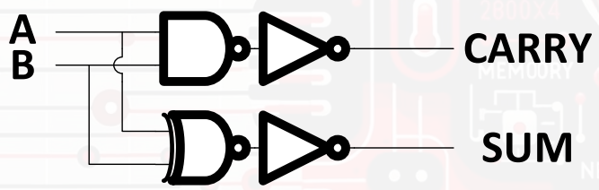</center>

위 스케메틱을 참고해 Halfadder를 만들것이다. 

다음은 primitive cell을 활용한 HalfAdder 베릴로그 코드이다.

```verilog
module HALFADD (
       // Outputs
       CARRY, SUM,
       // Ihnputs
       A, B
       );
    input A;
    input B;
    output CARRY;
    output SUM;

    //internal net
    wire   CARRYB;
    wire   SUMB;

    //primitive cell
    nand u0 (CARRYB, A, B);
    not u1 (CARRY, CARRYB);
    xnor u2 (SUMB, A, B);
    not u3 (SUM, SUMB);
endmodule
```

Halfadder는 4bit, 8bit같은 다비트 연산에서 이전자리에서 올라온 carry를 처리할 수 없다는 단점이 존재한다. 이를 보완한 두개의 1비트와 이전 자리에서 넘어온 carry를 포함해 덧셈을 할 수 있는 Fulladder가 있다. 

다음은 Fulladder의 스케메틱이다.

<center>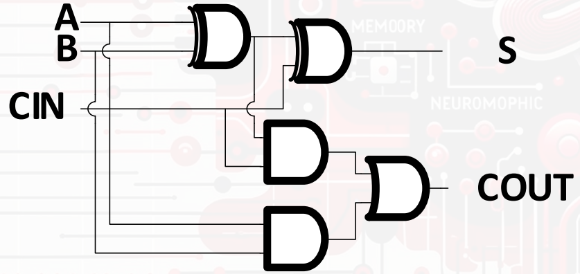</center>

다음은 Fulladder의 베릴로그 코드이다.

```verilog
module FULLADD (
                 // Outputs
                 COUT, SUM,
                 // Inputs
                 A, B, CIN
                 );

    input A;
    input B;
    input CIN;
    output COUT;
   output SUM;

    wire   SUMB;
    wire   C1;
    wire   C2;

    xor u0 (SUMB, A, B);
    xor u1 (SUM, SUMB, CIN);
    and u2 (C1, CIN, SUMB);
    and u3 (C2, A, B);
    or u4 (COUT, C1, C2);

 endmodule   
```

Halfadder와 Fulladder를 사용해 4bit Fulladder를 만들것이다.

4bit Fulladder의 구조는 다음과 같다.<center>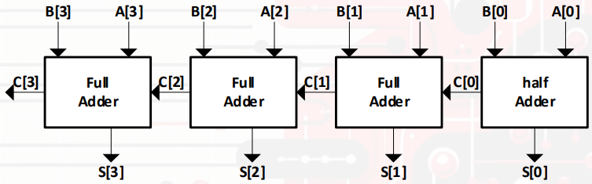</center>

이 구조에서 c[2:0]은 내부 wire로 처리할 것이다.

다음은 4bit Fulladder의 베릴로그 코드이다.

```verilog
module FULLADD4B(
        /*AUTOARG*/
        // Outputs
        S, COUT,
        // Inputs
        A, B
        );
    
    input [3:0]A;
    input [3:0] B;
    output [3:0] S;
    output    COUT;

    //interner net
    wire [2:0]      C;

    //instance
    FULLADD U3 (/*AUTOINST*/
           // Outputs
           .COUT         (COUT),
           .SUM       (S[3]),
           // Inputs
           .A         (A[3]),
           .B         (B[3]),
           .CIN		  (C[2]));
    FULLADD U2 (/*AUTOINST*/
           // Outputs
           .COUT         (C[2]),
           .SUM       (S[2]),
           // Inputs
           .A         (A[2]),
           .B         (B[2]),
           .CIN       (C[1]));
    FULLADD U1 (/*AUTOINST*/
           // Outputs
           .COUT         (C[1]),
           .SUM       (S[1]),
           // Inputs
           .A         (A[1]),
           .B         (B[1]),
           .CIN       (C[0]));
    HALFADD U0 (
           .A         (A[0]),
           .B         (B[0]),
           .CARRY(C[0]),
           .SUM(S[0]));
    
endmodule

                                   
```

다음은 7-segment decoder를 작동시켜볼 것이다. 7segment는 다음과 같이 되어있다.

<center>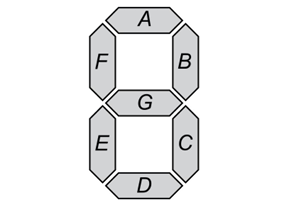</center>

7segment에 숫자를 표시하기 위한 코드는 다음과 같다.

```verilog
module DECODE7SEG(/*AUTOARG*/
         // Outputs
         OUT,
         // Inputs
         IN
         );
    input wire [3:0] IN;
    output reg [6:0] OUT;

    /*describe your code*/
    always@(*) begin
       case (IN)
    4'd0 : OUT = 7'b000_0001; //0
    4'd1 : OUT = 7'b100_1111; //1
    4'd2 : OUT = 7'b001_0010; //2
    4'd3 : OUT = 7'b000_0110; //3
    4'd4 : OUT = 7'b100_1100; //4
    4'd5 : OUT = 7'b010_0100; //5
    4'd6 : OUT = 7'b010_0000; //6
    4'd7 : OUT = 7'b000_1111; //7
    4'd8 : OUT = 7'b000_0000; //8
    4'd9 : OUT = 7'b000_0100; //9
    default : OUT = 7'b111_1111;
       endcase
    end

 endmodule
```

------

이제 이 코드를 fpga위에 올려 작동시켜볼 것이다.

위에서 작성한 7segment  v파일을 다음 파일에 옮긴다. 다음 사진에는 표시가 안 되어있지만, 파일을 옮길 때 follow terminal folder에 체크를 해준다

<center>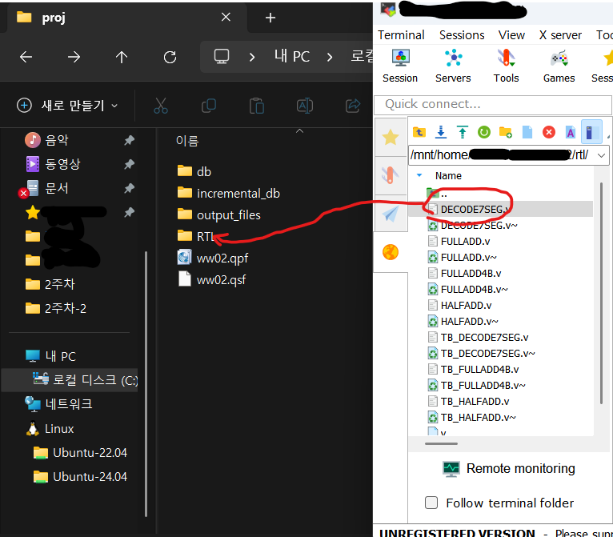</center>

다음은 quartus 창에서 새로운 프로젝트를 만들어 준다. 디바이스 이름은 내 보드에 맞게 설정해주고 fpga보드에 있는 이름을 입력해서 찾아준다.

<center>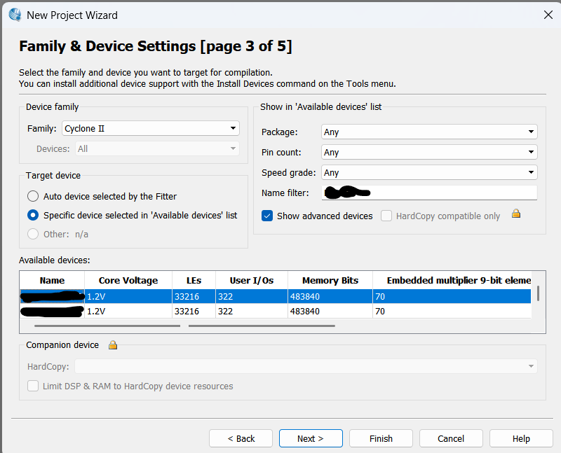</center>

프로젝트를 만든 후 파일에 내가 만든 v파일을 올려둔다.

<center>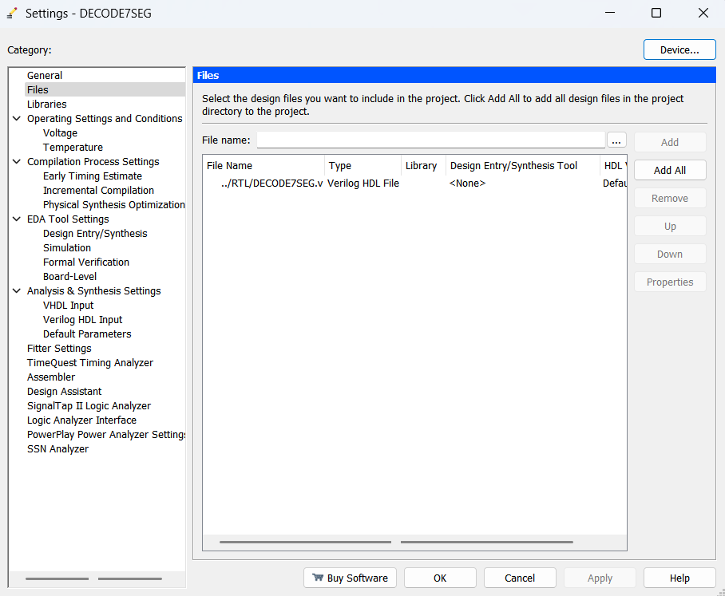</center>

다음은 pin planner의 모습이다. 여기서 fpga의 데이터시트를 바탕으로 in out 핀을 설정해준다. 입력으로는 led 아래에 있는 스위치 sw0 to sw3를 쓸 예정이고 출력에는 7segment를 쓸 예정이다. 

<center>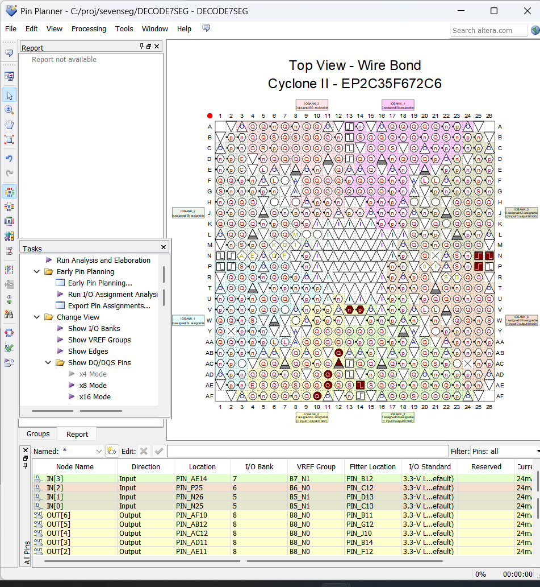</center>

핀설정을 끝낸 후 compile design을 눌러준다.

<center>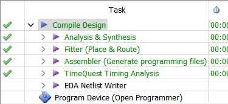</center>

다 완료가 된 후에 program device를 열어준다.

<center>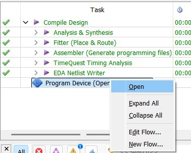</center>

programmer창에 들어가서 hardware setup을 usb-blaster에 연결해준다.

<center>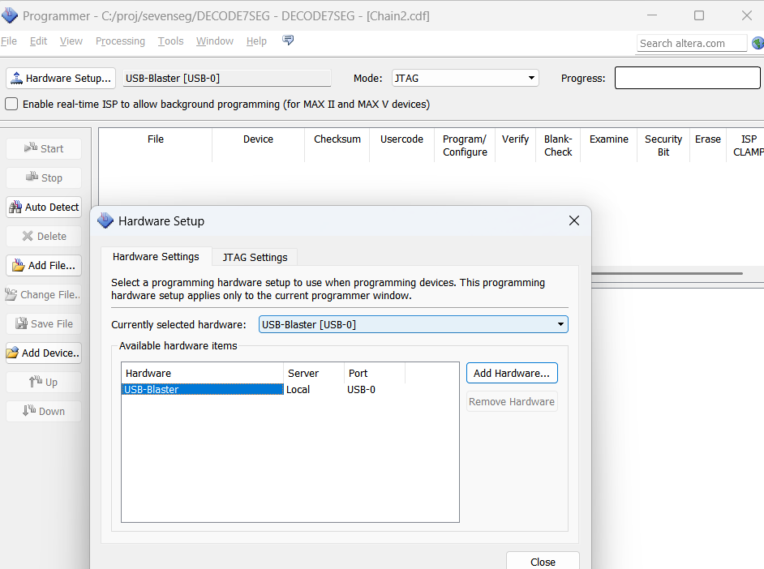</center>

Add file을 눌러 pof파일을 넣어준다.

<center>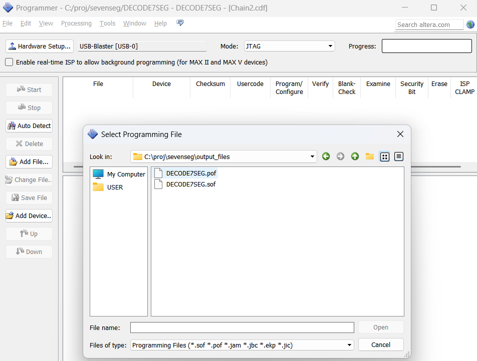</center>

start를 눌러 실행시킨다.

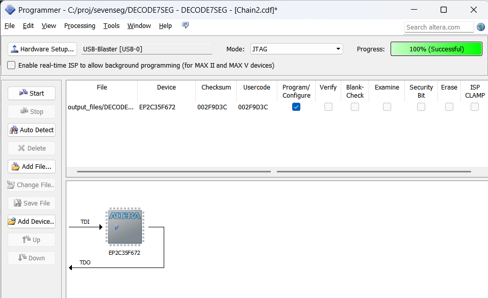

다음은 fpga보드에서 실행시킨 결과이다.

<center>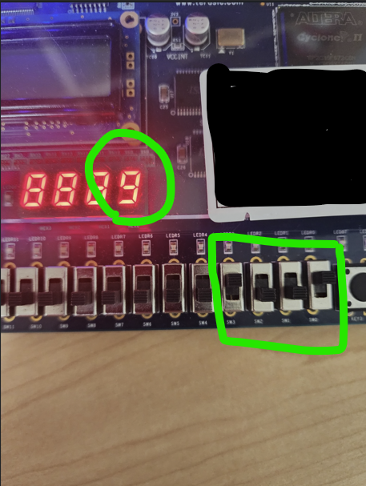</center>
