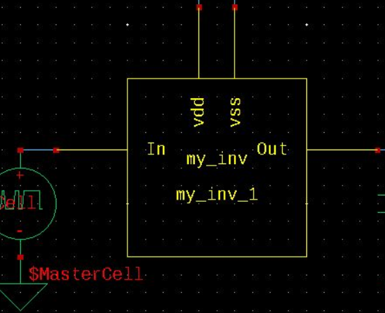
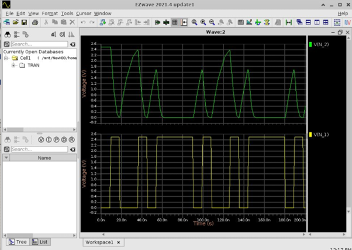
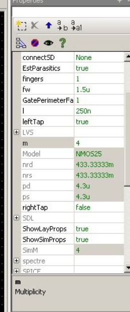

>참고 자료
>
>교수님 강의 자료

저번시간 바인드키 세팅까지 했고 시뮬레이션 언급 다시 함.

여기서 이 my_inv의 내부를 확인하고 싶다면 **더블클릭** 혹은 **shift+e**. 내부 스케메틱 모습을 확인할 수 있다. 밖으로 나오는 단축키는 **ctrl+e**이다. 

저번 수업에서 설정한 방법대로 시뮬레이션을 돌리면 다음과 같은 출력, 입력 전압을 볼 수 있다.

하지만 여기서 전압이 펄스 폭이 넓으면 쫓아 가지만, 좁을 경우에 출력 전압이 못 쫓아가는 모습이다. 

전류를 확인하고 싶을 때는 디바이스에 전류를 찍어보면 확인 할 수 있다.

다음은 전압 전류를 모두 표에 띄워 놓은 모습이다.

파란 그래프는 pmos, 주황 그래프는 nmos의 drain전류이다. 그래프와 같이 pmos는 끌어 올리는데 사용되고 nmos는 끌어 내리는데 사용된다. 

하지만 여기서 nmos는 끌어 내릴때 전류가 거의 1000마이크로까지 내려가는데 pmos는 450 반정도만 변한다. 끌어내리는거는 전류가 항상 강한데 끌어 내리는거는 항상 밑까지 내려온다. 그런데 low가 좁을때는 거의 못 올리고 길때는 거의다 끌어 올리지만 느리다. 이 이유는 pmos와 nmos의 전류 mobility 때문인데 nmos는 강한편이고 pmos는 약한편이다. 그래서 보통 pmos의 사이즈를 키워준다. 

다음은 pmos의 finger width를 2배 키워준 결과이다.

output 전압은 2.5V 까지 끌어 올렸다.(느리긴 하지만) 빠르게 하려면 트렌지스터를 더 카워야 한다. nmos pmos 속도가 비슷하게 잘 됐지만 두개의 속도를 올려줘야 해서 배율(m)을 조정해주면 

배율을 4배로 키운 것이니 자연스럽게 12마이크로로 쓴다는 의미이다. 이거로 시뮬레이션을 돌리면 다음과 같다.

이로써 입력과 출력은 거의 비슷해졌다. 더 반듯한 출력을 원한다면 전류를 더 써야하는데 여기서 전류는 3.5m정도가 나온다. pmos는 3.4m정도가 나와서 높이려면 사이즈를 2.5배 정도 키워야 하지만 레이아웃 크기가 너무 커지기 때문에 보통 2대1로 한다. 이 정도만 해도 충분히 괜찮다고 함.

------

2TR MUX를 만들어 보자. 다음과 같이 만들었다.

다음과 같이 심볼로 만들어 주었다.

이후 인버터 3개와 연결해 Mux의 동작을 확인할 것이다. 스케메틱은 다음과 같이 그렸다.

b노드에 해당하는 vbit을 20n만큼 딜레이 시켜서 시뮬레이션을 확인해본 결과이다. 다음 그래프들은 위에서 부터 순서대로 A,B,S,M_OUT, 마지막 인버터의 out이다.

M_OUT에서 값이 조금씩 맞지 않게 출력이 되지만 최종 인버터에서 나오는 값은 비교적 깔끔하게 출력이 되는 것을 확인할 수 있다. 값이 0.4정도로 나왔지만 2.5로 인버팅이 된 것을 볼 수 있다. 이로써 충분히 사용 가능함을 보였고 트렌지스터 두 개로 MUX를 만들어 보았다.

하지만 여기에는 큰 위험이 존재한다. 캡이 들어가면 기생 캡이 만들어지고 뭉개지는 부분이 생긴다. 

현재 pmos와 nmos의 전류 능력이 비슷해 2.5의 중앙인 1.25가 문턱 전압이다. 1.25보다 높으면 1, 낮으면 0으로 출력되는 것이다. 하지만 이 사이에 레이아웃을 엉성하게 해서 캡이 더 들어가면 1.2보다 높은데서 모든게 형성되면 모든게 의미가 없어진다. 캡이 있으면 불안한데 먹스 자체에서 전압을 까먹기 때문에 마진이 없어지고 더 불안해 지는 것이다.

쓰면 안되는 것은 아니지만 상황에 따라 잘 보고 써야한다는 것.

