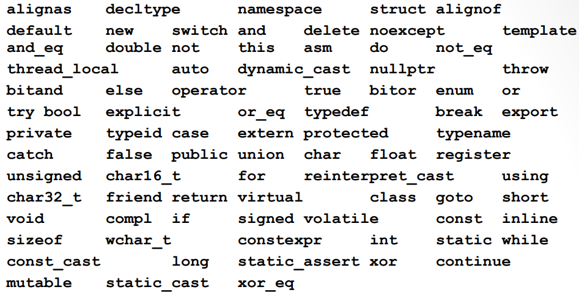

>참고 자료 [Fundamentals of C++ Programming](https://www.dbooks.org/fundamentals-of-c-programming-1201/), 
>
>[cppreference.com](https://en.cppreference.com/w/)
>
>교수님 강의자료

variable & expression

변수와 수식

variable은 값이 있으면서 그 값을 바꿀 수 있는 변수. 그렇기에 이름이 필요하다.

declaration & definition

선언과 정의

선언은 무엇에 대한 정보이고 이름은 ~ 다. 이런식

정의는 어떤 실체를 만드는 것이다. 정의할 때 이름도 넣어야 하기 때문에 정의할 때 선언도 같이 된다. 선언될 때 정의가 안 되는 경우도 있음.

변수는 사용 전에 항상 정의하고 사용해야하는데 다음과 같이 정의한다.

```c++
<type> <identifier> = <initializer>;
```

type에는 정수 실수등을 넣어줌. ex) int, float, double ...

```c++
int x = 10;
```

여기서 x는 변수이기 때문에 값을 바꿀 수 있다. 

Identifier는 알파벳 대소문자, 숫자, underscore로 구성할 수 있고 제일 앞자리에는 숫자가 올 수 없다. 위에서는 간단하게 x만 썼지만, 실제 코딩을 할 때에는 알아보기 쉽게 이름을 잘 만들어 줘야한다. 참고로 int같이 미리 정해진 이름들은 식별어로 쓸 수 없다. 쓸 수 없는 예약어들은 다음과 같다. 

<center></center>

변수 초기화 방법으로 컴마로도 구분이 가능하고 ()와 {}를 활용해서 초기화할 수 있다.

```c++
#include <iostream>
#pragma warning(disable:4700)// Disable warning messages 4700
int main() {
    int x1 = 10, y1 = { 20 }, z1(30);
    std::cout << x1 << ' ' << y1 << ' ' << z1 << ' ';
    //10 20 30
    int x2 = 0, y2 = {}, z2 = (0);
    std::cout << x2 << ' ' << y2 << ' ' << z2 << ' ';
    // 0 0 0
    int x3, y3{}, z3(); // z3 is not a variable.
    std::cout << x3 << ' ' << y3 << ' ';
    // ? (garbage value) 0
}
```

여기서 주의해야할 점은  다음 부분이다.

```c++
int x3, y3{}, z3();
```

int x3은 초기화가 되지 않은 상태이다. 그 다음인 y3{}또한 초기화가 되지 않는다. z3()는 다른 기능이 있어서 이것은 변수조차 아니다.

맨 위에 #pragma warning(disable:4700) 이것은 다음 에러일 때 에러표시 시키지 말아라는 뜻인데 애초에 이렇게 작성하지 말자.

------

Expressions

수식은 operator와 operands로 이루어져 있다. opearator로는 +-*/%의 기본연산자를 비롯한 다양한 연산자들이 있다. 

+를 예시로 설명하자면 1+2가 있다면 1과 2가 피연산자이고 +가 연산자이다. 피연산자가 두개 있어 이는 이항연산자라고 한다. 유일한 삼항연산자가 있지만 이는 다음 단원에서 설명한다.

+와 -는 숫자 앞에 붙어 단항연산자로 사용될 수 도있다. 

+-*/%는 모두 왼쪽에서 오른쪽으로 연산이 진행되지만, 단항연산자 +-는 오른쪽에서 왼쪽으로 연산이 진행된다. ex) +-+10  >> +(-(+10))

그 다음으로 assignment opperator가 있는데 이는 =이다. 그냥 수학에서는 =는 equality의 의미이지만, 코딩할 때는 오른쪽 값을 왼쪽에 대입하라는 것을 의미한다. 그리고 우리말로 대입 연산자라 한다.

만약 연산자들이 여럿 있다면 연산자 우선순위가 존재한다. 이것은 기본적으로 우리가 아는 사칙연산과 같다. 단항연산자 +-가 우선 */%가 그 다음, +-는 그것보다 다음, 이 연산들이 완료된 후 = 이 진행되는순서이다. 

------

Character types

기본적으로 문자를 char이라 표시할 수 있다. 그리고 char에는 signed char와 unsigned char로 나뉜다. 이는 캐릭터가 문자를 저장할 때도 쓰지만, 작은 범위의 숫자를 저장할 때도 쓰이기 때문이다. unsigned char의 대표적 예로는 rgb가 있다. 그리고 std::cout을 사용하면 ascii를 print 하도록 되어있다. 참고로 범위는 signed char : -128~127, unsigned char: 0~255이다.

그리고 타입이 명확히 명시되어있지 않으면 컴파일러가 암묵적으로 변환시킨다. 예를 들어 5/2를 하면 정수 나누기 정수이기 때문에 2라는 결과가 나온다. 실수와 실수를 나누면 실수가 나오겠지만 실수나누기 정수 혹은 정수 나누기 실수일 경우에는 둘 다 똑같은 타입으로 바꾸는데, 정수를 실수형으로 바꿔준다.

```c++
#include <iostream>
int main() {
	std::cout << 5 / 2 << ' ' << 5. / 2. << ' ' << 5 / 2. ;
}
```

```cmd
2 2.5 2.5
```

그리고 double과 long double과 같이 데이터 크기가 다를경우 데이터가 소실되지 않도록 큰 데이터타입으로 바꿔 연산된다.

```c++
#include <iostream> 
int main() {
	char ch1 = 'A', ch2 = 'a', ch3 = '5';
	std::cout << ch1 << ' ' << ch2 << ' ' << ch3 << ' ';
	// A a 5
	ch1 += 1;
	std::cout << ch1 << ' ' << ch2 + 1 << ' ' << ch3 + 1 << ' ';
	// B 98 54
	std::cout << (int)ch1 << ' ' << (char)(ch2 + 1) << ' '
		<< (char)(ch3 + 1) << ' ';
	// 66 b 6
}
```

char 문자와 숫자 둘 다 저장 가능하다. 문자가 저장되더라도 ascii코드에 위치한 번호로 저장되기 때문에 cout을 통해 ch+=1의 값을 출력했을 때 ascii코드 A의 다음 번호인 B가 출력되는 것이다. 하지만 여기서 출력하는 과정에서 ch2+1을 출력하게 되면 더하기 연산을 수행하게 되면서 데이터타입이 정수로 바뀌고 98이 출력된다. 그리고 '5'는 아스키코드 상에서 53번이므로 53+1이 되어 54가 나온다.

 (int)ch1의 경우 ch1을 정수형으로 바꿔주게 되고 66이 출력된다. (char)(ch2+1)은 ch2+1의 값을 캐릭터로 바꿔줬기 때무넹 b가 나온다. (char)(ch3+1)또한 마찬가지이다.

------

데이터 타입의 크기에 따라서 쓰이는게 다른데 먼저 정수의 경우 다음과 같다.

```
short (int) ≤ int ≤ long (int) ≤ long long (int)
unsigned short ≤ unsigned (int) ≤ unsigned long ≤ unsigned long long
short int (short), 2bytes, -32,768~32,767
int, 4bytes, -2,147,483,648~2,147,483,647
long int (long), 4bytes or 8bytes, -2,147,483,648~2,147,483,647
long long int (long long), 8bytes, -9,223,372,036,854,775,808~9,223,372,036,854,775,807
32-bit systems:
ILP32 or 4/4/4 (int, long, and pointer are 32-bit); Win32 API, Unix, Linux, macOS
64-bit systems:
LLP64 or 4/4/8 (int and long are 32-bit, pointer is 64-bit): Win32 API (x64)
LP64 or 4/8/8 (int is 32-bit, long and pointer are 64-bit): Unix, Linux, macOS
```

여기서 주의해야할 점은 64bit 시스템에서인데 윈도우에서는 int/long/pointer 가 4/4/8인데 유닉스, 리눅스 맥에서는 4/8/8이라는 점이다.

그리고 unsigned라는 표현을 하는데 얘네는 다음과 같은 범위를 갖는다.

```
unsigned short int (unsigned short), 2bytes, 0~65,535
unsigned int (unsigned), 4bytes, 0~4,294,967,295
unsigned long int (unsigned long), 4bytes, 0~4,294,967,295
unsigned long long int (unsigned long long), 8bytes, 0~18,446,744,073,709,551,615
```

그리고 간혹 숫자를 표현할 때 0xFF, 0b101010, 010이런식의 숫자들을 볼 수 있는데 0x는 16진수 hexadecima을 의미하고 010에서 0dms 8진수 octal, 0b는 이진수 binary를 의미한다. 

그리고 x = 3995505920U; 이런식으로 쓸 수 있는데 이는 마지막에 타입을 적어준 것이다 . 이렇게 쓴다면 자연스럽게 unsigned 가 된다. 다른 방식으로 UL혹은 LL등을 붙여주는 것으로 쓸 수 도 있다.

```c++
<cstdint>
```

라는 것도 존재하는데 이것은 스텐다드 형식으로 쓸 수 있게 비트를 명확히 해두는 것이다. os마다 설정이 다르게 되는게 싫다면 이걸 사용할 수 있다. 

------

float 타입 또한 int와 마찬가지로 크기에 따라 type을 다르게 쓴다.

```
float, 4bytes, 1.17549×10e-38, 3.40282×10e38, 6digits
double, 8bytes, 2.22507×10e-308, 1.79769×10e308, 15digits
long double, 8 (12, 16)bytes, 2.22507×10e-308, 1.79769×10e308, 15digits (10e-4932, 10e4932) 
```

float는 4byte, double은 8byte, long double도 8,12,16byte

float x = 3.14f 이런식으로 타입 변환 가능.

실수는 기본 타입이 double이기 때문에 f가 없으면 암묵적으로 double형으로 변환이 발생함.


지금까지는 변수에 대해 설명했는데 변수 중에 값을 수정하지 못하게 하는 const int, int const가 있다. 이러면 뒤에 값을 수정하지 못해서 반드시 초기화해서 지정해줘야 한다. 

------

Macro형식. c스타일인데 많이 쓴다고 함.

```c++
#include <iostream>
#define EMPTY // 얘는 다 없애버림
#define PI1 3.14159 
#define PI2 3.14159; //세미콜론까지 변환되는거임.
#define SCAN(x) x //scan(x)라는거를 x의 결과값으로 바뀌어버리는거임.
int main() {
    std::cout << 2. * PI1 << '\n'; // 6.28318
    //std::cout << 2. * PI2 << '\n'; // error 
    //std::cout << 2. * 3.14159; << '\n'; 
    std::cout << 2. * PI2; // 6.2831
    // std::cout << 2. * 3.14159;; // empty statement (;)
    std::cout << '\n' << EMPTY SCAN(10) << '\n'; // 10
}
```

#include는 전처리. #define을 설정해주면 컴파일 과정에서 코드 내에 있는 값들을 다 define으로 변하게 한다. include는 library copy paste이고 define은 코드 내에 있는걸 바꾸는것임.

;;가 되어있는경우 뒤에 있는 ;는 empty state, null state라고 한다. 그냥 아무것도 없는 것임.

```c++
#include <iostream>
#define EMPTY
int main() {
#ifdef EMPTY
    std::cout << "EMPTY was defined." << '\n';
#else
    std::cout << "EMPTY was not defined." << '\n'; // not code
#endif
}
```

#ifdef, #else, #endif 가 있는데 이건 아까 말한 os별 따로 만들어 줄 때 편리하다고 함. 아무튼 다른 상황에서 쓸 경우에 예외를 두는 방법.

------

Enumerated types 

열거형이라고 한다. 상수를 열거해 놓은것 인데 enum class, enum struct가 있다. 

```c
// Unscoped enumeration 
#include <iostream>
int main() {
    enum Color { Red, Orange, Yellow, Green, Blue, Violet };
    std::cout << Red << Orange << Yellow << std::endl
        // 012
        enum Animal { Cat = 1, Dog, Puppy=2 };
    std::cout << Cat << Dog << Puppy << std::endl
        // 122
}
```

다 unscoped인데 color, animal이라 되어있다. 값을 지정을 안 해 놔서 자동으로 0부터 시작해 1씩 증가한다. 이거는 c스타일이다.

```c++
// Scoped enumeration 
#include <iostream>
int main() {
    enum class Shade : char { Dark = 'a', Dim, Light, Bright };
    enum class Weight { Light = -1, Medium, Heavy };
    Shade color = Shade::Light; // type and scope
    Weight mass = Weight::Light; 
    std::cout << (char)color << std::endl; // c
    std::cout << (int)mass << std::endl; // -1
}
```

c++는 scoped인데 shade와 weight는 타입이 된다. c 스타일에서는 의미가 없고 상수처럼 쓴 반면 이것은 타입이 char로 되어있다. shade에서 weight에서 light에는 -2을 넣었으니 출력이 되지만, color는 내가 만든 타입이므로 cout으로 출력을 못 한다. 그래서 자료형 변환을 해서 볼 수 있다.

------

Auto

이것은 타입을 자동으로 지정해 주는것인데 타입이 명확할 경우에만 쓸 수 있다. 

```c++
#include <iostream>
#include <typeinfo>
int main() {
    auto count = 0;
    auto ch = 'Z';
    auto limit = 100.0;
    // auto x; // error
    std::cout << typeid(count).name() << std::endl; // int
    std::cout << typeid(ch).name() << std::endl; // char
    std::cout << typeid(limit).name() << std::endl; // double
}
```

위와 같이 명확한경우에만 쓸 수 있고 auto x와 같이 값이 명확하지 않은 경우 쓸 수 없다. 그리고 <typeinfo>라는 전처리문의 typeid, .name()을 쓰면 문자열로 타입이 출력되는 것을 확인할 수 있다.

------

교재 3단원에 해당하는 내용이 끝났으므로 exercises를 풀어보자

3.11 Exercises
1. Will the following lines of code print the same thing? Explain why or why not.

  ```
  std::cout << 6 << '\n';
  std::cout << "6" << '\n';
  ```

  답.

  cmd창에 출력된 값은 같지만 위의 6은 int타입이고 아래 6은 char타입이다.

2. Will the following lines of code print the same thing? Explain why or why not.

  ```
  std::cout << x << '\n';
  std::cout << "x" << '\n';
  ```

  답.

  위의 x는 변수에 해당하므로 x에 저장된 값을 출력하고, 아래의 x는 문자 x를 출력한다.

3. What is the largest int available on your system?

   답.

   ```
   2,147,483,647 
   ```

   int인 경우. long long int라 하면 9,223,372,036,854,775,807

4. What is the smallest int available on your system?

   답.

   ```
   -2,147,483,648
   ```

   int인 경우. long long int라 하면 -9,223,372,036,854,775,808

5. What is the largest double available on your system?

   답.

   ```
   1.79769 * 10e308
   ```

6. What is the smallest double available on your system?

   답.

   ```
   2.22507 * 10e-308
   ```

7. What C++ data type represents nonnegative integers?

   답.

   ```
   unsigned int
   ```

8. What happens if you attempt to use a variable within a program, and that variable is not declared?

   답.

   변수가 선언되지 않으면 컴파일러는 저장공간의 요구사항을 추론할 수 없으며 변수의 올바른 사용 여부를 확인할 수 없다. 한마디로 에러가 뜬다.

9. What is wrong with the following statement that attempts to assign the value ten to variable x?

  ```
  10 = x;
  ```

  답.

  10은 변수가 될 수 없고, x의 위치는 =연산자의 왼쪽에 위치해야한다.

10. Once a variable has been properly declared and initialized can its value be changed?

    답.

    변경할 수 있다.

11. What is another way to write the following declaration and initialization?

    ```c++
    int x = 10;
    ```

    답.

    ```c++
    auto x = 10;
    ```

12. In C++ can you declare more than variable in the same declaration statement? If so, how?

    답.

    ```c++
    int a, b, c;
    ```

    이런식으로 선언 가능함.

13. In the declaration

    ```c++
    int a;
    int b; 
    ```

    do a and b represent the same memory location?

    둘 다 다른 변수이고 다른 메모리 위치를 가진다.

14. Classify each of the following as either a legal or illegal C++ identifier:
    (a) fred (o)
    (b) if (x)
    (c) 2x (x)
    (d) -4 (x)
    (e) sum_total (o)
    (f) sumTotal (o)
    (g) sum-total (x)
    (h) sum total (x)
    (i) sumtotal (o)
    (j) While (o)
    (k) x2 (o)
    (l) Private (o)
    (m) public (x)
    (n) $16 (x)
    (o) xTwo (o)
    (p) _static (o)
    (q) _4 (o)
    (r) ___ (o)
    (s) 10% (x)
    (t) a27834 (o)
    (u) wilma's (x)

15. What can you do if a variable name you would like to use is the same as a reserved word?

    답.

    문자 하나를 대문자로 바꾸거나, 언더스코어를 넣거나, 네임스페이스를 쓰거나, 클래스 또는 구조체 멤버 변수로 활용하는 것인데, 되도록이면 사용하지 않는 것이 가장 좋음.

16. Why does C++ require programmers to declare a variable before using it? What are the advantages of declaring variables?

    답.

    1)

    ```c++
    int ZERO;
    ZER0 = 1;
    ```

    이렇게 코딩을 한 경우 식별자 숫자 0으로 끝나는데 특정 편집기나 코드 출력물에서는 차이 구분하기 힘들다. c++ 컴파일러에서는 오류를 감지할 것이다. 동적 타입 언어에서는 각각 다른 변수로 간주해 두 개의 변수를 생성해 버릴 것이다.

    2)

    ```c++
    int num;
    num = "hello";  // C++에서는 오류 발생!
    ```

    변수의 타입이 한 번 선언되면 변경될 수 없기 때문에 이러한 오류를 컴파일러가 즉시 감지한다. 반면 동적 타입 언어에서는 num의 타입이 자동으로 변경되며, 오류를 감지하지 못하고 실행되어 프로그램에 의도치 않은 버그를 초래할 수 있다.

    3)

    변수를 선언하기 전에 그 목적을 명확히 정의해야 하고, 선언을 통해 변수의 역할을 한 번 더 검토하는 계기가 된다.

    4)

    컴파일러는 변수의 타입을 미리 알고 있기 때문에, 해당 변수가 차지할 메모리 크기를 정확히 계산할 수 있다. 이로 인해 변수가 생성될 때 필요한 메모리 공간이 미리 확보되며, 실행 중에 변경되지 않는다.  메모리 관리에 효율적이다.

17. What is the difference between float and double?

    답.

    storage 크기가 다르다. float는 4byte고 double은 8byte이다. minimum precision도 6과 15 digits로 다르다.

18. How can a programmer force a floating-point literal to be a float instead of a double?

    답.

    ```c++
    float num1 = 3.14f
    ```

    뒤에 f를 붙임.

19. How is the value $2.45×10^{−5}$ expressed as a C++ literal?

    답.

    ```
    2.45 × 10e-5
    ```

20. How can you ensure that a variable’s value can never be changed after its initialization?

    답.

    ```c++
    const int num = 100;
    ```

    이것과 같이 타입 앞에 const를 붙여준다.

21. How can you extend the range of int on some systems?

    답.

    long 이나 long long 사용

22. How can you extend the range and precision of double on some systems?

    답.

    long double 사용

23. Write a program that prints the ASCII chart for all the values from 0 to 127.

    답.

    ```c++
    #include <iostream>
    
    int main(){
        for (int i = 0; i < 128; i++){
            std::cout << (char)i << ' ';
        }
    }
    ```

    ```cmd
    
    
    
                 ␦  1 2 3 4 5 6 7 8 9 : ; < = > ? @ A B C D E F G H I J K L M N O P Q R S T U V W X Y Z [ \ ] ^ _ ` a b c d e f g h i j k l m n o p q r s t u v w x y z { | } ~
    ```

24. Is "i" a string literal or character literal?

    답.

    string

25. Is 'i' a string literal or character literal?

    답.

    character

26. Is it legal to assign a char value to an int variable?

    답.

    가능. char는 정수형 타입의 일부이므로, char값을 int변수에 할당할 수 있다.

    ```c++
    char ch = 'A';  
    int num = ch;
    std::cout << num; 
    ```

    ```c++
    65
    ```

27. Is it legal to assign an int value to a char variable?

    답.

    가능. 근데 값이 char의 범위를 초과하면 데이터 손실 가능성이 있음.

28. What is printed by the following code fragment?

    ```c++
    int x;
    x = 'A';
    std::cout << x << '\n';
    ```

    답.

    ASCII값이 나와서 65가 출력된다.

29. What is the difference between the character 'n' and the character '\n'?

    답.

    n은 말그대로 n이고(ASCII 100번) '\n'는 줄바꿈이다.

30. Write a C++ program that simply emits a beep sound when run.

    답.

    Beep() 함수를 사용하면 된다고 한다. 근데 나는 안 배웠으니 넘어감.

31. Create an unscoped enumeration type that represents the days of the week.

    답.

    ```c++
    enum Days {Sunday, Monday, Tuseday, Wednesday, Thursday, Friday, Saturday};
    ```

32. Create a scoped enumeration type that represents the days of the week.

    답.

    ```c++
    enum class Days : char {Sunday, Monday, Tuseday, Wednesday, Thursday, Friday, Saturday};
    ```

33. Create an unscoped enumeration type that represents the months of the year.

    답.

    ```c++
    enum months {January, Fabruary, March, April, May, June, July, August, September, October, November, December}
    ```

34. Create a scoped enumeration type that represents the months of the year.

    ```c++
    enum class months : char {January, Fabruary, March, April, May, June, July, August, September, October, November, December}
    ```

35. Determine the exact type of each of the following variables:
    (a) auto a = 5; (int)
    (b) auto b = false; (bool)
    (c) auto c = 9.3; (double)
    (d) auto d = 5.1f; (float)
    (e) auto e = 5L; (long int)
