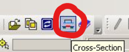

>참고 자료
>
>교수님 강의 자료

flipflop는 클락 주기에 따라 값이 변한다. latch는 클락이 high일 때는 계속 변한다. flipflop은 올라간 순간에 값을 저장한다. 

다음은 D flip flop이 clk이 high가 되는 순간에 값을 저장하는 것을 보여준다.


<center></center>

다음은 latch 두 개로 만든 D flip flop이다.

<center></center>

다음은 D flipflop의 작동이다.

<center></center>


Race Condition

flipflop에 같은 클럭을 준다면 상관이 없지만 회로의 특성상,같은 클럭이라 할지라도 두 flipflop사이의 거리가 멀 경우 기생캡이 생기고 딜레이가 발생할 수 있다. 

<center></center>

그래서 보통은 shift registor를 설계할 때 붙여준다. 

Pipeline 설계를 할 경우에는 멀리 떨어뜨려야 하는 상황이 생기는데, 이때는 위에서 아래로 진행되는 파이프라인이라면 클락을 아래부터 위로 주면서 문제를 해결할 수 있다.

혹은 overlap되지 않도록 클럭을 두개 쓰는 방법도 있다. 하지만 느려지는 문제가 있어 회사에서도 안 쓰고 우리도 안 쓸거다.

------

Gate Layout

레이아웃을 설계할 때, 게이트끼리 서로 잘 붙게 설계해야 하고, 라이브러리를 만들어야한다. 그래서 vdd끼리 붙어야 되고 변수끼리 붙어야 한다.

다음은 인버터 레이아웃의 예시이다.

<center></center>

well tap은 여기 substrate 자체가 vdd라는 의미이다. 위와 아래의 차이는 밑은 p type이고 위는 n type n-well이다. 웨이퍼 자체는 p type이란 의미이다. 그래서 위는 pmos이고 아래는 nmos다.

다음은 NAND 레이아웃의 예시이다.


------

Layout 툴 사용

우선 기본 창에서 ledit을 사용할 폴더를 만들어준다.

```cmd
mkdir ledit_lay
cd ledit_lay
ledit &
```

bindkey 설정하는 법은 이전 sedit에서 설정하는 방법과 같다.

시작할 때 file>new>design을 통해 내 라이브러리 칸을 만들 수 있다. <center></center>

여기서 openacess는 여러명의 사용자가 공유하며 만들 수 있고 TDB는 나만 볼 수 있는 layout이다. TDB로 만들어 주면 된다.

그 다음에는 라이브러리를 추가해 줄 것이다.

<center></center>

mylay가 있는 부분에 마우스 우클릭 add library에서 generic_250nm_testsetup.tdb파일을 가져오면 된다. 그러면 nmos나 pmos등 소자를 쓸 수 있다.

내 라이브러리에 셀을 하나 만들고 nmos를 가져오자. 그러면 다음과 같은 창이 뜬다.

<center></center>

사이즈를 조절할 수 있고, connect gate는 안 하는게 맞다. 라고 하심. 물론 나중에 바꿀 수도 있다 함. 

connect sd는 contect를 붙일거냐 말거냐인데 noneg하면 비어있는게 만들어지고, drain이냐 source냐, 아니면 둘다 뚫냐의 차이. 근데 다 만들어 놓고 봤는데 육안으로 구별은 되지 않았다.

그 다음에 tap은 body contect인데 nmos의 경우는 밑에 두고 pmos의 경우는 위에 둔다. bottom으로 두면 된다. 그렇게 설정을 끝내고 나면 다음과 같은 nmos layout을 볼 수 있다.

<center></center>

그리고 이 레이아웃에 쓰인 것들 별로 보고싶을 때는 layer palette를 확인하면 된다.

<center></center>

해당 소자에 선글라스 부분을 클릭하면 그 layout을 안 볼 수 있다.

다음에 확인할 기능은 cross section이다. 

<center></center>

저 버튼을 누르면 다음과 같은 창이 나온다

<center></center>

여기서 xst파일을 찾아준 후pick으로 단면도를 볼 위치를 지정해주면 다음과 같은 창이 아래에 뜬다.

<center></center>

공정 과정을 차례대로 보여주는데 내 툴에서는 오류가 발생한 상황이다.

