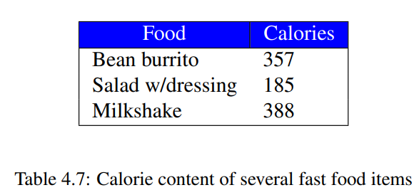

>참고 자료 [Fundamentals of C++ Programming](https://www.dbooks.org/fundamentals-of-c-programming-1201/), 
>
>[cppreference.com](https://en.cppreference.com/w/)
>
>교수님 강의자료

cin 은 추출연산자 >>를 사용. 키보드에서 입력한 데이터를 변수로 옮긴다. 그래서 cin의 오른쪽에 수식은 올 수 없고(지금까지 배운 내용으로는) 변수만 올 수 있다. 실행시 cmd창에서 실행자의 입력을 기다린다. 입력하고 엔터를 누르면 완료된다.

```c++
#include <iostream>
int main() {
    double degreesF, degreesC; 
    std::cout << "Enter the temperature in degrees F: ";
    std::cin >> degreesF;
    degreesC = 5 / 9 * (degreesF - 32);
    // 5 / 9 → zero
    std::cout << degreesC << '\n';
}
```

```cmd
Enter the temperature in degrees F: 212
0 (수정 전)
Enter the temperature in degrees F: 212
100 (수정 후)
Enter the temperature in degrees F: 100
37.7778
Enter the temperature in degrees F: 30
-1.11111
```

위는 화씨온도를 섭씨온도로 바꾸는 프로그램이다. 여기서 하나 문제가 이있다. 화씨를 섭씨로 바꾸는 공식에서 5 / 9는 정수 나누기 정수로 결과는 정수가 된다. 따라서 0 이되고 결과는 항상 0이 되는 문제가 발생한다. 이는 5.혹은 9.으로 바꾸면 해결된다. 

```c++
#include <iostream>
int main() {
    int hours, minutes, seconds;
 
    std::cout << "Please enter the number of seconds:";
    std::cin >> seconds;
 
    hours = seconds / 3600;
    seconds = seconds % 3600;
    minutes = seconds / 60;
    seconds = seconds % 60;
    std::cout << hours << " hr, " << minutes << " min, " << seconds << " sec\n";
}
```

```cmd
Please enter the number of seconds:6000
1 hr, 40 min, 0 sec
Please enter the number of seconds:2500
0 hr, 41 min, 40 sec 
Please enter the number of seconds:58
0 hr, 0 min, 58 sec

```

위는 주어진 초를 시, 분, 초로 바꿔주는 프로그램이다.

1시간은 60분이고 3600초이다. 따라서 입력 받은 초에서 시간만 뽑아내고 싶다면 3600으로 나눠주면 얻을수 있다. 

이제 시에 해당하는 부분을 바꾸고 남은 부분만 남긴 값을 %나머지 연산자를 활용해 seconds에 대입한다.

1분은 60초이므로 남은 초에서 60을 나누면 분을 뽑아낼 수 있다.

분에 쓰고 남은 부분을 %을 연산자를 활용해 seconds에 대입하면 hours, minutes, seconds에 시, 분, 초에 대한 값이 모두 입력 되었다.

따라서 출력은 시간 hr, 분 min, 초 sec로 잘 나온 것을 확인할 수 있다.

```c++
#include <iostream>
int main() {
    int x = 0, y;
    y = ++x;std::cout << x << ' ' << y << std::endl; // 1 1
    x = 0;
    y = x++;
    std::cout << x << ' ' << y << std::endl; // 1 0
}
```

여기서는 전위 증가연산자와 후위 증가연산자를 보여주고 있다. 둘은 사이드 이펙트가 같다. 1증가. 하지만 결과에는 차이가 있는데 ++x는 증가 후의 값이, x++는 증가 전의 값이 결과이다.

하지만 이들은 다음과 같은 식으로는 사용할 수 없다. 컴파일러마다 정의가 안 내려져 있어 다른 값이 나올 수 있다.

```c++
i = i++ + 2; 
i = ++i + i++; 
std::cout << i << i++; 
a[i] = i++; 
n = ++i + i; 
```

------

연산에는 사칙연산 뿐 아니라 bitwise연산도 있다.

&, |, ^, ~, >>, << 

```c++
#include <cstdint>
#include <bitset>
int main() {
    int8_t x = 0b11111111, y = 0b01111010;
 
    std::cout << std::bitset<8>(x & y) << std::endl; // 01111010
    std::cout << std::bitset<8>(x | y) << std::endl; // 11111111
    std::cout << std::bitset<8>(~(x & y)) << std::endl; // 10000101
    std::cout << std::bitset<8>(x ^ y) << std::endl; // 10000101
    std::cout << std::bitset<8>(y << 1) << std::endl; // 11110100
    std::cout << (int)y << " " << (int)(y << 1) << " " << (int)(y >> 1) << std::endl; // 122 244 61
}
// std::bitset: the class template bits
```

위는 bitwise연산에 대한 예시 코드이다.

------

스테틱 케스팅 c++타입은 여러개 있는데 컴파일 시간을 명확하게 정해야한다. 

```c++
#include <iostream>
int main() {
    int x = 5;
std::cout << static_cast<double>(x) / 2 //2.5
    << ' ' << static_cast<double>(x / 2); //2
}
```

여기서는 x가 바뀌는게 아니다. 결과가 double 타입으로 바뀌는 것이다. 따라서 위에서는 결과가 실수 5가 되어 출력이 2.5고, 아래는 결과가 2가 되어 실수 2가 출력이 되는 것이다.

------

overflow

```c++
#include <iostream>
int main() {
 short si = 0x7FFF;
 std::cout << si++ << ' '; // 32767
 std::cout << si-- << ' '; // -32768
 std::cout << si << std::endl; // 32767
 
 unsigned short usi = 0xFFFF;
 std::cout << usi++ << ' '; // 65535
 std::cout << usi-- << ' '; // 0
 std::cout << usi << std::endl; // 65535
}
```

컴퓨터에 저장공간에는 한계가 있고, 저장하는 값의 범위도 유한하다. 그래서 저장할 수 있는 값을 넘어버리면 overflow가 발생한다. 위의 코드가 그걸 잘 보여준다.

------

set precision

```c++
#include <iostream>
#include <iomanip>
int main() {
 float x = 0.1;
 std::cout << std::setprecision(25) << x << std::endl;
 // 0.1000000014901161193847656
 std::cout << std::setprecision(25) << 
 0.1 + 0.1 + 0.1 - 0.3 << std::endl;
 // 5.551115123125782702118158e-17
}
```

이는 자리수를 출력해 주는데 steprecision(25)는 25자리까지 출력한다.

컴퓨터는 실수를 저장할 때 2진수로 저장한다. 그로인해 오차가 발생한다. 예를들어 10진수 0.1을 이진수로 저장하면 순환소수가 된다. 

이 오차를 해결하기 위해서는 수치해석학이 필요하다. 입실론 뭐 그런게 있는데, 있다는 것만 알면 된다.

------

수업 내용이 교재 4단원까지 나갔으므로 교재의 exercises를 풀어보자.

4.12 Exercises

1. Is the literal 4 a valid C++ expression?

   답.

   유효함. integer literal.

2. Is the variable x a valid C++ expression?

   답.

   변수x는 유효한 표현식이다.

3. Is x + 4 a valid C++ expression?

   답.

   가능하다. 변수 x가 저장하고 있는 값과 4를 더해준다. 단, x가 string일 때는 정의되지 않는다.

4. What affect does the unary + operator have when applied to a numeric expression?

   답.

   아무런 효과가 없다. 숫자 앞에 붙여 사용 가능한데 실질적인 효과는 없다.

5. Sort the following binary operators in order of high to low precedence: +, -, *, /, %, =.

   답.

   */%가 우선 그 다음이 +-이다.

6. Write a C++ program that receives two integer values from the user. The program then should print the sum (addition), difference (subtraction), product (multiplication), quotient (division), and remainder after division (modulus). Your program must use only integers. 
   A sample program run would look like (the user enters the 10 and the 2 after the colons, and the program prints the rest):

  ```
Please enter the first number: 10
Please enter the second number: 2
10 + 2 = 12
10 - 2 = 8
10 * 2 = 20
10 / 2 = 5
10 % 2 = 0
  ```

  Can you explain the results it produces for all of these operations?

  답.

  각각 더하기, 빼기, 곱하기, 나누기, 나머지의 결과이다. 그리고 정수에서 정수를 연산했으므로 정수가 결과로 나온다.

7. Write a C++ program that receives two double-precision floating-point values from the user. The program then should print the sum (addition), difference (subtraction), product (multiplication), and quotient (division). Your program should use only integers.
   A sample program run would look like (the user enters the 10 and the 2.5 after the colons, and the program prints the rest):

  ```
Please enter the first number: 10
Please enter the second number: 2.5
10 + 2.5 = 12.5
10 - 2.5 = 7.5
10 * 2.5 = 25
10 / 2.5 = 4
  ```

  Can you explain the results it produces for all these operations? What happens if you attempt to compute the remainder after division (modulus) with double-precision floating-point values?

  답.

  각각 더하기,빼기, 곱하기, 나누기의 결과이다. 정수와 실수연산이므로 실수로 정수는 실수로 변환되어 결과는 실수가 출력된다. 

  나머지 연산에 들어가는 피연산자는 정수여야 하므로 오류가 발생한다.

8. Given the following declaration:

  ```
int x = 2;
  ```

  Indicate what each of the following C++ statements would print.
  (a) std::cout << "x"<< '\n';
  (b) std::cout << 'x'<< '\n';
  (c) std::cout << x << '\n';
  (d) std::cout << "x + 1"<< '\n';
  (e) std::cout << 'x'+ 1 << '\n';
  (f) std::cout << x + 1 << '\n';

  답.

  ```cmd
x #문자열이므로 그대로 출력
x #문자이므로 그대로 출력
2 #변수 x에 대한 결과이므로 2를 출력
x + 1 #문자열이므로 x + 1을 출력
121 #x는 문자지만 ASCII 120번의 값을 갖고 +1과 연산하는 과정에서 정수로 처리됨. 따라서 121을 출력
3 #2+1을 의미하므로 3을 출력
  ```

9. Sort the following types in order from narrowest to widest: int, double, float, long, char.

   답.

   메모리 크기가 좁은거에서 넓은 순으로 정렬하면

   char >> int >> long >> float >> double

   순서대로 1byte, 4byte, 4byte(시스템에 따라서는 8byte), 4byte, 8byte이다. 

10. Given the following declarations:

    ```
    int i1 = 2, i2 = 5, i3 = -3;
    double d1 = 2.0, d2 = 5.0, d3 = -0.5;
    ```

    Evaluate each of the following C++ expressions.
    (a) i1 + i2
    (b) i1 / i2
    (c) i2 / i1
    (d) i1 * i3
    (e) d1 + d2
    (f) d1 / d2
    (g) d2 / d1
    (h) d3 * d1
    (i) d1 + i2
    (j) i1 / d2
    (k) d2 / i1
    (l) i2 / d1
    (m) i1/i2*d1
    (n) d1*i1/i2
    (o) d1/d2*i1
    (p) i1*d1/d2
    (q) i2/i1*d1
    (r) d1*i2/i1
    (s) d2/d1*i1
    (t) i1*d2/d1

    ```c++
    #include <iostream>
    
    int main() {
    	int i1 = 2, i2 = 5, i3 = -3;
    	double d1 = 2.0, d2 = 5.0, d3 = -0.5;
    
    	std::cout << i1 + i2 << "\n";
    	std::cout << i1 / i2 << "\n";
    	std::cout << i2 / i1 << "\n";
    	std::cout << i1 * i3 << "\n";
    	std::cout << d1 + d2 << "\n";
    	std::cout << d1 / d2 << "\n";
    	std::cout << d2 / d1 << "\n";
    	std::cout << d3* d1 << "\n";
    	std::cout << d1 + i2 << "\n";
    	std::cout << i1 / d2 << "\n";
    	std::cout << d2 / i1 << "\n";
    	std::cout << i2 / d1 << "\n";
    	std::cout << i1 / i2 * d1 << "\n";
    	std::cout << d1* i1 / i2 << "\n";
    	std::cout << d1 / d2 * i1 << "\n";
    	std::cout << i1* d1 / d2 << "\n";
    	std::cout << i2 / i1 * d1 << "\n";
    	std::cout << d1* i2 / i1 << "\n";
    	std::cout << d2 / d1 * i1 << "\n";
    	std::cout << i1* d2 / d1 << "\n";
    }
    ```

    ```cmd
    7 #정수 더하기 정수이므로 정수가 출력
    0 #정수 나누기 정수로 정수 0이 출력
    2 #정수 나누기 정수 이므로 5/2의 몫인 2가 출력
    -6 #정수 곱하기 정수이므로 정수 -6이 출력
    7 #실수 더하기 실수이므로 실수 7이 출력
    0.4 #실수 나누기 실수이므로 실수 0.4가 출력
    2.5 #실수 나누기 실수이므로 실수 2.5가 출력
    -1 #실수 곱하기 정수이므로 정수가 실수로 변환되어 실수 -1이 출력
    7 #실수 더하기 정수이므로 정수가 실수로 변환되어 실수 7이 출력
    0.4 #정수 나누기 실수이므로 정수가 실수로 변환되어 실수 0.4가 출력
    2.5 #정수 나누기 정수 곱하기 실수이므로 정수가 실수로 변환되어 2/5*
    2.5 #
    0 #앞에 정수나누기 정수의 결과로 2/5가 0이 되므로 출력은 0이 나온다
    0.8 #
    0.8 #
    0.8 #
    4 #정수 나누기 정수 곱하기 실수이므로 앞의 계산은 정수. 따라서 정수2와 실수2를 곱한다. 실수 4를 출력
    5 #실수 곱하기 정수 나누기 정수이므로 정수가 실수로 변환되어 실수 5를 출력
    5 #실수 나누기 실수 곱하기 정수이므로 정수가 실수로 변환되어 실수 5를 출력
    5 #정수 곱하기 실수 나누기 실수이므로 정수가 실수로 변환되어 2*5/2.0, 실수 5를 출력
    ```

    

11. What is printed by the following statement:

    ```
    std::cout << /* 5 */ 3 << '\n';
    ```

    답.

    5는 주석처리되어 정수 3이 출력된다.

12. Given the following declarations:

    ```
    int i1 = 2, i2 = 5, i3 = -3;
    double d1 = 2.0, d2 = 5.0, d3 = -0.5;
    ```

    Evaluate each of the following C++ expressions.
    (a) i1 + (i2 * i3)
    (b) i1 * (i2 + i3)
    (c) i1 / (i2 + i3)
    (d) i1 / i2 + i3
    (e) 3 + 4 + 5 / 3
    (f) (3 + 4 + 5) / 3
    (g) d1 + (d2 * d3)
    (h) d1 + d2 * d3
    (i) d1 / d2 - d3
    (j) d1 / (d2 - d3)
    (k) d1 + d2 + d3 / 3
    (l) (d1 + d2 + d3) / 3
    (m) d1 + d2 + (d3 / 3)
    (n) 3 * (d1 + d2) * (d1 - d3)

    답.

    ```c++
    #include <iostream>
    
    int main() {
    	int i1 = 2, i2 = 5, i3 = -3;
    	double d1 = 2.0, d2 = 5.0, d3 = -0.5;
    
    	std::cout << i1 + (i2 * i3) << '\n';
    	std::cout << i1 * (i2 + i3) << '\n';
    	std::cout << i1 / (i2 + i3) << '\n';
    	std::cout << i1 / i2 + i3 << '\n';
    	std::cout << 3 + 4 + 5 / 3 << '\n';
    	std::cout << (3 + 4 + 5) / 3 << '\n';
    	std::cout << d1 + (d2 * d3) << '\n';
    	std::cout << d1 + d2 * d3 << '\n';
    	std::cout << d1 / d2 - d3 << '\n';
    	std::cout << d1 / (d2 - d3) << '\n';
    	std::cout << d1 + d2 + d3 / 3 << '\n';
    	std::cout << (d1 + d2 + d3) / 3 << '\n';
    	std::cout << d1 + d2 + (d3 / 3) << '\n';
    	std::cout << 3 * (d1 + d2) * (d1 - d3) << '\n';
    }
    ```

    ```cmd
    -13
    4
    1
    -3
    8
    4
    -0.5
    -0.5
    0.9
    0.363636
    6.83333
    2.16667
    6.83333
    52.5
    ```

13. How are single-line comments different from block comments?

    답.

    //는 줄끝까지 주석처리.

    /**/는 감싼 부분 주석처리

14. Can block comments be nested?

    답. 

    중첩 안된다. /\*/\*\*/\*/이렇게 되어있으면 첫번쨰 */에서 주석이 종료된다.

15. Which is better, too many comments or too few comments?

    답.

    적절한게 좋다. 너무 적으면 설계이유가 어렵고, 너무 많으면 코드가 복잡해보이고 가독성이 떨어짐.

16. What is the purpose of comments?

    답.

    코드 작성이유를 표시 가능하고 코드 수정, 디버깅시 유용하고, 코드를 비활성화해 테스트나 디버깅 과정에서 일시적으로 실행하지 않도록 한다.

17. The programs in Listing 3.4 (variable.cpp), Listing 4.4 (reformattedvariable.cpp), and Listing 4.5 (reformattedvariable2.cpp) compile to the same machine code and behave exactly the same. What makes one of the programs clearly better than the others?

    답.

    가독성 차이. 코딩하는 사람에게 보기 편하도록 쓰는것도 중요하다. 그래서 3.4가 제일 낫다.

18. Why is human readability such an important consideration?

    답.

    유지보수, 협업, 디버깅, 개발은 사람이 하는거니깐 인간의 가독성은 중요하다.

19. Consider the following program which contains some errors. You may assume that the comments within the program accurately describe the program’s intended behavior.

    ```c++
    #include <iostream>
    int main() {
        int n1, n2, d1; // 1
        // Get two numbers from the user
        cin << n1 << n2; // 2
        // Compute sum of the two numbers
        std::cout << n1 + n2 << '\n'; // 3
        // Compute average of the two numbers
        std::cout << n1+n2/2 << '\n'; // 4
        // Assign some variables
        d1 = d2 = 0; // 5
        // Compute a quotient
        std::cout << n1/d1 << '\n'; // 6
        // Compute a product
        n1*n2 = d1; // 7
        // Print result
        std::cout << d1 << '\n'; // 8
    }
    ```

    For each line listed in the comments, indicate whether or not a compile-time, run-time, or logic error is present. Not all lines contain an error.

    답.

    cin << n1 << n2; // 

    2 cin에 사용되는 연산자는 >>이고 std없이 cin 단독으로 사용했으므로 에러가 발생한다.

    d1 = d2 = 0; // 5 

    d2는 변수가 선언되지 않았다.

    std::cout << n1/d1 << '\n'; // 6

    d1에 0이 대입되었고 0으로 나눌 수 없으므로 에러가 발생한다.

    n1*n2 = d1; // 7

    수식은 대입연산자의 왼쪽에 올 수 없다. 

20. What distinguishes a compiler warning from a compiler error? Should you be concerned about warnings? Why or why not?

    답.

    error는 실행 파일을 생성할 수 없고, warning은 컴파일은 되지만 잠재적으로 문제가 될 수 있는 부분디다. 잠재적인 버그나 코드 품질문제가 발생할 수 있어 warning또한 유심히 봐야한다.

21. What are the advantages to enhancing the warning reporting capabilities of the compiler?

    답.

    잠재적 문재 조기발견, 코드품질 향상, 유지보수 용이, 개발 생산성 증대, 표준 준수 및 코드 일관성 강화 라고함.

22. Write the shortest way to express each of the following statements.
    (a) x = x + 1;
    (b) x = x / 2;
    (c) x = x - 1;
    (d) x = x + y;
    (e) x = x - (y + 7);
    (f) x = 2*x;
    (g) number_of_closed_cases = number_of_closed_cases + 2*ncc;

    답.

    ```c++
    x++; //(a)
    x /= 2; //(b)
    x--; //(c)
    x += y; //(d)
    x -= (y + 7); //(e)
    x *= 2; //(f)
    number_of_closed_cases += 2*ncc
    ```

23. What is printed by the following code fragment?

    ```
    int x1 = 2, y1, x2 = 2, y2;
    y1 = ++x1;
    y2 = x2++;
    std::cout << x1 << " " << x2 << '\n';
    std::cout << y1 << " " << y2 << '\n';
    ```

    Why does the output appear as it does?

    답.

    ```cmd
    3 3
    3 2
    ```

    ++x1는 x1의 값이 증가해 3이 된 후 y1에 대입되어 3 3이 결과로 나온다.

    x2++는 x2가 y2에 대입된 후 1이 증가해 3 2가 결과로 나온다.

24. Consider the following program that attempts to compute the circumference of a circle given the radius entered by the user. Given a circle’s radius, r, the circle’s circumference, C is given by the formula:

    <center>

$$
C = 2\pi r
$$

</center>

```c++
#include <iostream>
int main() {
    double C, r;
    const double PI = 3.14159;
    // Formula for the area of a circle given its radius    
    C = 2*PI*r;
    // Get the radius from the user
    cout >> "Please enter the circle's radius: ";
    cin << r;
    // Print the circumference
    std::cout << "Circumference is " << C << '\n';
}
```

(a) The compiler issues a warning. What is the warning?

답.

r이 초기화되지 않고 사용되었다.

(b) The program does not produce the intended result. Why?

답.

cout과 cin의 연산자가 잘못되었다. 그리고 std를 안 붙여 사용해 문제가 생겼다.

(c) How can it be repaired so that it not only eliminates the warning but also removes the logic error?

답.

r 초기화, std::cout <<, std::cin>> 로 수정.

25. In mathematics, the midpoint between the two points (x1, y1) and (x2, y2) is computed by the formula


$$
(\frac {x_1 + x_2}{2},\frac{y_1+y_2}{2})
$$

Write a C++ program that receives two mathematical points from the user and computes and prints their midpoint.
A sample run of the program produces

```cmd
Please enter the first point: (0,0)
Please enter the second point: (1,1)
The midpoint of (0,0) and (1,1) is (0.5,0.5)
```

The user literally enters "(0,0)" and "(1,1)" with the parentheses and commas as shown. To see how to do this, suppose you want to allow a user to enter the point (2.3,9), assigning the x component of the point to a variable named x and the y component to a variable named y. You can add the following code fragment to your program to achieve the desired effect:

```c++
double x, y;
char left_paren, comma, right_paren;
std::cin >> left_paren >> x >> comma >> y >> right_paren;
```

If the user literally types (2.3,9), the std::cin statement will assign the ( character to the variable left_paren. It next will assign 2.3 to the variable x. It assigns the , character to the variable named comma, the value 9 to the y variable, and the ) character to the right_paren variable. The left_paren, comma, and right_paren variables are just placeholders for the user’s input and are not used elsewhere within the program. In reality, the user can type in other characters in place of the parentheses and comma as long as the numbers are in the proper location relative to the characters; for example, the user can type *2.3:9#, and the program will interpret the input as the point (2.3,9).

답.

```c++
#include <iostream>

int main() {
	double x1, y1, x2, y2;
	char left_paren, comma, right_paren;

	std::cout << "Please enter the first point:";
	std::cin >> left_paren >> x1 >> comma >> y1 >> right_paren;
	std::cout << "Please enter the second point:";
	std::cin >> left_paren >> x2 >> comma >> y2 >> right_paren;

	double x_mid = (x1 + x2) / 2;
	double y_mid = (y1 + y2) / 2;

	std::cout << "The midpoint of ( " << x1 << ","<< y1 <<") and (" << x2 << "," << y2 <<") is (" 
		<< x_mid << "," << y_mid <<")";

}
```

결과

```cmd
Please enter the first point:(2,11)
Please enter the second point:(3,4.4)
The midpoint of ( 2,11) and (3,4.4) is (2.5,7.7)
```

26. Table 4.7 lists the Calorie contents of several foods. Running or walking burns off about 100 Calories per mile. Write a C++ program that requests three values from the user: the number of bean burritos, salads, and shakes consumed (in that order). The program should then display the number of miles that must be run or walked to burn off the Calories represented in that food. The program should run as follows (the user types in the 3 2 1):

    ```cmd
    Number of bean burritos, bowls of salad, and milkshakes eaten? 3 2 1
    You ingested 1829 Calories
    You will have to run 18.29 miles to expend that much energy
    ```

    Observe that the result is a floating-point value, so you should use floating-point arithmetic to compute the answers for this problem.

    <center></center>

답.

```c++
#include <iostream>

#define bean_burritos 357
#define bowls_of_salad 185
#define milkshakes 388
int main() {
	int num_burritos;
	int num_salad;
	int num_milkshakes;

	std::cout << "Number of bean burritos, bowls of salad, and milkshakes eaten?";
	std::cin >> num_burritos  >> num_salad >> num_milkshakes;

	int calories = num_burritos * bean_burritos + num_salad * bowls_of_salad + num_milkshakes * milkshakes;
	std::cout << "You ingested "<< calories << "Calories" << "\n";
	double miles = calories / 100.;
	std::cout << "You will have to run " << miles << "miles to expend that much energy";
}
```


```cmd
Number of bean burritos, bowls of salad, and milkshakes eaten?1
2
3
You ingested 1891Calories
```

