>참고 자료 : 교수님 강의 자료
>
>사용 툴 : Quartus, mobaxterm

Sequential logic

간단하게 flip flop혹은 latch를 활용한 로직이다. 이는 현재의 입력과 이전의 상태에 영향을 받는 것을 의미한다. 다음은 sequential logic의 간단한 구조이다. 말 한것과 같이 flipflop한 개와 combinational logic 한 개로 이루어져 있다.

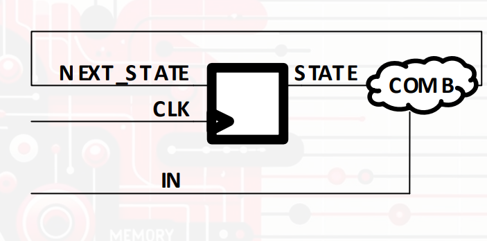

latch의 경우에는 clk이 1인 상태일 때 hold하기 때문에 데이터를 저장하는 시간은 0일때 만이다. flip flop은 clk가 posedge일 때 hold 하기 때문에 데이터를 저장하는 시간은 1과 0의 상태 둘 다 보존할 수 있어 latch의 두배정도가 된다. latch에 단점만 있는것은 아니다. flip flop은 latch 2개로 만들기 때문에 사이즈가 2배 차이난다. 

Combinational logic

이는 오로지 현재의 입력에만 영향을 받는 로직으로 메모리가 존재하지 않는다. 출력이 즉각적으로 업데이트 된다.

sequantial logic을 만들때는 reset이 존재하는데 reset을 clk과 동기화하냐, 비동기화하냐에 따라 다르게 설계할 수 있다. 

Synchronos reset

```verilog
//Synchronous Reset
always @(posedge CLK) begin
    if (!RSTN) // Reset checked on clock edge
        STATE <= IDLE; // Reset state
    else
        STATE <= NEXT_STATE; // Normal state transition
end
always@(*) begin
    NEXT_STATE = STATE & IN;
end
```

@(sensitivity list) @안에는 sensitivity list를 적어주는 것이다. 이는 always문을 사용할 때 안의 값이 변하면 always문을 실행한다는 의미이다. combinational logic의 경우에는 값이 변하면 변하는것이기 때문에 *을 써주지만, sequential logic은 clk에 영향을 받기 때문에 posedge clk를 넣어준다. synchronous reset은 clk과 동기화 됐기 때문에 clk만 senstivity list 에 넣어준다. 

Asynchronos reset

```verilog
//Asynchronous Synchronous Reset
always @(posedge CLK or negedge RSTN) begin
    if (!RSTN) // Reset checked on clock edge
        STATE <= IDLE; // Reset state
    else
        STATE <= NEXT_STATE; // Normal state transition
end
always@(*) begin
    NEXT_STATE = STATE & IN;
end
```

asynchronous는 reset을 clk와 동기화하지 않고 사용하는 것이다. 

------

Blocking & Non-Blocking statement

```verilog
module LAB01;
	reg [3:0] A;
	reg [3:0] B;
	reg [3:0] C;
	reg [3:0] D;
	initial begin
		A = 1;
		B = 2;
		C = 3;
		D = 4;
		#(10);
		B = A;
		C = B;
		D = C;
		#(10);
		$finish;
	end
endmodule
```

결과

```
A 1
B 2 >>> 1
C 3 >>> 1
D 4 >>> 1
```

전부 blocking statement이기 때문에 순차적으로 진행되어 모두 결과가 1이 되었다.

```verilog
module LAB02;
    reg [3:0] A;
    reg [3:0] B;
    reg [3:0] C;
    reg [3:0] D;
    initial begin
        A = 1;
        B = 2;
        C = 3;
        D = 4;
        #(10);
        B <= A;
        C = B;
        D = C;
        #(10);
        $finish;
    end
endmodule
```

결과

```
A 1
B 2 >>> 1
C 3 >>> 2
D 4 >>> 2
```

B<=A만 non-blocking statement이므로 우선 C=B, 그 다음은 D=C가 실행되며 C와 D는 2가 되고 B는 1이 된다.

```verilog
module LAB03;
    reg [3:0] A;
    reg [3:0] B;
    reg [3:0] C;
    reg [3:0] D;
    initial begin
        A = 1;
        B = 2;
        C = 3;
        D = 4;
        #(10);
        B = A;
        C <= B;
        D = C;
        #(10);
        $finish;
    end
endmodule
```

결과

```
A 1
B 2 >>> 1
C 3 >>> 1
D 4 >>> 3
```

B와 C가 먼저 순차적으로 진행되어 B=1, D=3이 된다. 이후 C에 B가 대입되어 B=1이 된다.


------

CLOCK GEN

FPGA의 CLK를 사용하고, 이를 사용해 1초마다 깜빡이는 기능을 올려볼 것이다.

```verilog
module CLKGEN1K (/*AUTOARG*/
   // Outputs
   CLK1K,
   // Inputs
   CLK50M, RSTN
   );
input CLK50M;//20ns
input RSTN;
output reg CLK1K;//1ms

reg [14:0] CNT;
always@(posedge CLK50M, negedge RSTN)begin
		if(!RSTN) begin
			CNT <= 15'd0;
			CLK1K <= 1'd0;
		end
		else begin
			CNT <= (CNT==15'd24999) ? 15'd0 : CNT + 15'd1;
			CLK1K <= (CNT==15'd24999) ? ~CLK1K : CLK1K;
		end
end
//always@(*) begin
//    NEXTCNT = (CNT == 15'd24999) ? 15'd0 : CNT + 15'd1;
//    NEXTCLK1K = (CNT == 15'd24999) ? ~CLK1K : CLK1K;
//end
    
endmodule

```

50M 클락을 사용해 1K클락을 만들고 싶다면, 20ns단위로 edge가 들어오는데 이를 카운트해서 500ns가 될 때 CLK1K값을 반전시키면 된다. 500ms를 ns로 바꾸면 500000ns이다. 클락의 주기는 20ns이기 때문에 25000을 binary로 표현해 줘야한다. $ 2^15 = 32768 $이므로 15비트만 있으면 표현해줄 수 있다. 그리고 sequantial logic과 combinational logic을 따로 만들어 줘서 코딩을 하는게 좀 더 정석적인 코딩 방법이다. 

```verilog
//'timescale 1000ns/10ns
module TB_CLKGEN1K;
   /*AUTOREGINPUT*/
   // Beginning of automatic reg inputs (for undeclared instantiated-module inputs)
   reg			CLK50M;			// To DUT of CLKGEN1K.v
   reg			RSTN;			// To DUT of CLKGEN1K.v
   // End of automatics
   /*AUTOWIRE*/
   // Beginning of automatic wires (for undeclared instantiated-module outputs)
   wire			CLK1K;			// From DUT of CLKGEN1K.v
   // End of automatics
   CLKGEN1K
     DUT
       (/*AUTOINST*/
	// Outputs
	.CLK1K					(CLK1K),
	// Inputs
	.CLK50M				(CLK50M),
	.RSTN					(RSTN));
   initial begin 
      CLK50M = 0;
      RSTN = 0;
      #(1);
      @(negedge CLK50M) RSTN = 1;
      #(3000);
      RSTN = 0;
      $finish;
   end
   always #0.01 CLK50M = ~CLK50M;
endmodule

```

1000ns 딜레이를 주고 클락이 negedge가 되는 순간에 reset 값을 업데이트 한다는 말이다. 그리고 1ms클락이 제대로 토글하는지 봐야하므로 3000정도 확인한 후 다시 리셋을 하는 것으로 설정했다.

결과

 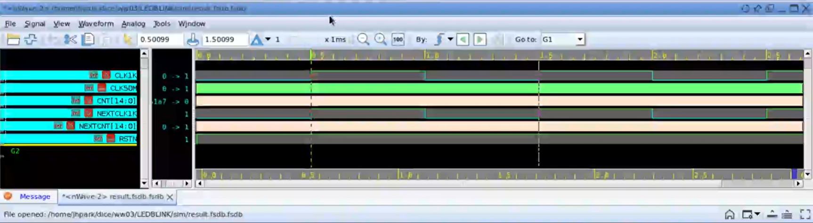

1ms 클락이 잘 자동 되는것을 확인했다.

------

LEDBLINK

하기 전, string 치환하는 방법. 텍스트 에디터.

```
:%s/AUTOINST/AINST/g
```

이는 왼쪽부터 순서대로 %s 스트링 치환을 할건데, AUTOINST를 AINST로 g global하게 바꾼다. 이러면 verilog AUTO를 돌려도 instance update를 하지 않는다.

```verilog
module LEDBLINK(/*AUTOARG*/
		// Outputs
		LED,
		// Inputs
		CLK50M, RSTN
		);
   /*AUTOINPUT*/
   // Beginning of automatic inputs (from unused autoinst inputs)
   input			CLK50M;			// To UCLKGEN of CLKGEN1K.v
   input 			RSTN;			// To UCLKGEN of CLKGEN1K.v
   wire 			CLK1K;			// From UCLKGEN of CLKGEN1K.v
   output reg 			LED;
   CLKGEN1K UCLKGEN(/*AINST*/
		    // Outputs
		    .CLK1K			(CLK1K),
		    // Inputs
		    .CLK50M		(CLK50M),
		    .RSTN			(RSTN));

   reg [8:0] 			CNT;
   
   always@(posedge CLK1K or negedge RSTN) begin
      if(!RSTN) begin
			 CNT <= 9'd0;
			 LED <= 1'd0;
      end
      else begin
			 CNT <= (CNT == 499) ? 9'd0 : CNT + 9'd1;
			 LED <= (CNT == 499) ? ~LED : LED;
      end
   end
endmodule
```

CLK1K를 사용한다. (1ms 클락)

CNT는 0.5초니까 1khz기준, 1ms이니 500ms마다 바뀌게 설정해준다. 그러면 500까지 셀 수 있어야 하므로 CNT는 9비트가 된다.

그래서 500마다 (0.5초 마다) LED가 깜빡이게 만들어줬다.

테스트벤치를 만드는 과정에서 initial begin 부분이 위의 CLKGEN과 같은 구조이므로 복사해서 가져오면 편할 것이다.

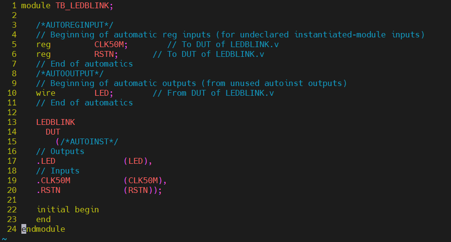

이전의 파일을 불러오려면 다음과 같이 할 수 있다.

```
:sp
```

split page를 하면 다음과 같이 된다.

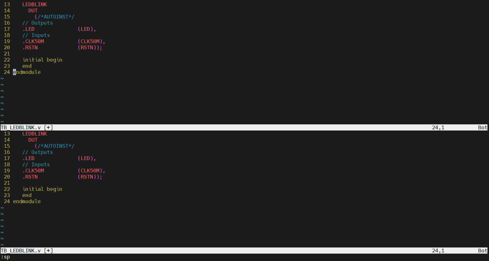

```
:e .
```

e하고 현재 폴더

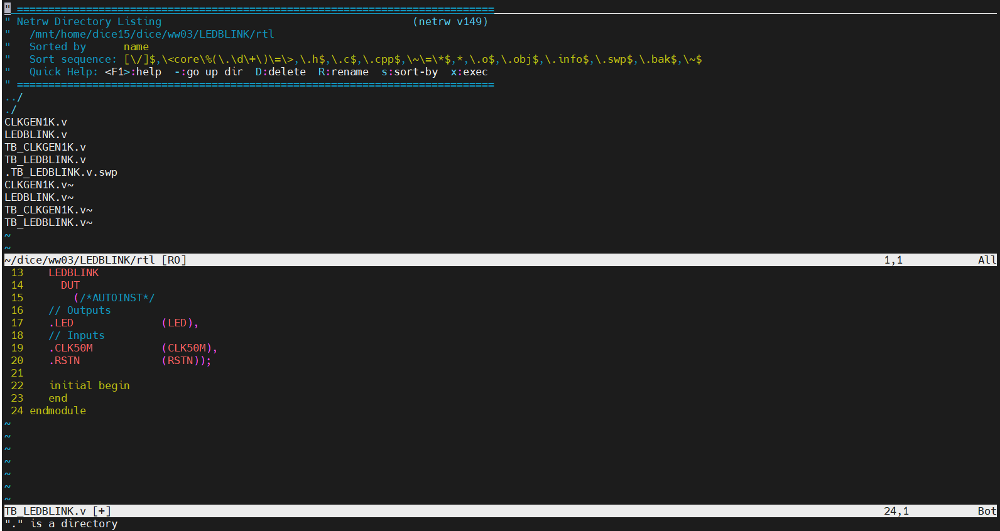

TB_CLKGEN1K.v파일에 커서를 옮기고 gf로 들어가서

```
shift + v 
y
ctrl + w + w
p
```

shift + v로 문장선택후 y로 복사를 한다. ctrl + w + w로 화면 이동을 한 후 p로 복사를 한다.

 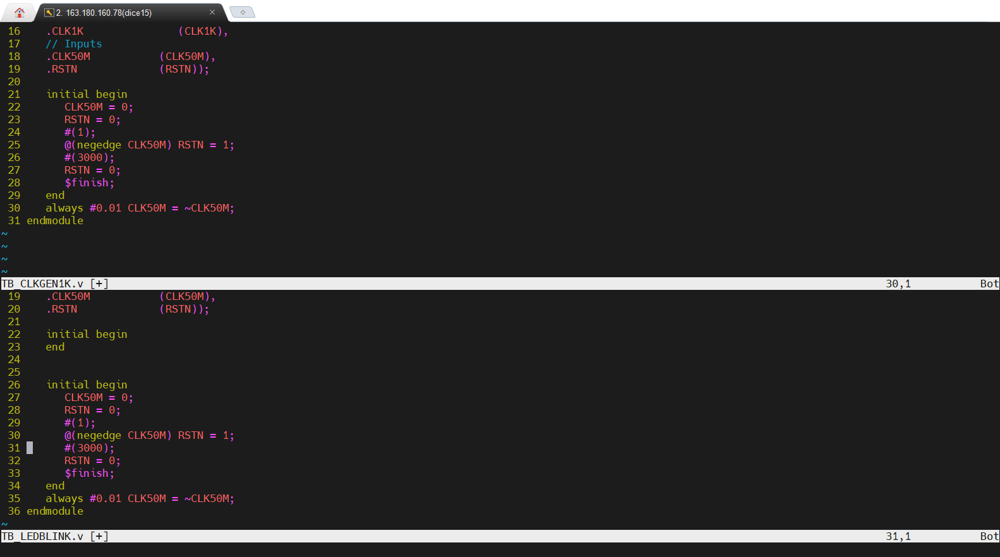

시간을 3ms가 아닌 3초를 해줘야 하니 3000에 000을 더 붙여준다.

참고로 sp는 페이지가 위아래로 분리되고 vs는 좌우로 분리된다.

그리고 폴더를 열때

```
:o filename
```

도 가능하지만 파일을 다 외울 수 없으니

```
:e .
```

을 하면 현재 폴더를 열 수 있다.


```verilog
module TB_LEDBLINK;

   /*AUTOREGINPUT*/
   // Beginning of automatic reg inputs (for undeclared instantiated-module inputs)
   reg			CLK50M;			// To DUT of LEDBLINK.v
   reg			RSTN;			// To DUT of LEDBLINK.v
   // End of automatics
   /*AUTOOUTPUT*/
   // Beginning of automatic outputs (from unused autoinst outputs)
   wire   		LED;			// From DUT of LEDBLINK.v
   // End of automatics

   LEDBLINK
     DUT
       (/*AUTOINST*/
	// Outputs
	.LED					(LED),
	// Inputs
	.CLK50M				(CLK50M),
	.RSTN					(RSTN));

   initial begin 
      CLK50M = 0;
      RSTN = 0;
      #(1);
      @(negedge CLK50M) RSTN = 1;
      #(1500000);
      RSTN = 0;
      $finish;
   end
   always #0.01 CLK50M = ~CLK50M;
endmodule
```


결과

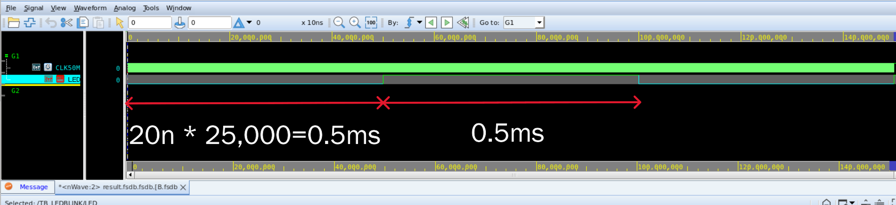

LED가 1초에 한번씩 깜빡이는 것을 확인했다.

------

LEDBLINK on FPGA

이제 만든 verilog 코드를 fpga위에 올려볼 것이다.

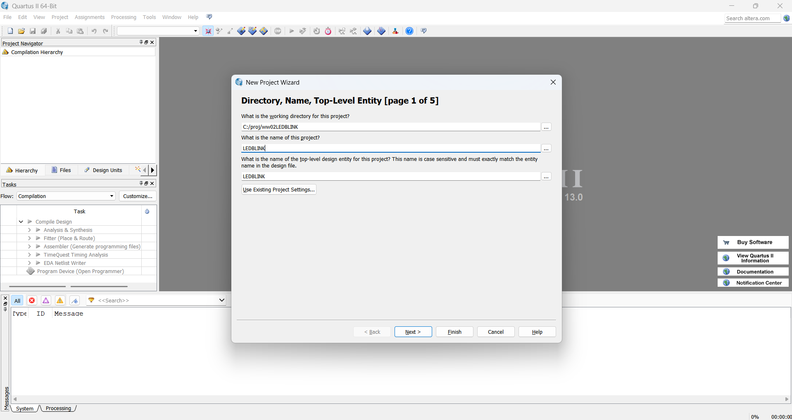

file > new > New Quartus 2 project OK 를 하면 다음과 같은 창이 나오고, 프로젝트 위치와 이름을 설정해준다.

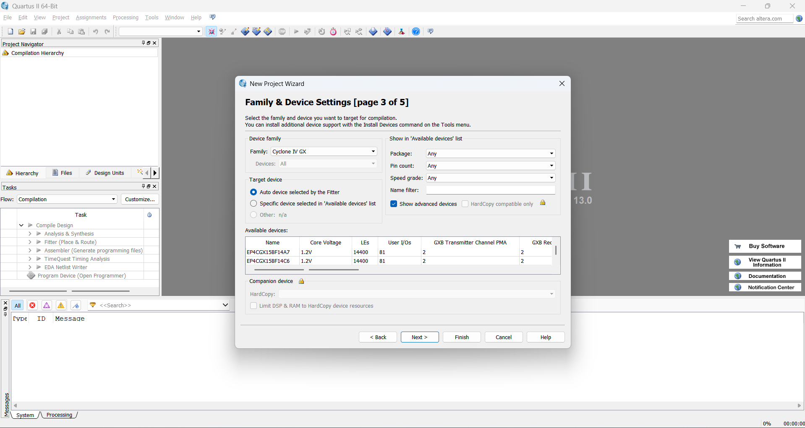

next > next를 한 후 내가 가진 보드의 사양과, 일련번호를 입력하면 된다. 그 후 finish 하면 새로운 프로젝트가 만들어진다. 

이후 proj폴더에 따로 verilog v파일을 보관할 폴더를 만들어 mobaxterm에서 만든 v파일을 옮겨준다. 

project nevigator에 files를 누른 후 가져온 v 파일들을 넣어준다.

이후 Tasks에 compile design을 눌러준다. 그러면 error 또는 warning이 나오는데 이들을 해결해야한다. 

우선 pin planner에 우리가 사용할 led와 swith의 pin number를 입력해준다. 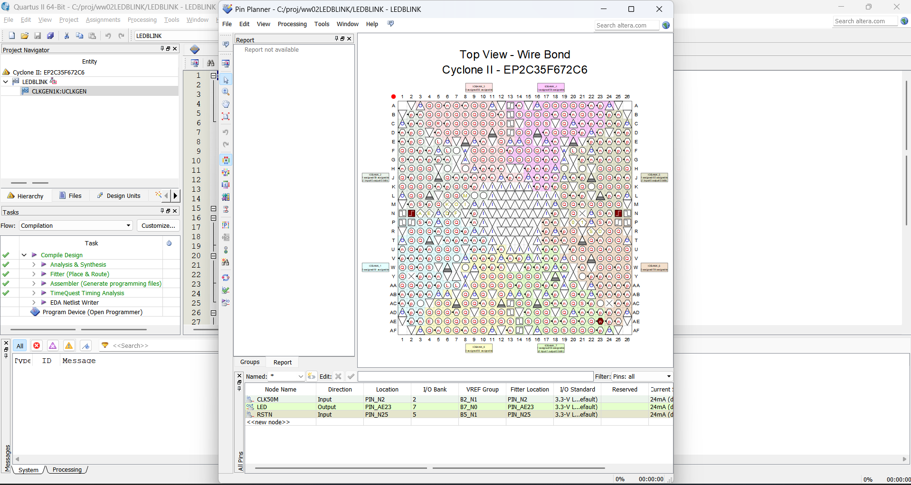

매핑을 끝낸 후 다시 컴파일하면, warning이 줄었지만, TimeQuest Timing Analyzer에 빨간 불이 들어와 있다. 이는 타이밍적으로 뭔가 부족하다는 의미고unconstrained path가 떠있고 다음과 같이 문제가 있는 부분들을 보여준다.

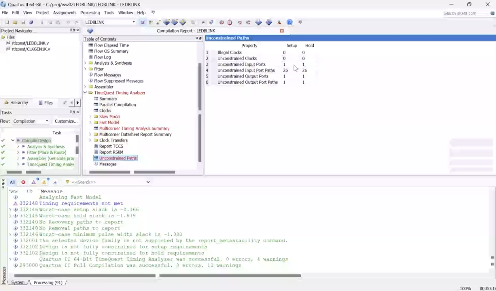

이를 해결하기 위해서는 constraint를 지정해 줘야 하는데, verilog behavior모델을 짰는데 어떤 타이밍에 작동할 것인지 등에 대한 선언을 안 해줘서 생긴 문제이다. 대부분의 constraint는 synopsys에서 만든 sdc문법을 따라간다.

assignment > timequest timing analyzer wizard에 들어간다.

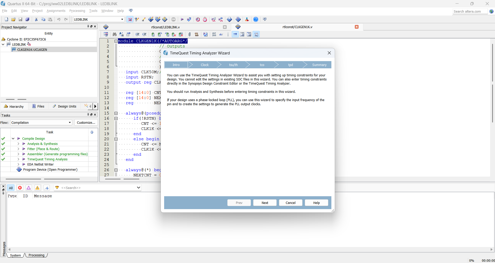

이름은 CLOCK50M, Input Pin은 CLK50M, period는 20ns, rising은 0초에서, falling은 10ns 로 설정한다. 그러면 아래에 sdc command를 자동으로 입력해준다.

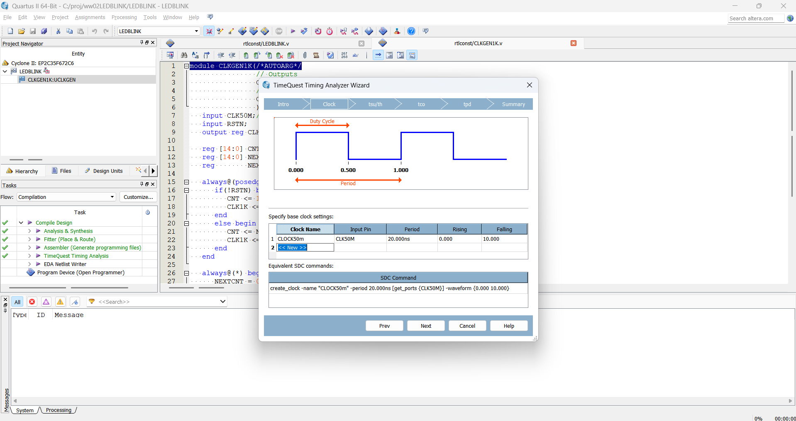

클락을 정의했으면, 그 클락과 동기화된 데이터들도 정의를 해야한다. 바깥에서 들어오고 나가는 것을 알지 못하니 정의를 해야한다. Top design에서 data port와 output port는 정의해야한다. 

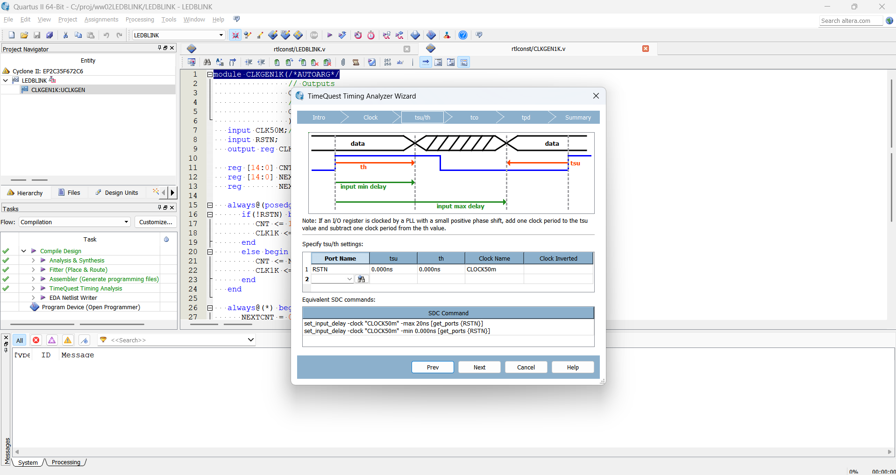

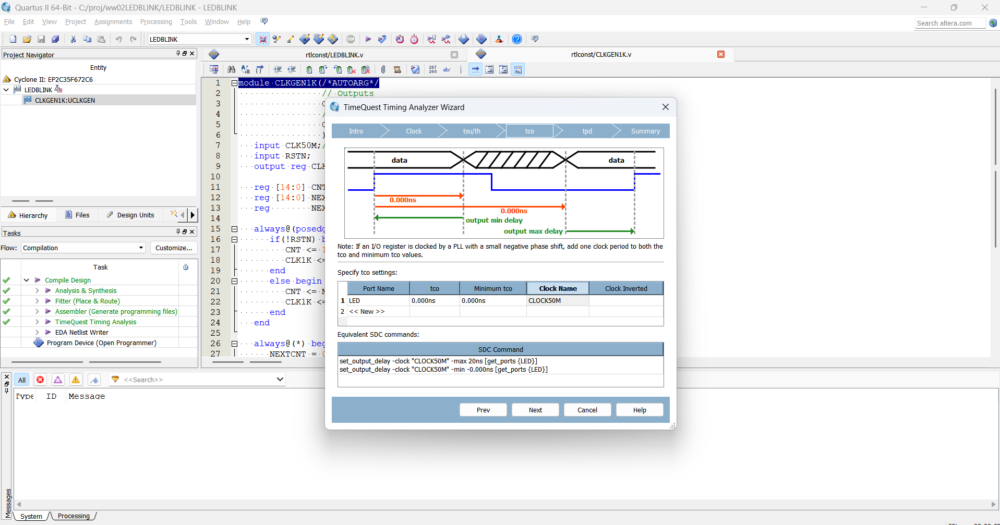

next를 한 다음 finish를 누르면 files에 sdc파일이 생성된다. 

우리가 사용할 클락은 CLK1K이므로 CLK50M으로 파생된 create_generated_clock을 만들입력해준다.

```sdc
create_clock -name "CLK50M" -period 20.000ns [get_ports {CLK50M}] -waveform {0.000 10.000}

create_generated_clock -name "CLOCK1K" -divide_by 100 -source [get_ports {CLK50M}] [get_nets {UCLKGEN|CLK1K}]
```

get_ports는 CLK50M의 포트와 맞춰준다. 

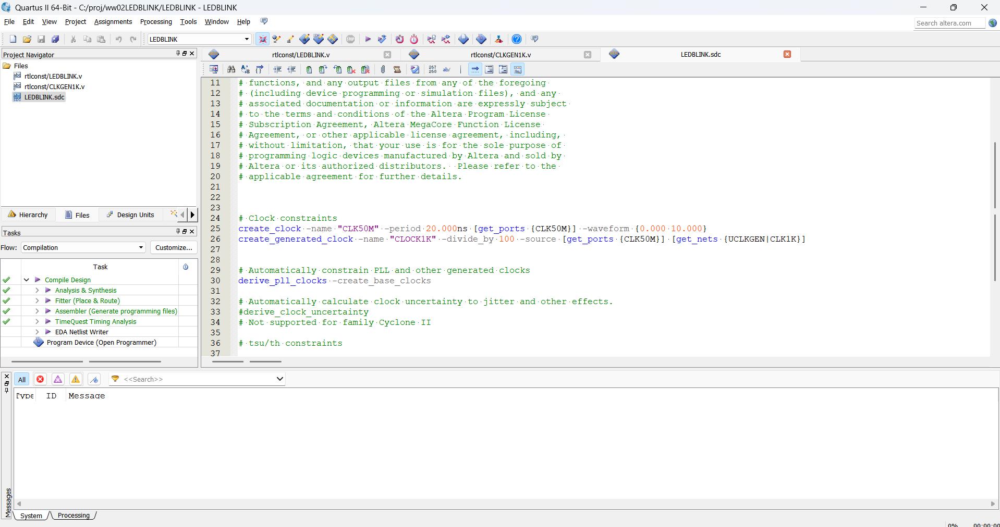

get_nets또한 맞춰야 하는데 Tool > TimeQuest Timing Analyzer에서 update timing netlist를 눌러준다.

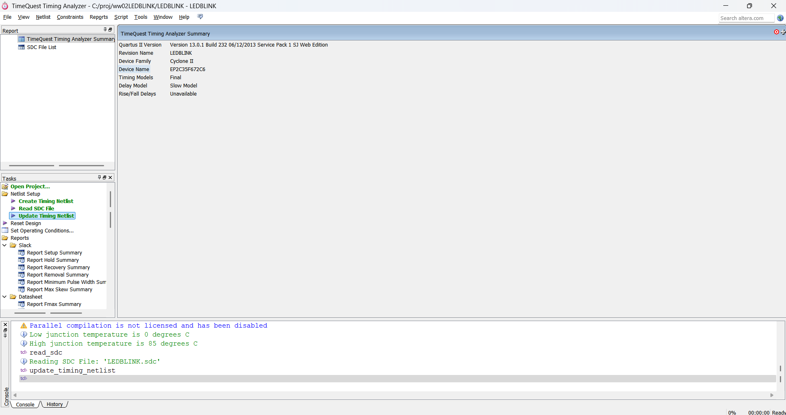

여기서 view > namefinder를 누르면 합성된 내부 net을 검색할 수 있다. get_net을 선택하고\ *CLK1K\*로 감싸면 리스트가 나오고, UCLKGEN|CLK1K를 선택해준다.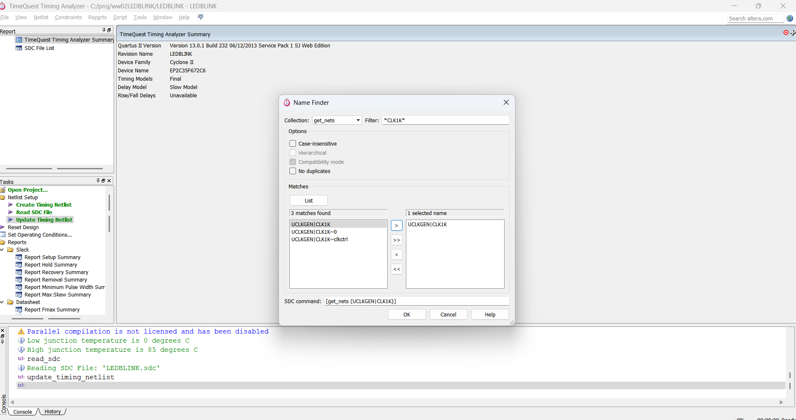

복사된 값을 get_net에 입력하면 된다.

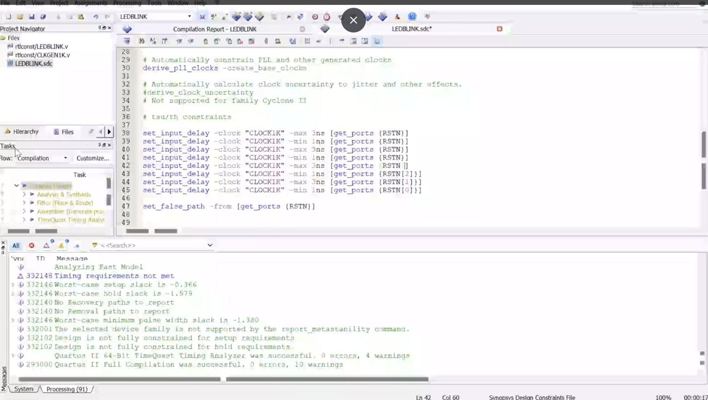

input delay를 다음과 같이 선언할 수 있고 min max를 설정할 수 있다. 그리고 원래는 CLOCK50M으로 되어 있었지만, 우리가 사용할 클락은 CLOCK1K이므로 바꿔준다. 그리고 set_false_path를 넣어서 asynchoronous인 RSTN이 풀업이면 getport 에 대한 값은 가짜다 라고 선언을해 무시한다.

지금은 리셋밖에 없으니 버스에대한것과 set input delay는 지웠다.

set output delay 또한 clock을 바꾸고 min max를 바꿔준다.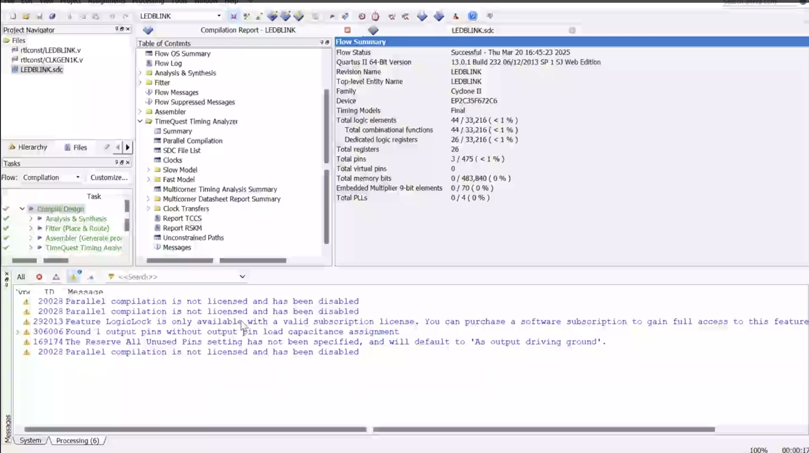

다시 컴파일을 돌렸더니 다른 것들은 license warning이지만 하나 output pins without pin load capacitance assignment가 있다. 이것만 해결하면 된다. 이는 IO pin에는 뒷단의 예상 값을 지정해줘야한다. 그래서 assignment에 assignment editor를 누른다.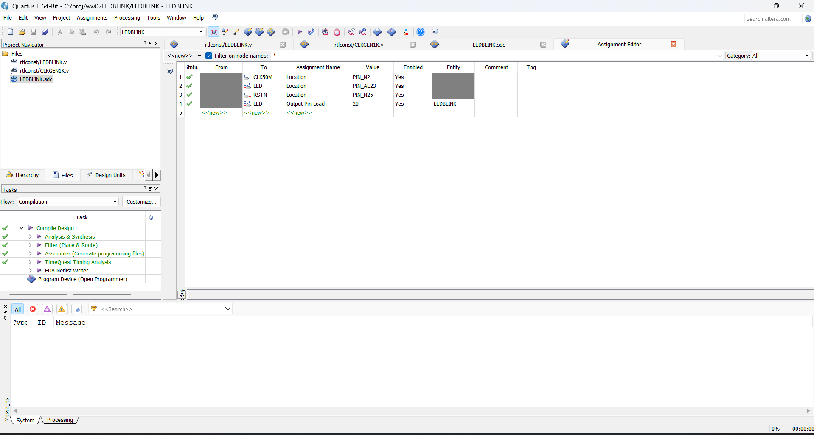

assignment name중에 pin관련해서 Output Pin Load를 선택하고 value를 20 적어준 후 save한다. 이제 컴파일하면 warning이 시스템적인것만 남게 된다.

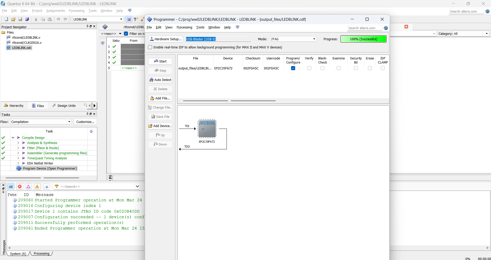

이제 program device에 들어가서 실행시키면 fpga 보드에서 작동하는 것을 확인할 수 있다.
