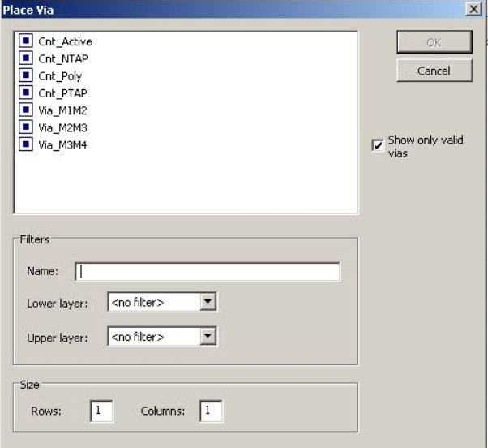
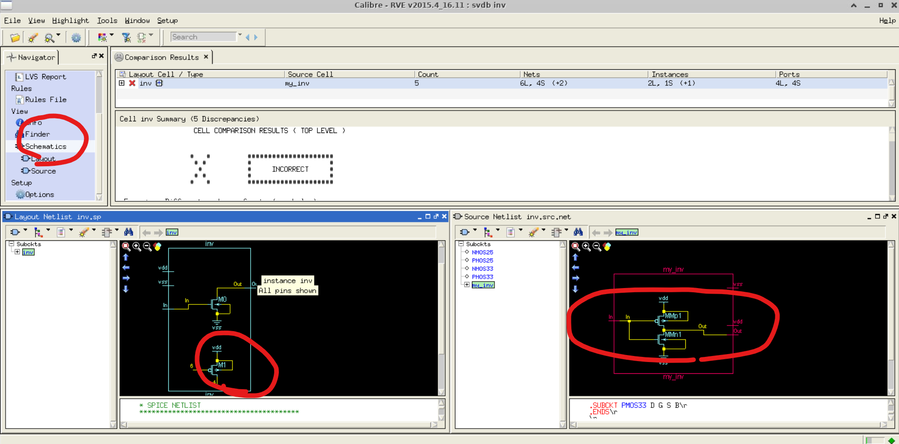

>참고 자료
>
>교수님 강의 자료

저번에 공부한 부분에서 오류가 뜬 것의 원인을 찾지 못했지만, 삭제 후 다시 세팅을 하니 해결되었다.

저번 시간에는 layout을 킨 상태에서 소자를 세팅했다. 여기서 소자의 사이즈를 바꾸고 싶다면  소자를 클릭한 후 q를 누른다.

누른 후에 다음과 같은 창이 나오는데, 우리는 pmos의 사이즈를 두 배 더 키우고 싶으니 width를 3u로 바꿔준다.

그럼 다음과 같이 pmos가 layout상에서 두 배 더 커진 것을 확인할 수 있다.

이제 이 두 mos를 연결하고 싶다면 layer palette에 가서 확인할 것이 있다. 여기서 drawn으로 해 놓으면, 실제 그릴 수 있는 것들을 확인할 수 있다. 그리고 purpose는 말 그대로 목적을 의미한다.

valid에는 더 많은 것들이 있는데 마킹을 해 놓으면 에러가 났을 때 뜨는 레이어도 있다. valid를 사용할 경우도 있지만 보통은 drawn을 사용한다.

이제 navigator에 있는 box를 클릭하고 두 소자를 잇는 layer를 선택해 그려주면 이을 수 있다. 참고로 게이트 라인으로 poly를 썼지만 poly는 저항을 가지고 있어 저항을 줄이기 위해서는 poly를 안 쓸 수도 있다.

그래서 q를 누른 후 connect gate를 통해 gate를 만드는 방법도 있다. 

그러면 poly에 메탈이 연결된다. 그리고 drain을 메탈1 으로 연결시킨다. r (rectangle) 단축키를 누르면 쉽게 그릴 수 있다.

그리고 만약, 메탈을 그렸는데 두께를 줄이고 싶다면, ctrl을 누르고 클릭하면 edge를 선택할 수 있다. 이 상태에서 마우스 휠을 누른 채로 사이즈를 조정할 수 있다. 

사실 더 편한것은 p(path)를 누른채로 왼쪽 마우스 오른쪽 마우스르 누르면 쉽게 그릴 수 있다.

이제 가운데를 통하게 하려면 object snap이 필요하다. e를 누르면 다음과 같은 창이 나오는데 여기서 object snap을 확인할 수 있다.  

여기서 enable을 하면 꼭짓점과 중심점을 잡을 수 있다. 다음과 같이 빨간 중심점을 확인할 수 있고, 메탈1을 p를 눌러 중심에 만들어 줬다.

 

그리고 중간에 에러가 있는지 확인하는 방법이 있는데 e를 누르면 나온 창에서 rule-aware layout을 통해 할 수 있다. 하지만 이것은 대략적인 체크고 툴이 느려지게 돼서 사용하지 않는 기능이다. 

이걸 키고 prevent violations를 키면 쓸 수 있는 기능이다. 하지만 안 쓴다.

이후 메탈로 소스와 바텀을 연결해주었다.

그 다음에 poly에 메탈을 연결해야지 입력을 줄 수 있다. 그래서 콘텍을 달아야 하는데 o를 누르면 via를 볼 수 있다. 

폴리에 콘텍을 달아줄 것이기 때문에 cnt_poly를 선택하고 poly에 붙여준다. 

그리고 소자의 길이를 재고싶을 때 k를 누르면 다음과 같이 길이를 잴 수 있다. 그리고 없애는 것은 shift + k를 누르면 된다.

인버터가 만들어졌다. 이제 라벨링을 할 것이다. l을 누르고 해당 위치에 클릭하면 라벨링을 할 수 있다. 다음과 같이 vdd, vss, in, out을 라벨링 했다.

이제 우리가 만들었던 schematic과 비교를 할 것이다. sedit에서 inv에 들어가면, scale이 같은지 확인해야 한다. 그리고 포트 이름이 같은지 확인해야 한다. 

이제 위의 레이아웃이 제대로 됐는지 확인하려면, 그림 자체의 룰을 지켰는지 봐야한다. 그래서 DRC(Design Rule Check)를 해야 한다. DRC는 빨간 표시에 위치해 있고, 누르면 다음과 같은 창이 나온다.

Rules에서 drc rule file을 넣어준다.

이걸 한 후 그냥 Run DRC를 하면 아무것도 안 뜨지만 다음과 같이 메탈을 끊어놓고 돌리게 된다면 다른 결과가 나온다. 

이와 같이 design상의 문제를 확인할 수 있다. 그리고 아래있는 check를 클릭하면 문제가 있는 부분이 highlight되면서 수정하기 편하다.

그 다음은 LVS를 할 것이다. LVS는 레이아웃과 내가 설계한 회로와 같은지 확인하는 것이다. 

Rules의 LVS파일은 DRC에서 사용했던 폴더에 있다.

그리고 Input에 계속 빨간 불이 들어와 있는데, netlist에서 내가 비교할 schematic이 뭔지 알려주면 된다.

이후 Run LVS를 하고 layout과 스케메틱 둘 다 비교했을 때 문제가 없다면 다음과 같이 나온다.

만일 폴리와 메탈1을 끊어놓고 다시 돌린다면 다음과 같이 나온다.

layout cell은 내가 만든 layout이고 source는 schematic을 말한다. 

문제를 찾으려면 우선은 포트를 봐야 한다. net이 4개가 있는데 layout에는 선이 6개라고 되어있는 것으로 에러가 뭔지 파악할 수 있다. 그리고 schematics를 클릭하면 다음과 같은 그림을 볼 수 있고 그림에서 nmos에 out이 연결되지 않은 것을 볼 수 있고, 실제 layout에 가면 문제를 확인할 수 있다. 

그리고 layout에서 ctrl + f를 누르면 toggling을 할 수 있는데 인스턴스는 그냥 블럭으로 보이게 할 수 있다. 내가 실제로 그린 것만 보인다. 

