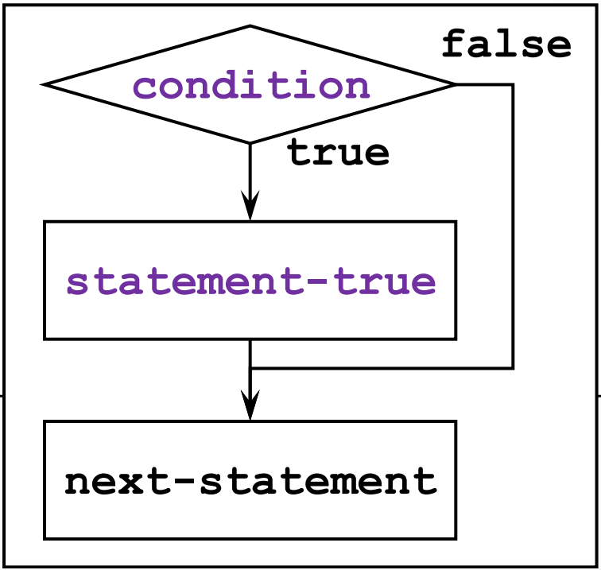
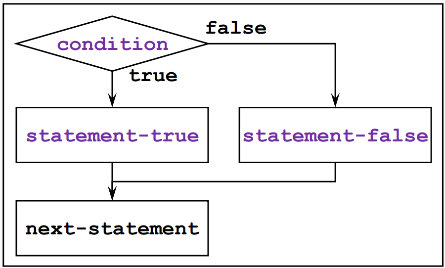

>참고 자료 [Fundamentals of C++ Programming](https://www.dbooks.org/fundamentals-of-c-programming-1201/), 
>
>[cppreference.com](https://en.cppreference.com/w/)
>
>교수님 강의자료

#### Boolean values

sizeof 오퍼레이터는 sizeof(type)나 sizeof expression하면 메모리값의 크기를 리턴해 준다.

Boolean값은 ture false를 출력한다. 0이면 false 그 외 값들은 ture이다. 

```c++
#include <iostream>
int main() {
    bool b1 = false;
    std::cout << true << ' ' << b1 << std::endl; // 1 0
    std::cout << sizeof(int) << ' ' << sizeof(b1) << std::endl;
    // 4 1
    // sizeof(bool) is not required to be 1.
    std::cout << std::boolalpha;
    std::cout << true << ' ' << b1 << std::endl; // true false
    std::cout << std::noboolalpha;
    std::cout << true << ' ' << b1 << std::endl; // 1 0
}
```

b1 = false;라 쓴것은 b1 = 0으로 쓴 것과 동일하다. cout으로 bool을 출력하면 기본적으로 0과 1로 출력된다. 그래서 true false로 출력하고싶다면 std::boolalpha를 사용하면 된다. std::noboolalpha하면 다시 돌아온다.

sizeof(int)를 하니 int의 크기인 4byte가, sizeof(b1)을 하니 bool의 크기인 1byte가 출력되었다.

```c++
#include <iostream>
int main() {
    enum {RED, GREEN, BLUE};
    bool b1 = 0, b2 = 10, b3 = -10, b4 = 1.2, b5 = RED, b6 = GREEN;
    std::cout << std::boolalpha;
    std::cout << b1 << ' ' << b2 << ' ' << b3 << ' ' << b4 << ' '
        << b5 << ' ' << b6 << '\n';// flase true true ture false true
}
```

0이면 false 아니면 true. 열거형으로 만들어 놓으니 0이되는 부분은 std::boolalpha로 인해 false로 출력된다.

------

#### Comparison Operator

관계연산자는 기본적으로 C++에서 two way comparison으로 사용되고 boolean value가 일반적으로 나온다. three way도 있지만 중간고사 이후에 설명할 예정.

Two-way comparison
• Equal to, ==
• Not equal to, !=
• Less than, <
• Greater than, >
• Less than or equal to, <=
• Grater than or equal to, >=

이런 종류가 있는데 여기서 <의 반대되는 개념은 >가 아닌>=이다.

------

#### if Statement

if문은 다음과 같이 동작한다.



condition에 있는 것은 bool로 본다. 그래서 0이면 false, 1이면 ture다.

```c++
#include <iostream>
int main() {
    if (1)
        std::cout << "true" << std::endl; // true
    if (0)
        std::cout << "false" << std::endl; // not executed
}
```

if문은 statement가 ture일때만 출력하므로 보면 1일때 ture를 출력하고 false는 출력되지 않는다.

```c++
#include <iostream>
int main() {
    if (1)
        std::cout << "1 "; // 1
    if (0)
        std::cout << "2 ";
    std::cout << "3 "; // 3
    if (0) {
        std::cout << "4 ";
        std::cout << "5 ";
    }
}
```

우선 if(1)에서 1은 출력이 된다. 그 다음 if(0)에서 얼마나 출력 되는지 알아야 하는데 if문은 1문장만 출력을 한다. 그래서 2는 if(0)이므로 출력이 되지 않지만 std::cout << "3";은 if에 영향받지 않고 3을 출력하는 문장이므로 출력이 된다. 이렇게 2개 이상의 문장이지만 한문장 처럼 사용하고싶다면 { }로 문장들을 감싸주면 된다. 그래서 세번째 if에서는 4와 5 둘다 출력되지 않는다.

{}를 쓰면 여러 문장도 되고 한 문장만 넣는거도 되고 빈 중괄호, empty statement도 가능하다.  

```c++
#include <iostream>
int main() {
    if (0);
    std::cout << "6 "; // 6
    if (0) {}
    std::cout << "7 "; // 7
}
```

그래서 이 코드에서 첫번째if에 걸려있는 6은 출력이 안 되지만 두번째 if에는 empty statement인 {}가 존재하므로 std::cout << "7";은 7을 출력한다.

------

##### if statement (else)



false인 경우에도 출력되는 것을 만들고 싶다면 else를 사용하면 된다.

```c++
#include <iostream>
int main() {
    int x;
    std::cin >> x;
    if (x % 2 == 0)
        std::cout << "even\n";
    else
        std::cout << "odd\n";
}
```

else또한 문장 단우 하나만 출력한다. 

여기에서는 x%2 == 0 즉 x가 짝수일 때 나머지가 0이 되어 if의 statement가 ture가 된다. 따라서  even을 출력한다. 홀수일 때 나머지가 1이 되어 statement는 false, odd를 출력한다.

```c++
#include <iostream>
#include <vector>
int main() {
    int x = 10;
    if (int y = 10; x == y)
        std::cout << "10" << std::endl; // 10
   	/*study yet*/
    std::vector v = { 5, 3, 4, 6, 3 };
    if (auto id = std::find(v.begin(), v.end(), 4); id != v.end())
        std::cout << std::distance(v.begin(), id); // 2
    if (auto id = std::find(v.begin(), v.end(), 9); id != v.end())
        std::cout << std::distance(v.begin(), id);
}
```

만약 if의 statement에 문장이 들어간다면 세미콜론으로 구분지어준다. 

변수 x가 main함수 내부에서만 쓸 수 있는것 처럼, 여기서 y는 if문 안에서만 쓸 수 있다. 

study yet 아래부분은 아직 배우지 않는 내용이다. 변수가 if문 밖에서 쓰일 위험도 있기 때문에 초기화 위치를 넣어주면 if문 안에서 쓰는건지 알 수 있다.

------

#### Logical Operators

만약 if문에 조건을 여러개 넣고싶다면 logical operator를 사용하면 된다. 
**NOT, !**

not은 ture를 false로, false를 true로 바꿔주는 역할을 한다. 입력은 하나다.

**AND, &&**

and는 ture ture 두개의 입력이 들어올때만 true를 출력한다. 입력은 두 개다. 그래서 입력 중에 먼저 오는 값이 false면 두 번째 입력은 고려 안 하고 바로 false가 된다.
**OR, ||**

or는 false false 두개의 입력이 들어올때만 false를 출력한다. 입력은 두 개다. 그래서 입력 중에 먼저 오는 값이 true면 두 번째 입력은 고려 안 하고 바로 true가 된다.
Precedence

우선순위는 다음과 같다.

• **! > && > ||**

```c++
#include <iostream>
int main() {
    int x;
 
    std::cin >> x;
    if (x > 10 && x % 2 == 0)
        std::cout << "x is greater than 10 and is a even.\n";
}
```

여기서 x 값을 바았다면 가장 먼저 연산 되는 것은 x>10이고 그 다음은 x%2이므로 만약 x>10이 false라면 x%2를 고려하지 않고 바로 false가 된다.

```c++
#include <iostream>
int main() {
    int x;
 
    std::cin >> x;
    if (0 < x < 10)
        std::cout << "x is greater than 0 and is less than 10.\n";
    // (0 < x) < 10 → true/false < 10
    if (0 < x && x < 10)
        std::cout << "x is greater than 0 and is less than 10.\n";
}
```

만약 x에 11이 입력되었다 가정하자.  (0<x<10)의 참거짓은 일반적인 수학 공식이라면 거짓이 되지만 여기서는 항상 true가 된다. 왜냐하면 연산 우선순위가 왼쪽에 서부터 오기 때문에 (0<x)<10이 된다. 따라서 0<x가 참이므로 1이되고 1<10은 항상 참이다. 0<x에 x 가 0보다 작은 값이어도 마찬가지다. 0<x가 false면 0이되고 0<10은 항상 참이다. 따라서 이를 올바르게 작동시키려면 (0 < x && x < 10)와 같이 작성해야한다.

