>참고 자료
>
>교수님 강의 자료

inv2를 만들어줬다. finger를 3으로 해서 만들었다. 메탈 1으로 pmos,nmos 각각 vdd, vss를 연결했고, in out을 연결해 줬다. 그리고 poly로 gate를 연결했다. 마지막으로 place via에 cnt_poly를 만들어 in port를 만들었다.

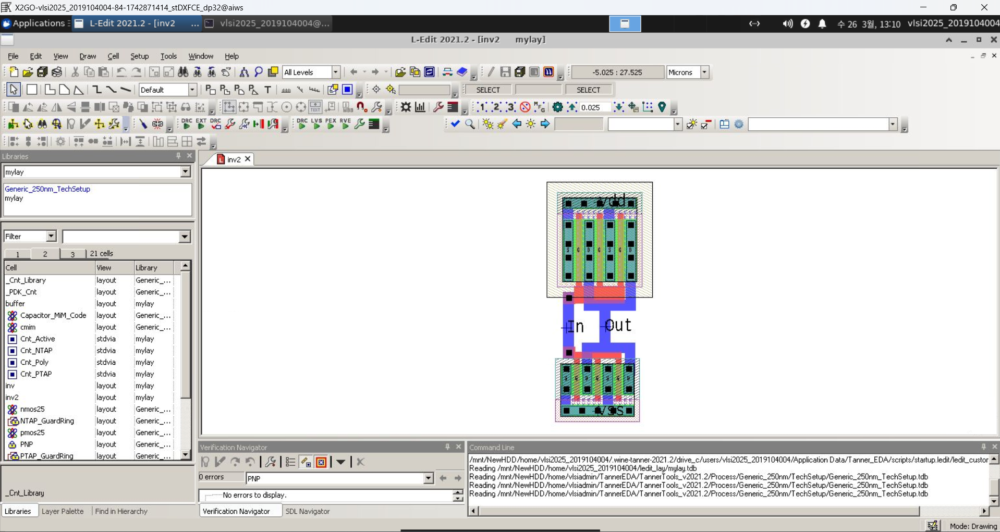

이제 inv 와 inv2를 사용해 버퍼를 만들것이다. 이때 두개의 사이즈를 맞춰줘야한다.

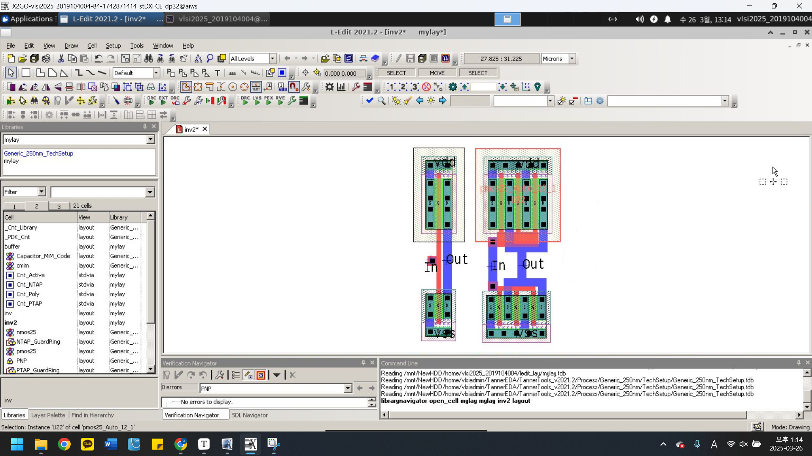

다음과 같이 k를 써서 위치를 맞춰준다.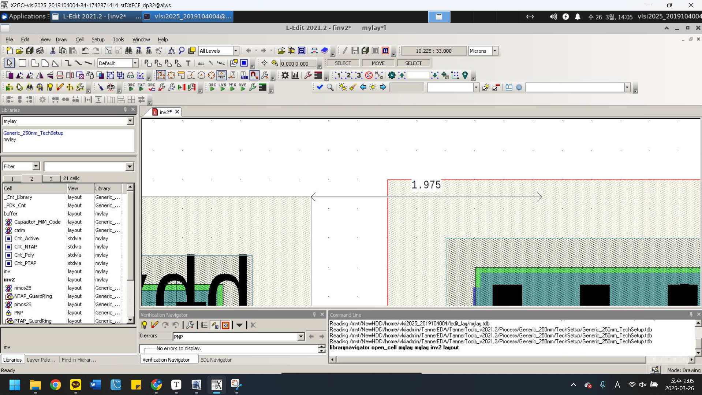

 sedit을 킨 후 ledit에서 lvs를 확인해준다.

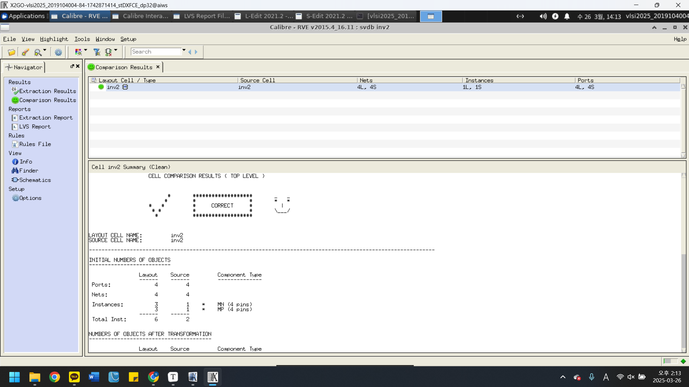

그리고 drc도 해준다.

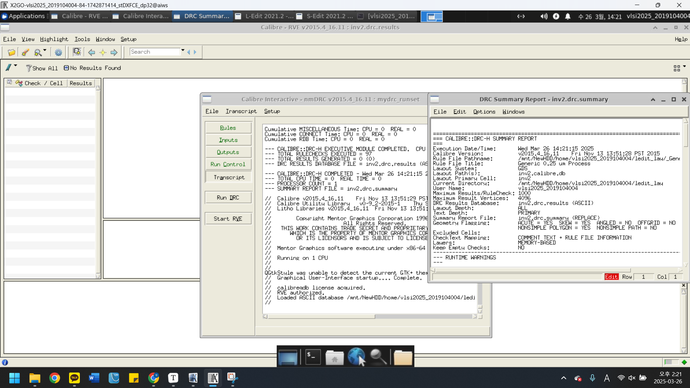

------

이제 inv2의 스케메틱과 레이아웃이 일치하고 디지안상에도 문제가 없다. 이제 inv와 inv2를 연결해 buffer를 만든다. buffer cell을 새로 만들어준 후 inv와 inv2를 드레그해서 불러온다. 그리고 위치를 맞춰주었다. 

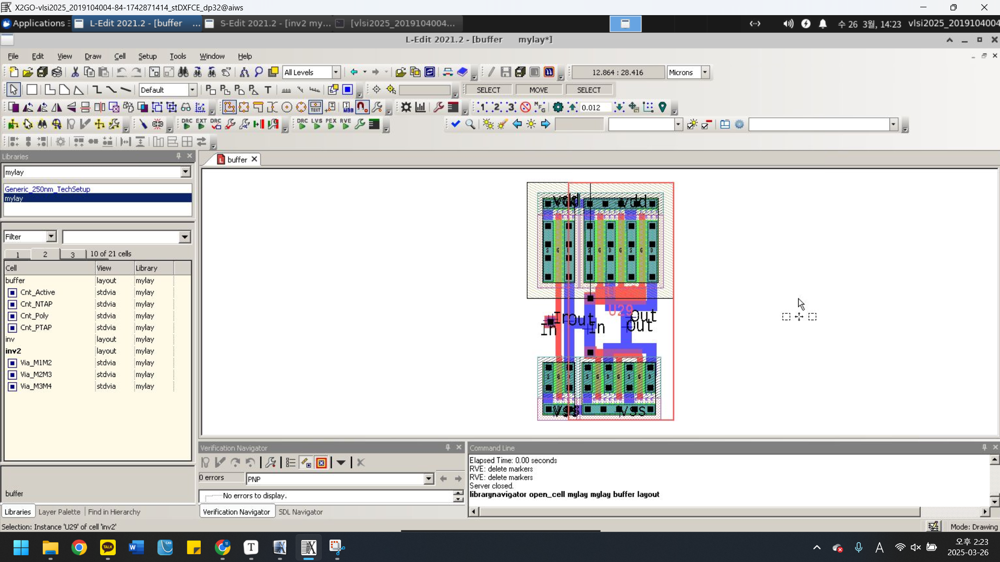

metal1을 사용해 vdd, vss를 연결해 주고, inv의 out이 inv2의 in과 연결한다.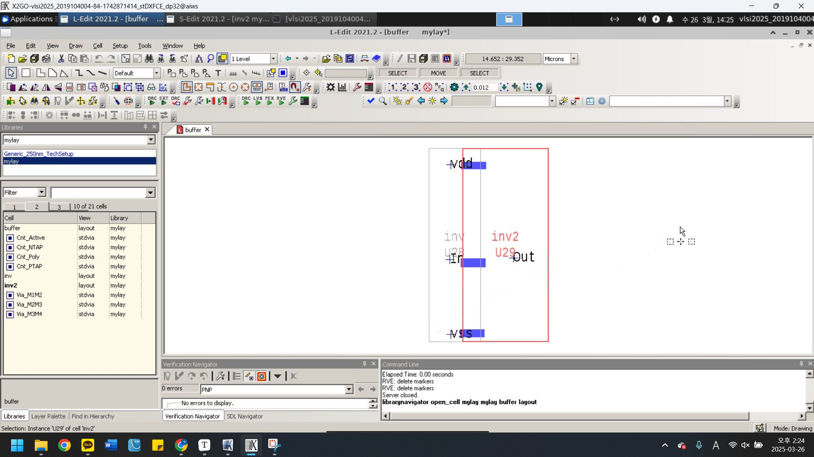

ctrl + f를 누르면 현재 셀에서 컨텍, 라벨링 한부분만 보인다. lvs를 해보았더니 다음과 같이 에러가 나왔다.

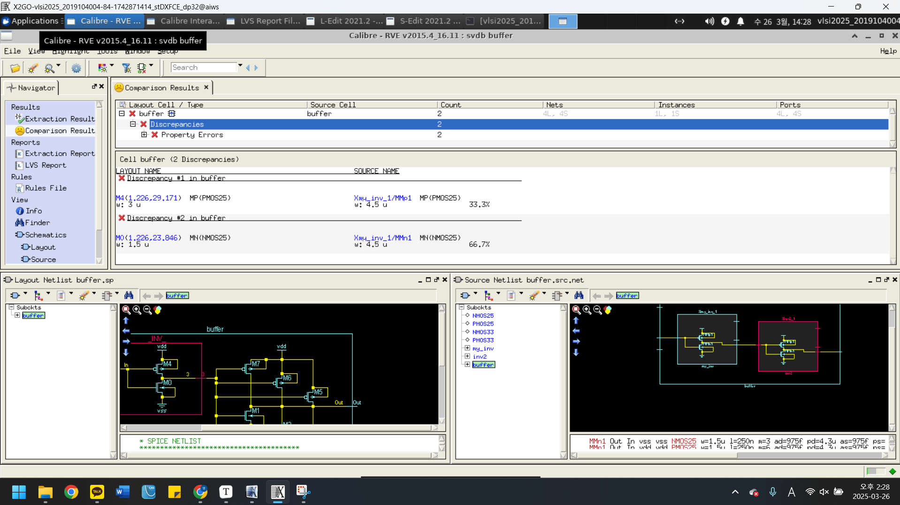

사이즈에서 문제가 생긴것으로 보인다. 스케메틱에서 사이즈를 3u, 1.5u로 바꿔준 후 lvs를 돌렸다. 다음과 같이 lvs가 성공했다.

이제 drc를 해주었다. 다음과 같이 에러가 났고, 그 부분을 수정했다.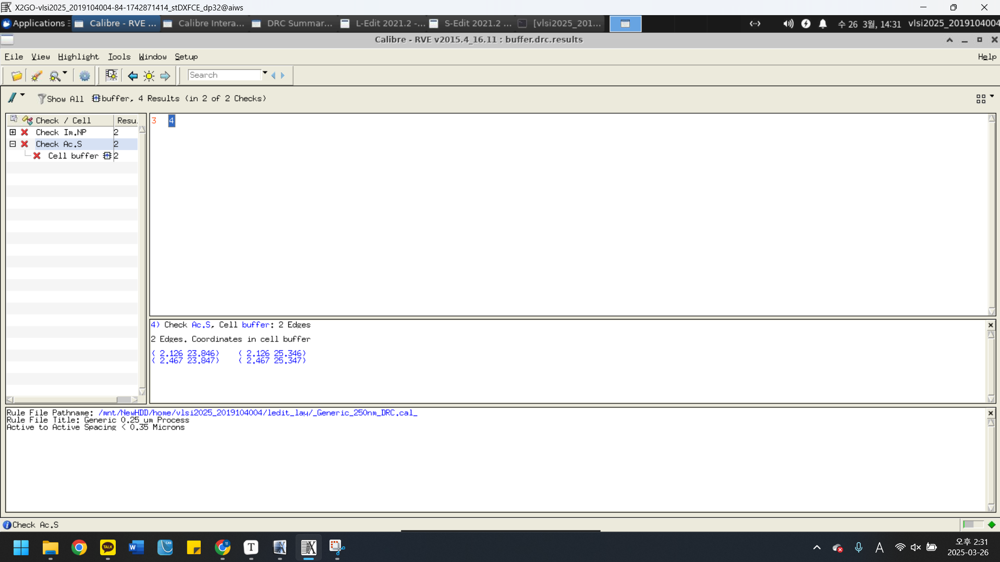

수정후

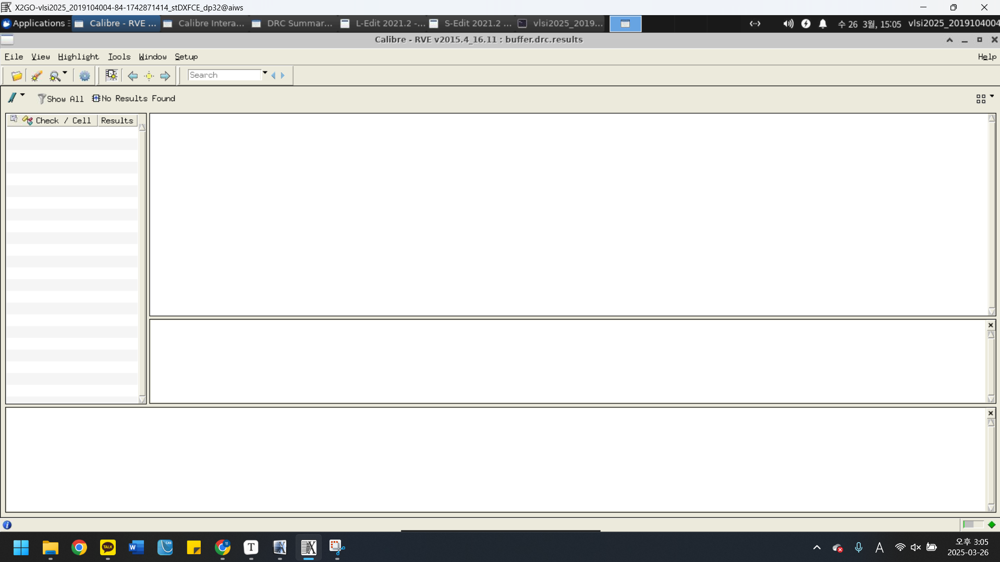

------

이론

모스의 캡 체널은 다음과같이 생성된다. 다음 그림과 같이 위부터 폴리로 게이트가 만들어지고 전압을 가하면 엑티브가 된다.

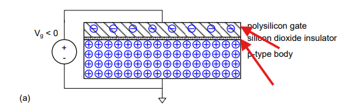

ptype poly로 되어있으므로 홀이 올라온다. 음의전압이니깐 홀은 양극을 갖고 있으므로 올라가는 것이다. 반대로 양의 전압을 주면 홀을 밀어낸다. 여기서는 thresh hold 이상으로 밀어내다 보면 전자가 올라오게 된다. 그것이 inversion이다.

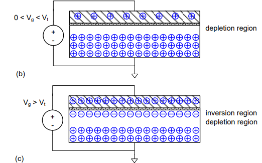

트렌지스터는 세가지 영역에서 동작한다. linear, saturation, cut off인데 디지털은 cut off 아니면 linear로 동작한다. saturation은 아날로그에서 중요한 부분.

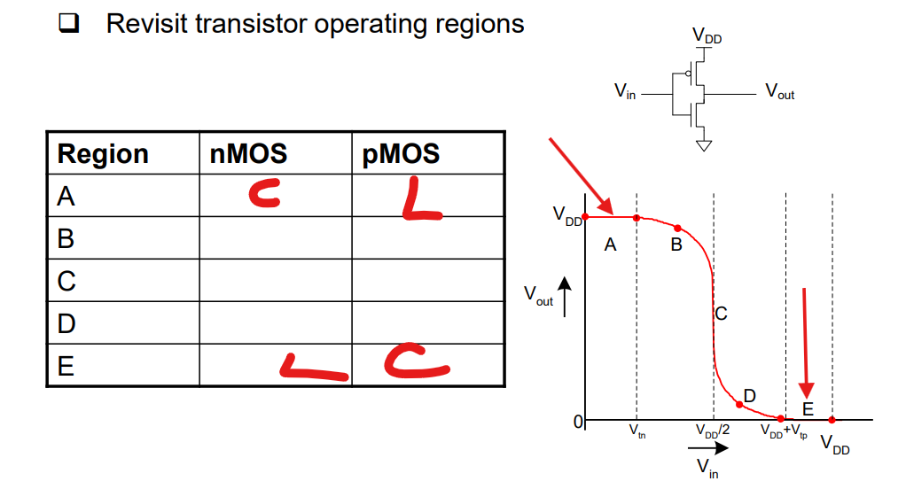