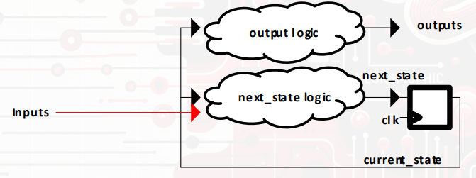
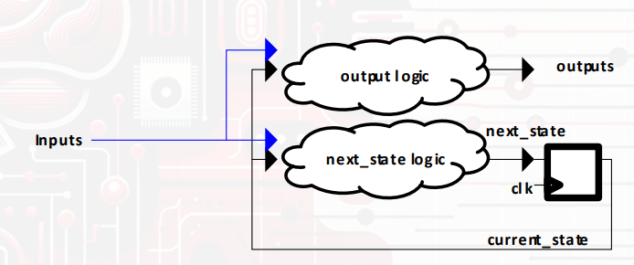

>참고 자료 : 교수님 강의 자료
>
>사용 툴 : Quartus, mobaxterm


FSM(Finite State Machine)

조합 논리는 현재 입력에 따라 다음 상태와 출력을 결정한다.

여기서 moore 와 mealy로 나뉘는데 moore는 현재 상태에만 의존하고 mealy는 현재 상태와 입력 모두 의존한다. 

Moore machine



Mealy machine



left/right shifter를 만들어 보았다.(moore)

```verilog
module LRSHIFTERMO(/*AUTOARG*/
                   // Outputs
                   out,
                   // Inputs
                   clk, rstn, sw
                   );

   input clk;
   input rstn;
   input [1:0] sw;
   output reg [3:0] out;

   parameter ST0 = 2'b00, ST1 = 2'b01, ST2 = 2'b10, ST3 = 2'b11;

   reg [1:0]        current_state, next_state;

   always@(posedge clk , negedge rstn)begin

      if(!rstn)
        current_state <= ST0;
      else 
        current_state <= next_state;
   end

   always@(*) begin
      case(sw)
        2'b00: next_state = current_state;
        2'b01: next_state = (current_state == ST0) ? current_state : current_state -2'b1;
        2'b10: next_state = (current_state == ST3) ? current_state : current_state +2'b1;
        2'b11: next_state = current_state;
        default: next_state = ST0;
      endcase
   end

   always@(*) begin
      case(current_state)
        ST0: out = 4'b0001;
        ST1: out = 4'b0010;
        ST2: out = 4'b0100;
        ST3: out = 4'b1000;
        default: out = 4'b0000;
      endcase
   end

endmodule
```


다음은 mealy machine이다.

```verilog
module LRSHIFTERME(/*AUTOARG*/
                   // Outputs
                   out,
                   // Inputs
                   clk, rstn, sw
                   );

   input clk;
   input rstn;
   input [1:0] sw;
   output reg [3:0] out;

   parameter ST0 = 2'b00, ST1 = 2'b01, ST2 = 2'b10, ST3 = 2'b11;

   reg [1:0] current_state, next_state;

   always@(posedge clk or negedge rstn) begin
      if (!rstn)
         current_state <= ST0;
      else
         current_state <= next_state;
   end

   always@(*) begin
      case(sw)
         2'b00: next_state = current_state;
         2'b01: next_state = (current_state == ST0) ? current_state : current_state - 2'b1;
         2'b10: next_state = (current_state == ST3) ? current_state : current_state + 2'b1;
         2'b11: next_state = current_state;
         default: next_state = ST0;
      endcase
   end

   // 출력 로직 (Mealy: current_state + sw에 따라 결정)
   always@(*) begin
      case(sw)
         2'b00: begin
            case(current_state)
               ST0: out = 4'b0001;
               ST1: out = 4'b0010;
               ST2: out = 4'b0100;
               ST3: out = 4'b1000;
               default: out = 4'b0000;
            endcase
         end
         2'b01: begin
            case(current_state)
               ST1: out = 4'b0001; // ST1에서 왼쪽 이동하면 ST0 출력
               ST2: out = 4'b0010; // ST2 → ST1
               ST3: out = 4'b0100; // ST3 → ST2
               default: out = 4'b0001;
            endcase
         end
         2'b10: begin
            case(current_state)
               ST0: out = 4'b0010; // ST0 → ST1
               ST1: out = 4'b0100; // ST1 → ST2
               ST2: out = 4'b1000; // ST2 → ST3
               default: out = 4'b1000;
            endcase
         end
         2'b11: out = 4'b0000;
         default: out = 4'b0000;
      endcase
   end

endmodule
```

moore와 mealy의 차이는 다음과 같다.

|           | Moore machine                              | Mealy machine                        |
| :-------- | ------------------------------------------ | ------------------------------------ |
| 출력      | 현재 상태에만 의존                         | 현재 상태와 입력에 의존              |
| 출력 시점 | 클럭 변화 이후(상태가 바뀐 후)             | 입력이 바뀌는 즉시(상태 변화 없어도) |
| 속도      | 한 박자 느림(출력이 상태 변화 이후 반영됨) | 빠름(입력 변화에 바로 반응함)        |
| 출력수    | 상태 수만큼만 출력 가짐                    | 상태 수보다 더 다양한 출력 가능      |
| 복잡도    | 단순하고 디버깅 쉬움                       | 복잡할 수 있음, 출력이 더 민감함     |

Moore:       상태 --- 출력(ST0) --- 상태변화 --- 출력(ST1)
Mealy:       상태 --- 출력(ST0,입력에 따라 바로 바뀜) --- 상태변화

------

Key Debouncing 해결법

```verilog
//핵심 요소들
reg [2:0] key3shift;
wire debounced_key3;
wire KEY3EDGE;
reg debounced_key3_prev;
reg first_run;
```

shift register 방식으로 3샘플 버튼 상태 저장한다. 3비트 레지스터에 최근 3번의 KEY3값을 shift in하고 key3shift가 3'b111이면 버튼이 안정적으로 눌린다 간주한다.

```verilog
key3shift <= {key3shift[1:0], KEY3};
```

안정적인 눌림을 판별하기 위해 debounced_key3를 만들었다. 버튼이 연속적으로 3번 1이 입력되었을 때만 눌린것으로 인정.(노이즈 방지 기능)

```verilog
assign debounced_key3 = (key3shift == 3'b111);
```

edge검출(KEY3EDGE) debounced_key3가 0에서 1로 전이되는 순간 검출. 즉 안정적으로 버튼이 눌린 첫 순간만 감지.

```verilog
assign KEY3EDGE = (~first_run) && (debounced_key3 & ~debounced_key3_prev);
```

이전 상태 저장 및 첫 실행 처리, 시프트 레지스터가 초기화되기 전(first_run)에는 엣지 검출 안 하도록 함. 한 번만 실행되고 이후엔 정상 작동한다.

```verilog
if(first_run) begin
    debounced_key3_prev <= debounced_key3;
    first_run <= 0;
end else begin
    debounced_key3_prev <= debounced_key3;
end
```

------


```verilog
module STOPWATCH(/*AUTOARG*/
                 // Outputs
                 DAY10, DAY1, HOUR10, HOUR1, MIN10, MIN1, SEC10, SEC1,
                 // Inputs
                 CLK1K, RSTN2, RSTN, KEY3
                 );
   // INPUTS
   input CLK1K;
   input RSTN2;
	input RSTN;
   input KEY3;
   // OUTPUTS
   output reg [3:0] DAY10;
   output reg [3:0] DAY1;
   output reg [3:0] HOUR10;
   output reg [3:0] HOUR1;
   output reg [3:0] MIN10;
   output reg [3:0] MIN1;
   output reg [3:0] SEC10;
   output reg [3:0] SEC1;
   // sequential logic 
   reg [3:0]        NEXTDAY10;
   reg [3:0]        NEXTDAY1;
   reg [3:0]        NEXTHOUR10;
   reg [3:0]        NEXTHOUR1;
   reg [3:0]        NEXTMIN10;
   reg [3:0]        NEXTMIN1;
   reg [3:0]        NEXTSEC10;
   reg [3:0]        NEXTSEC1;
   reg [9:0]        NEXTCNT;
   reg [9:0]        CNT;
   // now key
   //reg              RUN;
   reg              debounced_key3_prev;
   wire             debounced_key3;
	wire             KEY3EDGE;
	reg [2:0]        key3shift;
	reg              first_run;
   //state
   reg [1:0]        current_state, next_state;
   parameter reg [1:0] RESET = 2'b00;
   parameter reg [1:0] START = 2'b01;
   parameter reg [1:0] STOP = 2'b10;
   
	assign debounced_key3 = (key3shift == 3'b111);
   assign KEY3EDGE = (~first_run)&&(debounced_key3 & ~debounced_key3_prev);
   always@(posedge CLK1K, negedge RSTN2, negedge RSTN) begin
      if(!RSTN)begin
		   DAY10 <= 0;
         DAY1 <= 0;
         HOUR10 <= 0;
         HOUR1 <= 0;
         MIN10 <= 0;
         MIN1 <= 0;
         SEC10 <= 0;
         SEC1 <= 0;
         CNT <= 0;

         current_state <= RESET;
			key3shift <= 0;
         debounced_key3_prev <= 0;
         first_run <= 1;
		end
		else begin
		if(!RSTN2) begin
         DAY10 <= 0;
         DAY1 <= 0;
         HOUR10 <= 0;
         HOUR1 <= 0;
         MIN10 <= 0;
         MIN1 <= 0;
         SEC10 <= 0;
         SEC1 <= 0;
         CNT <= 0;

         current_state <= RESET;
			
			key3shift <=0;
			debounced_key3_prev <=0;
         first_run <= 1;
      end
      else begin
         DAY10 <= NEXTDAY10;
         DAY1 <= NEXTDAY1;
         HOUR10 <= NEXTHOUR10;
         HOUR1 <= NEXTHOUR1;
         MIN10 <= NEXTMIN10;
         MIN1 <= NEXTMIN1;
         SEC10 <= NEXTSEC10;
         SEC1 <= NEXTSEC1;
         CNT <= NEXTCNT;

         current_state <= next_state;
         
			key3shift <= {key3shift[1:0], KEY3};
			
			debounced_key3_prev <= debounced_key3;
			first_run <= 0;
			end
		end
   end


   //output flow
   always@(*) begin
      case(current_state)
        RESET: begin
           NEXTDAY10 = 0;
           NEXTDAY1 = 0;
           NEXTHOUR10 = 0;
           NEXTHOUR1 = 0;
           NEXTMIN10 = 0;
           NEXTMIN1 = 0;
           NEXTSEC10 = 0;
           NEXTSEC1 = 0;
           NEXTCNT = 0;
			  next_state = (first_run || KEY3EDGE) ? START : RESET;
        end
        START: begin
           NEXTDAY10 =(CNT == 10'd999) ? (SEC1 == 4'd9) ? (SEC10 == 4'd5) ? (MIN1 == 4'd9) ? (MIN10 == 4'd5) ? (HOUR1 == 4'd3) ? (HOUR10 == 4'd2) ? (DAY1 == 4'd1) ? (DAY10 == 4'd3) ? 4'd0 : DAY10 : (DAY1 == 4'd9) ? DAY10 + 4'd1 : DAY10 : DAY10 : DAY10 : DAY10 : DAY10 : DAY10 : DAY10 : DAY10;
           NEXTDAY1 = (CNT == 10'd999) ? (SEC1 == 4'd9) ? (SEC10 == 4'd5) ? (MIN1 == 4'd9) ? (MIN10 == 4'd5) ? (HOUR1 == 4'd3) ? (HOUR10 == 4'd2) ? (DAY1 == 4'd1) ? (DAY10 == 4'd3) ? 4'd0 : DAY1 + 4'd1 : (DAY1 == 4'd9) ? 4'd0 : DAY1 + 4'd1 : DAY1 : DAY1 : DAY1 : DAY1 : DAY1 : DAY1 : DAY1 ;
           NEXTHOUR10 = (CNT == 10'd999) ? (SEC1 == 4'd9) ? (SEC10 == 4'd5) ? (MIN1 == 4'd9) ? (MIN10 == 4'd5) ? (HOUR1 == 4'd3) ? (HOUR10 == 4'd2) ? 4'd0 : HOUR10 : (HOUR1 == 4'd9) ? HOUR10 + 4'd1 : HOUR10 : HOUR10 : HOUR10 : HOUR10 : HOUR10 : HOUR10;
           NEXTHOUR1 =  (CNT == 10'd999) ? (SEC1 == 4'd9) ? (SEC10 == 4'd5) ? (MIN1 == 4'd9) ? (MIN10 == 4'd5) ? (HOUR1 == 4'd3) ? (HOUR10 == 4'd2) ? 4'd0 : HOUR1 + 4'd1 : (HOUR1 == 4'd9) ? 4'd0 : HOUR1 + 4'd1 : HOUR1 : HOUR1 : HOUR1 : HOUR1 : HOUR1;
           NEXTMIN10 = (CNT == 10'd999) ? (SEC1 == 4'd9) ? (SEC10 == 4'd5) ? (MIN1 == 4'd9) ? (MIN10 == 4'd5) ? 4'd0 : MIN10 + 4'd1 : MIN10 : MIN10 : MIN10 : MIN10;
           NEXTMIN1 = (CNT == 10'd999) ? (SEC1 == 4'd9) ? (SEC10 == 4'd5) ? (MIN1 == 4'd9) ? 4'd0 : MIN1 + 4'd1 : MIN1 : MIN1 : MIN1;
           NEXTSEC10 = (CNT == 10'd999) ? (SEC1 == 4'd9) ? (SEC10 == 4'd5) ? 4'd0 : SEC10 + 4'd1 : SEC10 : SEC10;
           NEXTSEC1 = (CNT == 10'd999) ? (SEC1 == 4'd9) ? 4'd0 : SEC1 + 4'd1 : SEC1;
           NEXTCNT = (CNT == 10'd999) ? 10'd0 : CNT + 10'd1;
			  next_state = (KEY3EDGE) ? STOP : START;
           
        end
        STOP: begin
           NEXTDAY10 = DAY10;
           NEXTDAY1 = DAY1;
           NEXTHOUR10 = HOUR10;
           NEXTHOUR1 = HOUR1;
           NEXTMIN10 = MIN10;
           NEXTMIN1 = MIN1;
           NEXTSEC10 = SEC10;
           NEXTSEC1 = SEC1;
           NEXTCNT = CNT;
			  next_state = (KEY3EDGE) ? START : STOP;
		  end
		  
		  default: next_state = RESET;
      endcase
   end

endmodule
```

내가 짠 stopwatch 코드

