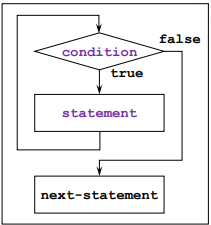
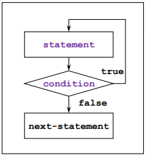
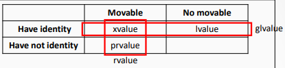

>참고 자료 [Fundamentals of C++ Programming](https://www.dbooks.org/fundamentals-of-c-programming-1201/), 
>
>[cppreference.com](https://en.cppreference.com/w/)
>
>교수님 강의자료

#### 반복문



반복문은 위 그림과 같은 플로우러 진행된다. 조건이 true면 if문처럼 밑으로 내려가는게 아닌 다시 올라가서 컨디션을 확인하고 true 면 계속 반복하고 false가 나올때까지 진행하는 형식이다. 

```c++
#include <iostream>
int main() {
    int x;
    x = 0; // initialization
    while (x < 5) { // condition
        std::cout << x++ << ' '; // 0 1 2 3 4 // updating
    }
    std::cout << x << std::endl; // 5
    x = 0;
    while (true) {
        std::cout << x++ << ' '; // 0 1 2 3 4
        if (x >= 5) break; // break
    }
    std::cout << x << std::endl; // 5
    x = 0;
    while (x < 5) {
        x++;
        if (x % 2) continue; // continue
        std::cout << x*10 << ' '; // 20 40
    }
}
```

반복문 밖에서 x를 선언 및 정의를 해주었다. 여기서 x는 5보다 작으니 진행되고 x의 값을 출력한 후 1을 더해준다. 그래서 x가 5가 될때까지 진행되고, 출력은 0,1,2,3,4가 나온다. x의 값은 5로 종료가 된다. 

while문의 condition에 true를 넣으면 항상 실행이다. 그리고 while문 내부에서 **break**를 통해 반복문을 빠져나올 수 있다. 그래서 반복문 내부의 cout이 계속 진행되다 5가 되었을 때 if문이 실행되며 break로 빠져 나오게 된다.

그 다음은 while문 내부에 if문이 x가 홀수면 true고 짝수면 false가 된다. 근데 if문에 있는 **continue**는 반복문으 처음으로 가게 하는 것이다. 따라서 홀수면 뒤의 x\*10을 출력하지 않고 돌아간다. 짝수면 실행되지 않아 x\*10을 출력하게 된다.

###### for 문

while보단 for문이 더 많이 사용된다. 

for(init_expr ; condition ; expr) statement이런 식이다.

while문에서 필요한 요소는 밖에서 조건의 값을 초기화하는게 필요했다. 그리고 동작을 위한 초기화가 필요하고, 값을 바꿔주는게 while문 내에 있어야 했다. for문은 그것들을 모두 괄호 안에 쓸 수 있다. 그 조건들은 세미콜론으로 나눠 놓았다.

```c++
#include <iostream>
int main() {
    int x;
    for (x = 0; x < 5; x++) {
     std::cout << x << ' '; // 0 1 2 3 4
    }
    std::cout << x << std::endl; // 5
    for (int y = 0; y < 5; y++) {
        std::cout << y << ' '; // 0 1 2 3 4
    }
    std::cout << std::endl; // y cannot be accessed.
    // The scope of y is the second for.
}
```

여기서 위의 for문에서는 x를 밖에서 선언해 주었지만 두 번째 for문처럼 안에서 선언을 해 줘도 된다. 따라서 위와 아래는 모두 같은 결과가 출력되었다. 만약 for 안에서 선언된 y를 밖에서 출력하려 한다면 선언되지 않은 변수라고 뜰 것이다. 

```c++
#include <iostream>
int main() {
 
    for (int x = 0; ; x++) { // the loop condition is trues
        if (x >= 5) break;
        if (x % 2) continue;
        std::cout << x << ' '; // 0 2 4
    }
    std::cout << '\n';
    for (int x = 0, y = 10; x < 2 || y < 20; x++, y += 2) 
        // comma operators
        std::cout << x << ' ' << y << std::endl;
    // 0 10
    // 1 12
    // 2 14
    // 3 16
    // 4 18
}
```

반복문에서 괄호 안에 아무것도 안 쓰면 syntax error가 뜨지만 for문은 안 쓸 수 있다. aksdir 가운데만 있으면 while문과 똑같다. 근데 그 가운데 마저도 안 써도 된다. 안 쓰면 무한 루프가 된다. 

이 코드에서는 첫번째 for문에서는 x=0으로 초기화 되고 for문이 실행된후 x가 더해진다. 5가 넘어가는 순간 for문이 끝나도록 break가 걸려있고, x가 짝수면 x값을 출력한다. 그래서 값이0,2,4가 출력된다.  

두번째 for문처럼 변수를 2개를 선언할 수 있다. 그래서 x는 0으로, y는 10으로 초기화 되었고, x가 이보다 작거나 y가 20보다 작으면 반복문이 계속된다. 그리고 반복문이 끝나면 x는 1더해지고 y는 2더해지는 구조이다. 

차례대로 x는 0,1,2,3,4로 증가되는 것을 볼 수 있다. 그리고 y 값이 2씩늘어나다 20이되는순간에는 반복문이 실행되지 않는다. 그래서 4 18까지 나온 것이다.  

------

###### comma operator

,도 연산자처럼 쓰인다. 

```c++
#include <iostream>
int main() {
    int x, y, z;
    x = (y = 10, z = 20);
    std::cout << x << ' ' << y << ' ' << z << std::endl; //20 10 20
    for (int i = 0; i < 5, i < 3; ++i)
        std::cout << i << ' '; // 0 1 2 
}
```

여기서 보면 ','는 and가 아니라 아예 없는것이다.

x=(y=10,z=10)에서 y=10이 대입되고 결과는 10인데 그 다음에 z=20이 나오면서 결과는 20이 되어 x에는 20이 대입된다. 

그리고 i<5와 i<3에서도 뒤의 i<3이 결과가 되면서 0,1,2만 출력되는 것이다.

###### do while

일단 하라는 의미. 



일반적인 while문과 다르게 먼저 처리한 후 컨디션을 확인하는 방법이다. 처리 후 컨디션이 true면 다시 올라가고 false면 다음으로 넘어가게 된다. 앞에거를 무조건 쓰고싶다면 이 방법을 쓴다.

```c++
#include <iostream>
int main() {
    int x;
    do {
        std::cout << "Input: ";
        std::cin >> x;
    } while (x < 0);
    std::cout << x << " >-= 0\n";
}
// Input: -5
// Input: 10
// 10 >-= 0
```

x가 0보다 작다면 while문은 아예 실행이 안 되지만 do while문을 쓰면 먼저 실행 한 후 condition을 확인한다.

------

소수를 만드는 코드이다.

```c++
#include <iostream>
int main() {
    for (int n = 2; n < 100; ++n) {
        bool isPrime = true;
        for (int k = 2; k < n; ++k) {
            if (n % k == 0) {
                isPrime = false;
                break;
            }
        }
        if (isPrime) std::cout << n << ' ';
    }
}
// Output
2 3 5 7 11 13 17 19 23 29 31 37 41 43 47 53 59 61 67 71 73 79 83 89 
97
```

n은 2에서 100까지 99까지 증가하다 100이 되면 반복문이 멈춘다. 우선 isPrime이란 변수를 만들어 소수를 판별한다. k를 n까지 증가시키는 반복문이 있다. 여기서 n이 k로 나누어 떨어지면 isPrime은 false가 되고 해당 반복문이 종료가 된다. 

break로 반복문이 종료되었다면, isPrime은 false이므로 n이 출력되지 않는다. 만약 if문이 실행되지 않고 반복문이 종료되면 isPrime은 ture이므로 n이 출력된다. 이 과정에서 소수만 출력된다. 처음 n=2일때는 안의 for문이 시작 자체를 안 하므로 바로 2가 출력된다.

```c++
#include <iostream>
int main() {
    for (int n = 2; n < 100; ++n) {
        int k;
        for (k = 2; k < n; ++k) { // when n == 1(?)
            if (n % k == 0) {
                break;
            }
        }
        if (k == n) std::cout << n << ' ';
    }
}
// Output
2 3 5 7 11 13 17 19 23 29 31 37 41 43 47 53 59 61 67 71 73 79 83 89 
97
```

이 코드에서는 n이 k로 나누어 떨어지면 if문을 종료하는데 이렇게 되면 k!=n이므로 if문은 실행되지 않는다. 만일 n이 소수라면 k가 n값과 같을 때까지 증가하므로 n이 소수일때만 출력하게 된다.

```c++
#include <iostream>
#include <cmath>
int main() {
    for (int n = 2; n < 100; ++n) {
        int k;
        for (k = 2; k <= sqrt(n) ; ++k) {
            if (n % k == 0) {
                break;
            }
        }
        if (k > sqrt(n)) std::cout << n << ' ';
    }
}
// Output
2 3 5 7 11 13 17 19 23 29 31 37 41 43 47 53 59 61 67 71 73 79 83 89 
97
```

이 코드에서는 cmath를 사용해 루트를 사용한 모습이다. 

n이 소수가 아니라면 그 약수에 짝이되는 약수가 존재한다. 그리고 작은 약수의 제곱은 n보다 작거나 같다. 만약 k가 약수라면 break로 if문이 끝나고 k>sqrt(n)이 false가 되어 n이 출력되지 않는다. 만약 n이 소수라면 k가 sqrt(n)보다 커질 때 까지 반복문이 반복될 것이고 n이 출력될 것이다. 

------

```c++
#include <iostream>
#include <cstdlib>
#include <ctime>
int main() {
    srand((unsigned int)time(0));
    int N = 10;
    int sum = 0, min, max;
    for (int i = 0 ; i < N ; ++i) {
        int x = rand() % 101;
        std::cout << x << ' ';
        sum += x;
        if (i == 0) min = max = x;
        else if (x < min) min = x;
        else if (x > max) max = x;
    }
    std::cout << "\nSum: " << sum << ", average: " << (double)sum / N << ", min: " << min << ", max: " << max;

}
// Possible output
17 89 60 61 76 86 78 99 7 59
Sum: 632, average: 63.2, min: 7, max: 99
```

rand함수를 진짜 난수처럼 쓰려면 시드를 시간에 동화시켜주면 된다. 

그리고 난수를 101로 나눠주어 0에서 100까지 101가지 케이스가 나온다. 임의로 x를 만들어서 누적합을 구한다면 sum이라는 변수에 x를 계속 더해주면 된다. 그러고 출력할 때 x의 개수를 나눠주면 평균이 된다.

그 다음에 최댓값 최솟값을 출력하려면, 우선 min, max에 x값을 넣어주고, 만약 x가 min보다 작으면 min에 x를 대입하고 max보다 크면 max에 x를 대입하면 된다. 그래서 난수가 생성됨과 동시에 평균, 최대, 최소가 출력된다.

```c++
// sine(x) = x - (x*x*x/3!) + (x*x*x*x*x/5!) - (x*x*x*x*x*x*x/7!) + ...
#include <iostream>
int main() {
    const double pi = 3.14159;
    for (double degree = -90; degree <= 90.; degree +=30) {
        double radian = degree * pi / 180.;
        double sine = 0;
        double num = radian; double denom = 1.;
        double sign = 1.;
        for (int i = 1; fabs(num / denom) > 1.E-15; i += 2) {
            sine += sign * num / denom;
            num *= radian * radian;
            denom *= (i + 1) * (i + 2);
            sign *= -1.;
        }
        std::cout << "sin(" << degree << ") = " << sine << ", ";
    }
}
// Output 
sin(-90) = -1, sin(-60) = -0.866025, sin(-30) = -0.5, sin(0) = 0, sin(30) 
= 0.5, sin(60) = 0.866025, sin(90) = 1,
```

이 코드는 테일러 급수를 이요해 sine을 계산하는 코드이다. 테일러 급수에 대한 설명은 코드 맨 위의 주석으로 되어있다. 

우선 degree를 -90.부터 시작해 90이 되면 끝나는 식이고 30도씩 증가하는 형식이다. 

degree를 라디안 형식으로 바꿔준다. 이제 사인을 초기화 해주고 num에 라디안에 넣어주는데 이는 첫 항의 분자이다.(x) 

denom은 첫 항의 분모이다. (1!)

sign은 부호를 의미한다. 

```c++
for (int i = 1; fabs(num / denom) > 1.E-15; i += 2) {
    sine += sign * num / denom; 
    num *= radian * radian;    
    denom *= (i + 1) * (i + 2); 
    sign *= -1.;               
}
```

i를 1로 초기화 하고, fabs (num / denom)이 항의 절댓값이 1.E-15 보다 작아질떄까지 반복한다. 

사인은 부호와 분수를 곱한 값을 계속 더해주는 식으로 반복문이 진행된다. 분자는 radian의 제곱을 곱해주고, 분모는 펙토리얼이 2단계씩 넘어가도록 곱을 해준다. 부호는 계속 바뀌도록 -1을 곱해준다.

이 과정을 통해 sine을 테일러 급수를 이용해서 표현했다.

 

------

###### References



참조라는 의미인데 별명이라 보면 된다.

\<type\>& \<identifier\> = \<object or function\>

이와 같은 형식으로 사용한다. 여기서 & 은 오퍼레이터가 아니라 lvalue reference라고 하는데 지금은 이런게 있다 정도로 알고 있으면 된다 

```c++
#include <iostream>
int main() {
    int x = 10;
    int& r = x;
    std::cout << x << ' ' << r << std::endl; // 10 10
    x = 5;
    std::cout << x << ' ' << r << std::endl; // 5 5
    r = 20;
    std::cout << x << ' ' << r << std::endl; // 20 20
}
```

int x를 변수로 선언하고 10으로 초기화 하였다.

int& r은 정수 타입의 변수에 대해서 별명을 지을 수 있다는 얘기다. 근데 이는 선언과 동시에 지정해 줄 대상으로 초기화 해야한다. 

기존 x에 대해 이름만 하나 더 붙여주는 형식이다. 실체는 한개이고 이름은 2개인 셈. x를 통해 접근해도 되고 r을 통해 접근해도 된다.

처음에서 x와 r모두 10이 되고 x가 변하면 r도 변하고 r이 변하면 x도 변한다. 

선언 할 때만 대상을 지정해 주는 것이고, 만약 int y = 3이 있다면 r = y;라 했다 하자. 그려면 y가 별명이 된게 아니라 정수 대입이라 r=3인 것이다.

------

###### Pointer

위의 reference는 이름을 하나 더 붙여준거라면 pointer는 변수의 위치를 가리키는 것이다.

\<type\>* \<identifier\> = {\<initializer\>}; 

이런 식으로 선언 및 초기화 된다.

```c++
#include <iostream>
int main() {
    int x = 10, y = 20;
    int* p = &x;
    std::cout << p << ' ' << &x << '\n’;
// possible output: 000000481D5CFA20 000000481D5CFA20
        p = &y;
    std::cout << p << ' ' << &y << '\n’;
// possible output: 000000481D5CFA24 000000481D5CFA24
}
```

여기서의 &은 오퍼레이터다. 이것은 x가 저장된 주소를 의미한다. x와 y에 각각 10과 20을 대입해 주었다. 이때 포인터 p에 x의 주소를 대입해  준다. 그러면 p와 x의 주소인 &x를 출력하면 같은 값이 나온다. p에 &y를 대입해 주면 &y와 똑같은 값이 출력된다.

정리하자면 

<>&의 &은 심벌

<>*의 *은 심벌 

&x의 &은 연산자

*x의 *은 연산자

```c++
#include <iostream>
int main() {
    int x = 10;
    int* p = &x;
    std::cout << *p << ' ' << x << '\n'; // 10 10
*p = 5;
    std::cout << *p << ' ' << x << '\n'; // 5 5
    x = 20;
    std::cout << *p << ' ' << x << '\n'; // 20 20
}
```

*p의 *는 indirection operator로 포인터가 가리키고 있는 실체의 값이 결과이다.

int*p = &x이러면 p가 x를 가리키는 것이다. *p를 사용하면 p가 가리키고 있는 실체를 의미한다. 그래서 처음의 cout에서 *p와 x의 출력이 같은것이다.

여기서 *p에 5를 대입해 주는 것은 실체에 5를 대입한다는 의미와 같다. 그래서 x의 값이 5로 바뀌었고, x=20을 하면 *p의 출력이 20이 되는것.

```c++
#include <iostream>
int main() {
    std::cout << sizeof(int*) << ' ' << sizeof(double*) << ' ' << sizeof(char*) << ' ' << sizeof(void*) << '\n'; // 8 8 8 8
    int x = 1;
    int* p1 = &x;
    void* p2 = p1;
    int* p3 = static_cast<int*>(p2);
    *p3 = 10;
    std::cout << x << '\n'; // 10 
}
```

void라는 자료형이 있는데 이는 자료형이라기 보단 비어있다는 의미이다. 여기서 포인터를 void로 선언할 수 있다. 

int형을 가져오려면 int형 포인터가 필요하고, double이라면 double형 포인터가 필요하다. 그런데 void를 하게된다면 indirection이 불가능하다. void는 단지 주소만 저장하는 역할을 한다.