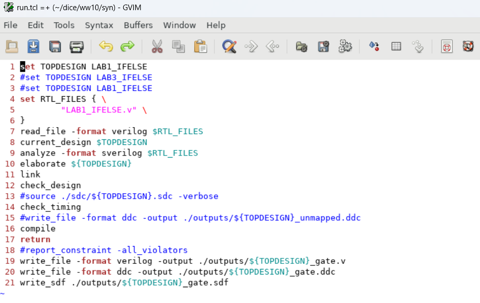

>참고 자료 : 교수님 강의 자료
>
>사용 툴 : Quartus, mobaxterm


우선 파일을 복사해왔다.

```
cp /home/jhp/dice/ww10/* ./ -r
```

rtl 폴더에 들어가보면 LAB1_IFELSE.v 파일이 있고 열어보았다.

```verilog
module LAB1_IFELSE(/*AUTOARG*/
                   // Outputs
                   out,
                   // Inputs
                   a, b, sel
                   );
   input a;
   input b;
   input sel;
   output reg out;

   always@(*)begin
      if(sel) begin
         out = a;
      end
      else begin
         out = b;
      end
   end
endmodule
```

이러면 mux가 만들어 질 것이다.

syn폴더로 넘어가면 .synopsys_dc.setup라는 파일이 있다.

이걸 열어보면 

```
##########################################################################################
# User-defined variables for logical library, RTL setup
##########################################################################################
set edkdir    "/home/eda/pdk/gpdk/14n/SAED14nm_EDK_06052019"
set lib_rvt   "${edkdir}/stdcell_rvt/db_nldm"                 ;#Logic cell library directory
set lib_hvt   "${edkdir}/stdcell_hvt/db_nldm"                 ;#Logic cell library directory
set lib_lvt   "${edkdir}/stdcell_lvt/db_nldm"                 ;#Logic cell library directory
set lib_io    "${edkdir}/io_std/SAED14_EDK/lib/io_std/db_nldm"       ;#IO library directory
set lib_mem   "${edkdir}/sram/lib/sram/logic_synth/single"    ;#Memory library directory
set lib_pll   "${edkdir}/pll/SAED14_EDK/lib/pll/logic_synth"  ;#PLL library directory
set RTL_path  "./../rtl"                            ;#RTL directory

######################################################################
# Search path Settings
######################################################################
set search_path "$search_path . $lib_rvt \
      $lib_hvt \
      $lib_lvt \
      $lib_io \
      $lib_mem \
      $lib_pll \
      $RTL_path"

##########################################################################################
# Target & Link library setup
##########################################################################################
#SS
set target_library "saed14rvt_ss0p72v125c.db"
set link_library "* $target_library \
      saed14rvt_ff0p88vm40c.db \
      saed14rvt_ss0p6v125c.db \
      saed14io_fc_ss0p72v125c_1p62v.db \
      saed14pll_ss0p72v125c.db \
      saed14sram_ss0p72v125c.db \
      dw_foundation.sldb"

##TT
#set target_library "saed14rvt_tt0p8v25c.db"
#set link_library "* $target_library \
#     saed14io_fc_tt0p8v25c_1p8v.db \
#     saed14pll_tt0p8v25c.db \
#     dw_foundation.sldb"
#
##FF
#set target_library "saed14rvt_ff0p88vm40c.db"
#set link_library "* $target_library \
#     saed14io_fc_ff0p88vm40c_1p96v.db \
#     saed14pll_ff0p88vm40c.db \
#     saed14sram_ff0p88vm40c.db \
#     dw_foundation.sldb"
##########################################################################################
# User setup
##########################################################################################
define_design_lib work -path "./work"
set hdlin_enable_rtldrc_info true
set hdlin_enable_presto_for_vl true
```

 위에서부터

set edkdir    "/home/eda/pdk/gpdk/14n/SAED14nm_EDK_06052019" 스텐다드 셀의 타이밍 정보, 레아아웃 정보, 핀포트의 위치 이런것들을 모아둔 폴더랑 db 경로. 

set lib_*는 스텐다드 셀의 속도가 있는데 r 은 regular h는 느리지만 lowpower에 강함. l은 빠른데 power가 많이 쓰임.

io, mem, pll은 이번 프로젝트에서는 쓸 일 없음. nand nor ff latch이런거 외 나머지 예를들어 sram pll같은 복잡하거나 아날로그 셀들

사용 방법은 set {변수} {변수의 value} 이렇게 사용함

rtl path는 한 칸 올라가서 rtl로 들어가면 된다고 해서 "./../rtl" 이렇게 만들어 놓음.

serach_path를 사용하면 절대경로를 치지 않아도 쓸 수 있게 함.


target_library는 어떤 스텐다드 셀 라이브러리를 쓸건지 정해주는 것.

link_library는 타이밍적인 analysis를 할 때, 사용.

그 외는 부수적인거임. 그리고 g f 눌러서 실제 존재하는 파일인지 확인하기.

----------

```
dc_shell
```

티클파일 돌리기.

```
sh gvim ./run.tcl &
```

sh shell에서 커맨드를 사용하겠다.

gvim graphical vim이 뜨고

run.tcl은 우리가 실행시킬 파일

&는 gvim을 띄워도 활성화 되게 만들어줌. 안 쓰면 gvim을 닫아야 다시 활성화됨.



```tcl
set TOPDESIGN LAB2_IFELSE
#set TOPDESIGN LAB3_IFELSE
#set TOPDESIGN LAB1_IFELSE
set RTL_FILES { \
		  "LAB1_IFELSE.v" \
}
read_file -format verilog $RTL_FILES
current_design $TOPDESIGN
analyze -format sverilog $RTL_FILES
elaborate ${TOPDESIGN}
link
check_design
#source ./sdc/${TOPDESIGN}.sdc -verbose
check_timing
#write_file -format ddc -output ./outputs/${TOPDESIGN}_unmapped.ddc
compile
return
#report_constraint -all_violators
write_file -format verilog -output ./outputs/${TOPDESIGN}_gate.v
write_file -format ddc -output ./outputs/${TOPDESIGN}_gate.ddc
write_sdf ./outputs/${TOPDESIGN}_gate.sdf
```

실제 파일이 있는지 보려면	 

```
:vs (vertical screen)
:e . (파일 목록 띄우는거)
```

이걸 통해 파일을 타고 들어가서 확인 가능.


set TOPDESIGN LAB1_IFELSE 로 변수설정 후 모듈을 잡아준다.

#은 커맨트로 간주(주석)이므로 무시.

tcl문법에서 {" "}이런식으로 중괄호에 큰 따옴표를 하면 element1개가 들어간다. 스페이스를 하고 나열할 수 있지만 엔터를 치고싶다면 역 슬레시를 한 후 해야함.

이제 tcl에 있는 코드 한 줄씩 dc_shell에 붙여넣는다.


readfile까지 붙여넣으면 다음과 같이 되고 
read_file -format verilog ${RTL_FILES} 처럼 중괄호를 붙여주면 변수 이름을 명확히 할 수 있다.
이러면 RTL_FILE을 읽어서 분석을 간단히 해보는 것인데 target library 셀이 들어와 있는지 먼저 확인해 보는 것이다. 실제로 코드상에 에러가 있다면 같이 띄워주는데 지금은 에러가 나지 않았다. 옾션으로 -rtl 파일로 지정을 했기때문에 Detecting이 netlist로 짰는지 behavior로 짰는지 분석을 해주는데 지금은 rtl로 되었다고 확인함. 그래서 코드상에 에러는 없다. 그리고 현재 파일이 LAB1_IFELSE다 라고 나왔다.

이후 

```
current_design $TOPDESIGN
```

이렇게 탑 셀을 지정할 수 있다.


```
analyze -format verilog $RTL_FILES
```

이렇게 하면 좀 더  자세히 코드를 분석하게 되는 것이고 문제 없는것을 확인했다.


그다음은

```
link
```


내가 짠 코드에 매크로가 있을 수도 있으니 실제로 내가 짠 모듈들이랑 db타이밍이랑 연결을 해주는 작업.

```
elaborate $TOPDESIGN
```


```
start_gui
```

start_gui에서


and gate처럼 생긴 애를 클릭해주면 schematic을 볼 수 있다. 너무 복잡하다보니 내가 보고싶은 부분만 보여준다. 그래서 signal flow를 클릭해주면 더 자세히 확인할 수 있다.


SELCT_OP_2.1_2.1_1이것은 시놉시스에서 게이트레벨을 표준으로 만들어 놓은게 있는데 제너럴 테크파일을 gtac 라이브러리라 하는데 거기 있는것을 가져온 것이다. 

elaboration까지 하면 behavior 코드가 gate 레벨로 바뀌는데 이것은 표준 라이브러리로 바뀌게 된다. 하지만 이것은 공정사에서 제공하는 라이브러리 셀과는 다르다. 그래서 그걸 해주는게 compile, syntesis다.

그 다음은 

```
check_design		
```

 design에 문제가 없는지 체크해줌.


그러고 타이밍적으로 문제가 없는지도 확인해줌. 지금 우리 코드에느 ㄴcombinational만 있기 때문에 뭐가 나와도 무시한다.

```
check_timing 
```


그다음은 compile

```
compile	
```

타이밍 조건을 만족하면서 가장 적은 파워와 가장 적은 면적을 만족하는 공정사에 있는 스텐다드 셀로 바꿔줌(mapping).


실행 후에는 실제 공정사의 스텐다드 셀로 바뀐 것을 확인할 수 있다.

이제 IFELSE코드 중 else를 주석처리한 후 이 과정을 다시 거치면


위와 같이 latch가 만들어지는것을 알 수 있다. 그래서 이를 해결하기 위해서는 else 를 항상 붙여주거나 시작할 때 out=0으로 초기화를 해주는 방식으로 한다. init value를 써주던가 else를 써주던가.


위와 같이 ff를 만들어준다.

그후 tcl파일을 바꿔준다. lab1 에서 lab2로 변경해주기만 하면됨.

그리고 dc_shell에 들어가서 

```cmd
source run.tcl
```

돌리게 됐을 때, ff가 있다면 ff에 대한 정보가 뜬다.


bus는 1bit이기 때문에 없다.
MB multi bit도 없다.
AR Asyncronous reset은 있다.
AS Asyncronous set flipflop은 없다. 이것은 리셋값을 넣었을 때 1로 업데이트되는지 0으로 업데이트되는 놈인지를 찾는것.
SR Syncronous reset은 없다.
SS Syncronous set 없다.
ST Syncronous toggle(?) 없다.

고로 dff만 쓴다는 것을 알 수 있고 dff가 일반 combinational logic보다 면적이 크다. 그래서 면적 관점에서 이걸 보면 감이 온다.


```
report_timing -to [get_selection]
```


timing constraint 하나도 안 들어가있음. 실제로 합성할 때는 면적만 최대한 줄이는 방향을 만들고 타이밍은 신경 안 씀. 
