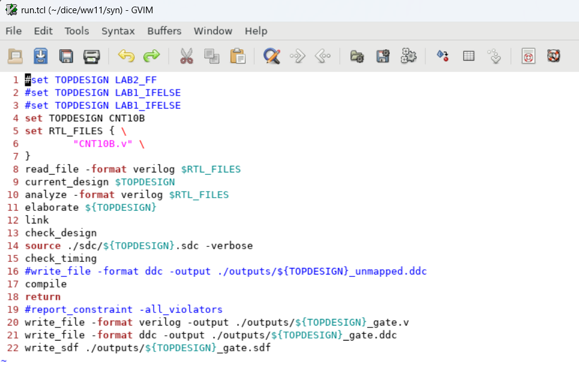
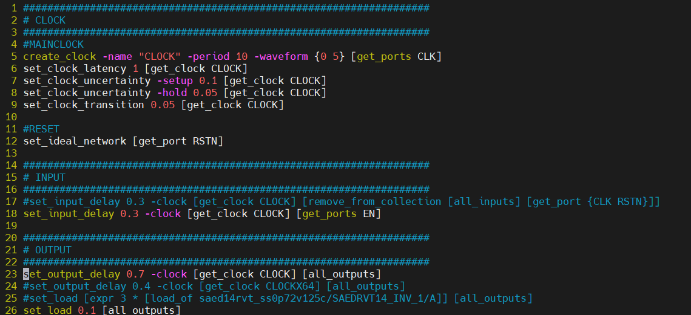
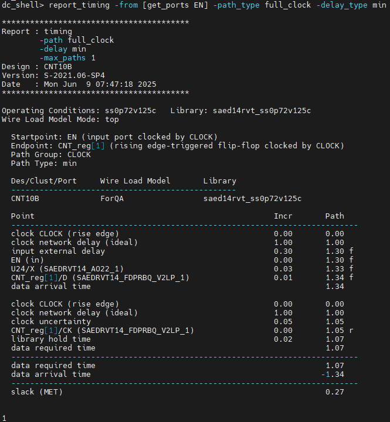

>참고 자료 : 교수님 강의 자료
>
>사용 툴 : Quartus, mobaxterm


우선 rtl 폴더에서 다음과 같이 CNT10B 카운터를 만들어 준다.

```verilog
module CNT10B(/*AUTOARG*/
              // Outputs
              CNT,
              // Inputs
              CLK, RSTN, EN
              );
   input CLK;
   input RSTN;
   input EN;
   output reg [9:0] CNT;

   reg [9:0]        COMB_CNT;

   always@(posedge CLK, negedge RSTN) begin
      if(!RSTN) begin
         CNT <= 10'd0;
      end
      else begin
         CNT <= COMB_CNT;
      end
   end

   always@(*) begin
      COMB_CNT = 10'd0;
      if(EN) begin
         COMB_CNT = CNT +10'd1;
      end
      else begin
         COMB_CNT = CNT;
      end
   end

endmodule
```

이후 syn 폴더로 들어가서 dc_shell을 친다.

```cmd
dc_shell
```

그러면 다음과 같이 dc shell이 뜬다.


그 다음 run.tcl을 돌려본다.

```cmd
sh gvim run.tcl &
```



```tcl
#set TOPDESIGN LAB2_FF
#set TOPDESIGN LAB1_IFELSE
#set TOPDESIGN LAB1_IFELSE
set TOPDESIGN CNT10B
set RTL_FILES { \
		  "CNT10B.v" \
}
read_file -format verilog $RTL_FILES
current_design $TOPDESIGN
analyze -format verilog $RTL_FILES
elaborate ${TOPDESIGN}
link
check_design
source ./sdc/${TOPDESIGN}.sdc -verbose
check_timing
#write_file -format ddc -output ./outputs/${TOPDESIGN}_unmapped.ddc
compile
return
#report_constraint -all_violators
write_file -format verilog -output ./outputs/${TOPDESIGN}_gate.v
write_file -format ddc -output ./outputs/${TOPDESIGN}_gate.ddc
write_sdf ./outputs/${TOPDESIGN}_gate.sdf
```

위에서부터 순서대로 dc_shell에 붙여준다.

read_file 까지 붙여 넣으면 다음과 같은 log가 뜬다.


```
currnet_design $TOPDESIGN
```

current_design은 verilog 파일을 여러개 쓸 때, Topdesign이 뭔지를 정해줘야한다. 그래서current design을 해주면 가장 최근의 design이 top으로 들어간다.

```
analyze -format verilog $RTL_FILES
```

좀 더 자세히분석

```
elaborate ${TOPDESIGN}
```

컴파일을 한 블럭끼리 연결시켜줘서 실제적으로 얘네가 동작하는데 이상 없는지 확인해줌.

```
start_gui
```

design 의 complexity가 높은 애를 기준으로 만들어졌기 때문에 다 보여주지 않음. 그래서 레지스터 기준으로 앞뒤를 클릭해서 해당 path에 뭐가 문제가 있는지 분석을 해야함.


게이트셀로 바뀌었지만, 공정사에서 제공한 게이트셀은 아직 아님. 그래서 gtac library에 있는 것으로 바꿔줘야함. 근데 elaborate단계에서는 보통 스케메틱을 확인하진 않음. 이런게 있다 정도만 알면 됨. 

check_timing을 하기 전에, sdc를 넣어줄 것이다.

syn폴더의 sdc폴더에서, CNT10B.sdc 파일을 만들어줬다.



```
###################################################################
# CLOCK
###################################################################
#MAINCLOCK
create_clock -name "CLOCK" -period 10 -waveform {0 5} [get_ports CLK]
set_clock_latency 1 [get_clock CLOCK]
set_clock_uncertainty -setup 0.1 [get_clock CLOCK]
set_clock_uncertainty -hold 0.05 [get_clock CLOCK]
set_clock_transition 0.05 [get_clock CLOCK]

#RESET
set_ideal_network [get_port RSTN]

###################################################################
# INPUT
###################################################################
#set_input_delay 0.3 -clock [get_clock CLOCK] [remove_from_collection [all_inputs] [get_port {CLK RSTN}]]
set_input_delay 0.3 -clock [get_clock CLOCK] [get_ports EN]

###################################################################
# OUTPUT
###################################################################
set_output_delay 0.7 -clock [get_clock CLOCK] [all_outputs]
#set_output_delay 0.4 -clock [get_clock CLOCKX64] [all_outputs]
#set_load [expr 3 * [load_of saed14rvt_ss0p72v125c/SAEDRVT14_INV_1/A]] [all_outputs]
set_load 0.1 [all_outputs]

```

single clock에 single reset이면 이 sdc 기반으로 사용하면됨. sdc는 바깥 상황에 대한 정보를 넣어주면 블락 내부에 대해서는 알아서 함. 그러면 그 바깥 사정을 넣어줄때는, 각 블락의 입력, 출력, 포트로 들어감. 그래서 모든 포트에 sdc를 기입해주면 됨. 이게 기본이다.

그럼 지금부터 하나씩 설명하면

syncoronous 디자인에서 제일 먼저 해야할거는 클락을 디자인하는 것이다.
**create_clock** 클락을 정의해주고. 이름은 **-name "CLOCK"** 이렇게 정의함. 클락에서 중요한것은 duty cycle과 주기다. **-period 10** 이렇게 하면 주기는 10ns라는 의미이다. **-waveform {0 5}** 이것은 듀티 사이클을 정의하는 부분인데 첫번째는 rise, 두번째는 fall을 의미한다. 여기서는 0ns에서 올라가고 5ns에서 내려가는 클락이 된다. 그 다음에 **[get_port CLK]**는 포트를 활성화시켜주는 것이다.

**set_clock_latency** 1은 클락이라 하는 놈이 ??소스로부터, 포트로부터 핀까지, 시그널이 ㅜㅁㄹ리적으로 가야하니깐, 인버터나 버퍼를 달아줘서 같은 시간에 도달하도록 클락 트리를 만들어줌. 클락은 모두 동일하게 도달한다 가정함. 그래서 딜레이가 어느정도일 것이다를 정해주는게 clock_latency이다. 그래서 1n로 했는데 그대로 써주면 됨. get_clock으로 CLOCK를 넣어줌.

**set_clock_uncertainty**는 edge가 정확한 타이밍에 나오지 않음. 그래서 어느정도 빨리오거나 늦게 오는 경우가 발생한다. 그래서 그 값만큼 마진을 넣어줘야한다. -setup / -hold을 표시해줌. 지터 노이즈가 대부분의 요소. 파워가 흔들리거나 rf노이즈가 들어오거나 하면 클라이 움직이는데 그걸 감안해도 올바른 데이터를 가져가겠다는 의미이고, edge기준으로 덧마진을 더 주는거고 setup, hold에 더 해준다.

**set_clock_transition**은 뭐 세워주고 눕고라고 하는데 뭔지 모르겠음.

latency는 2n이상은 권장하지 않음. 

그래서 sdc의 MAINCLOCK은 그대로 고정함. 주기만 바꿀 수 있음.

 **set_ideal_network [get_port RSTN]** false_path로 설정해 줬을때와 비슷한 의미이다.


**#set_input_delay 0.3 -clock [get_clock CLOCK] [remove_from_collection [all_inputs] [get_port {CLK RSTN}]]
set_input_delay 0.3 -clock [get_clock CLOCK] [get_ports EN]**
들어오는 데이터도 클럭에 동기화 되어있으므로 어떤 클럭에 동기화되어 들어온 데이터인지 명시해줘야함. 그리고 바깥에서 들어오는 딜레이 마진이 어느정도인지를 적어줘야한다. 우리는 input은 30 output은 70으로 마진을 잡는다.

**set_output_delay 0.7 -clock [get_clock CLOCK] [all_outputs]**

**set_load 0.1 [all_outputs]**

```
source ./sdc/${TOPDESIGN}.sdc -verbose
```


이렇게 11111나오면 잘 된것이고, error가 나오면 위 창에 떴을 것이다.

sdc를 넣어준 다음에 check timing을 해줘야한다.

```
check_timing
```


여기에 뭐라도 적히면 sdc누락인셈. 그래서 sdc를 다 기입해줘야한다.
clock, reset, input, output 다 적어줬다. 그래서 sdc 모두 다 입력해준것 이므로  다 쓴 것.

이후에 compile

```
compile
```


이런것을 볼 수 있는데, worst neg slack에 숫자가 나왔다, 그럼 망한거라고 보면 됨. 왜냐하면 타이밍 조건을 만족하지 못하는 path가 있다는 의미이므로. 

```
report_constraints -all_violators
```


얘가 어느정도 그 보여줌. 이름이 유사한 친구가 두개면 밑에 이름을 띄워주고 하나만 있으면 자동으로 만들어줌. 결과는 깨끗함. 사이즈가 작아서.

그래서 하나를 더 해봄.

```
report_timing -from [get_ports EN] -path_type full_clock
```


```
dc_shell> report_timing -from [get_ports EN] -path_type full_clock

****************************************
Report : timing
        -path full_clock
        -delay max
        -max_paths 1
Design : CNT10B
Version: S-2021.06-SP4
Date   : Mon Jun  9 07:37:22 2025
****************************************

Operating Conditions: ss0p72v125c   Library: saed14rvt_ss0p72v125c
Wire Load Model Mode: top

  Startpoint: EN (input port clocked by CLOCK)
  Endpoint: CNT_reg[9] (rising edge-triggered flip-flop clocked by CLOCK)
  Path Group: CLOCK
  Path Type: max

  Des/Clust/Port     Wire Load Model       Library
  ------------------------------------------------
  CNT10B             ForQA                 saed14rvt_ss0p72v125c

  Point                                                   Incr       Path
  --------------------------------------------------------------------------
  clock CLOCK (rise edge)                                 0.00       0.00
  clock network delay (ideal)                             1.00       1.00
  input external delay                                    0.30       1.30 f
  EN (in)                                                 0.00       1.30 f
  U15/X (SAEDRVT14_INV_S_1)                               0.04       1.34 r
  U16/X (SAEDRVT14_AO22_1)                                0.04       1.38 r
  CNT_reg[9]/D (SAEDRVT14_FDPRBQ_V2LP_1)                  0.01       1.39 r
  data arrival time                                                  1.39

  clock CLOCK (rise edge)                                10.00      10.00
  clock network delay (ideal)                             1.00      11.00
  clock uncertainty                                      -0.10      10.90
  CNT_reg[9]/CK (SAEDRVT14_FDPRBQ_V2LP_1)                 0.00      10.90 r
  library setup time                                      0.00      10.90
  data required time                                                10.90
  --------------------------------------------------------------------------
  data required time                                                10.90
  data arrival time                                                 -1.39
  --------------------------------------------------------------------------
  slack (MET)                                                        9.51

```

결론은 마진이 9.51 남는단 얘기.

```
report_timing -from [get_ports EN] -path_type full_clock -delay_type min
```



```
dc_shell> report_timing -from [get_ports EN] -path_type full_clock -delay_type min

****************************************
Report : timing
        -path full_clock
        -delay min
        -max_paths 1
Design : CNT10B
Version: S-2021.06-SP4
Date   : Mon Jun  9 07:47:18 2025
****************************************

Operating Conditions: ss0p72v125c   Library: saed14rvt_ss0p72v125c
Wire Load Model Mode: top

  Startpoint: EN (input port clocked by CLOCK)
  Endpoint: CNT_reg[1] (rising edge-triggered flip-flop clocked by CLOCK)
  Path Group: CLOCK
  Path Type: min

  Des/Clust/Port     Wire Load Model       Library
  ------------------------------------------------
  CNT10B             ForQA                 saed14rvt_ss0p72v125c

  Point                                                   Incr       Path
  --------------------------------------------------------------------------
  clock CLOCK (rise edge)                                 0.00       0.00
  clock network delay (ideal)                             1.00       1.00
  input external delay                                    0.30       1.30 f
  EN (in)                                                 0.00       1.30 f
  U24/X (SAEDRVT14_AO22_1)                                0.03       1.33 f
  CNT_reg[1]/D (SAEDRVT14_FDPRBQ_V2LP_1)                  0.01       1.34 f
  data arrival time                                                  1.34

  clock CLOCK (rise edge)                                 0.00       0.00
  clock network delay (ideal)                             1.00       1.00
  clock uncertainty                                       0.05       1.05
  CNT_reg[1]/CK (SAEDRVT14_FDPRBQ_V2LP_1)                 0.00       1.05 r
  library hold time                                       0.02       1.07
  data required time                                                 1.07
  --------------------------------------------------------------------------
  data required time                                                 1.07
  data arrival time                                                 -1.34
  --------------------------------------------------------------------------
  slack (MET)                                                        0.27


1
```

데이터가 오는시간 클락이 오는시간. 홀드같은경우는 클락보단 빨라야하니깐 빠른 애가 옴. 여기는 10 더한게 없어짐. 첫번째 엣지가 너무 빨라버리면 이렇게 됨. 다음엣지에서 채야되는데. rtl로 작동 안하겠지. 의도 한거면 몰라도 의도하지 않게 그렇게 될 수 있다. 


 report_timing -from [get_ports EN] -path_type full_clock -delay_type min

-from은 데이터path의 어느순간부터 지나간거를 보겠다를 적어줌.이거 말고

스케메틱에 들어와서 특정 path의 딜레이를 보고싶으면 플립플랍의 d를 클릭해라.


그후 

```
report_timing -to [get_selection] -path_type full_clock -delay_type max
```

이러면 모든 클락이 다 보이고, default가 max이고 max가 setup time 마진, min이 hold time 마진을 봄. 그래서 이렇게 치면 해당패스에서 가장  나쁜 마진을 보여준다.

추가 옵션으로

```
report_timing -to [get_selection] -path_type full_clock -delay_type max -significant_digits 4 -nosplit
```

하면 유효숫자 4자리, 그리고 split 안 하게 해줌.

```
report_timing -to [get_pins -hier CNT_reg[0]/D]
```

이거와도 같은 의미.

이런거 안 치면 그냥 바로 가장 나쁜 결과가 나옴. 그러고 레지스터 기준으로 보는거니깐 선택을 바꾼다고 하려면.

```
change_selection [get_cells -hier CNT_reg[0]]
change_selection [get_pins]
change_selection [get_nets]
```

하면 디지인 에서 셀을 보여줌. 그러면 앞뒤로 선택을 하면됨.

n12이렇게 되면 지정하지 않는 net이 나올 때가 있음. 그래서 net은 어렵고, 레지스터 기준을 잡고, 그거 기준으로 vcs 찍어봐야함.
