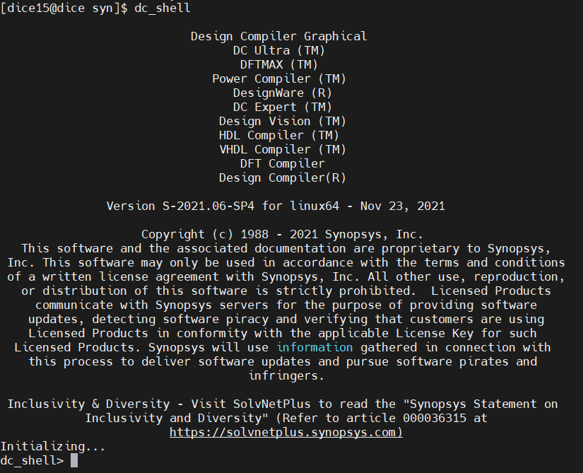
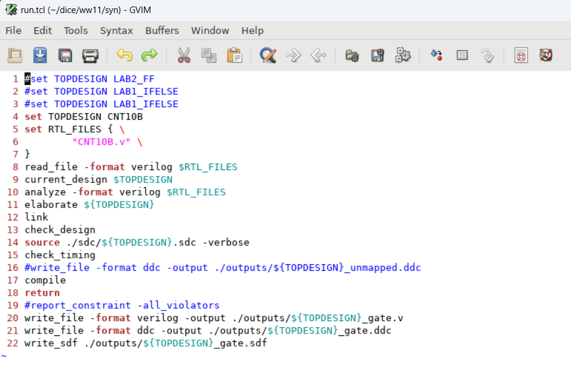

>참고 자료 : 교수님 강의 자료
>
>사용 툴 : Quartus, mobaxterm


우선 rtl 폴더에서 다음과 같이 CNT10B 카운터를 만들어 준다.

```verilog
module CNT10B(/*AUTOARG*/
              // Outputs
              CNT,
              // Inputs
              CLK, RSTN, EN
              );
   input CLK;
   input RSTN;
   input EN;
   output reg [9:0] CNT;

   reg [9:0]        COMB_CNT;

   always@(posedge CLK, negedge RSTN) begin
      if(!RSTN) begin
         CNT <= 10'd0;
      end
      else begin
         CNT <= COMB_CNT;
      end
   end

   always@(*) begin
      COMB_CNT = 10'd0;
      if(EN) begin
         COMB_CNT = CNT +10'd1;
      end
      else begin
         COMB_CNT = CNT;
      end
   end

endmodule
```

이후 syn 폴더로 들어가서 dc_shell을 친다.

```cmd
dc_shell
```

그러면 다음과 같이 dc shell이 뜬다.



그 다음 run.tcl을 돌려본다.

```cmd
sh gvim run.tcl &
```



```tcl
#set TOPDESIGN LAB2_FF
#set TOPDESIGN LAB1_IFELSE
#set TOPDESIGN LAB1_IFELSE
set TOPDESIGN CNT10B
set RTL_FILES { \
		  "CNT10B.v" \
}
read_file -format verilog $RTL_FILES
current_design $TOPDESIGN
analyze -format verilog $RTL_FILES
elaborate ${TOPDESIGN}
link
check_design
source ./sdc/${TOPDESIGN}.sdc -verbose
check_timing
#write_file -format ddc -output ./outputs/${TOPDESIGN}_unmapped.ddc
compile
return
#report_constraint -all_violators
write_file -format verilog -output ./outputs/${TOPDESIGN}_gate.v
write_file -format ddc -output ./outputs/${TOPDESIGN}_gate.ddc
write_sdf ./outputs/${TOPDESIGN}_gate.sdf
```

