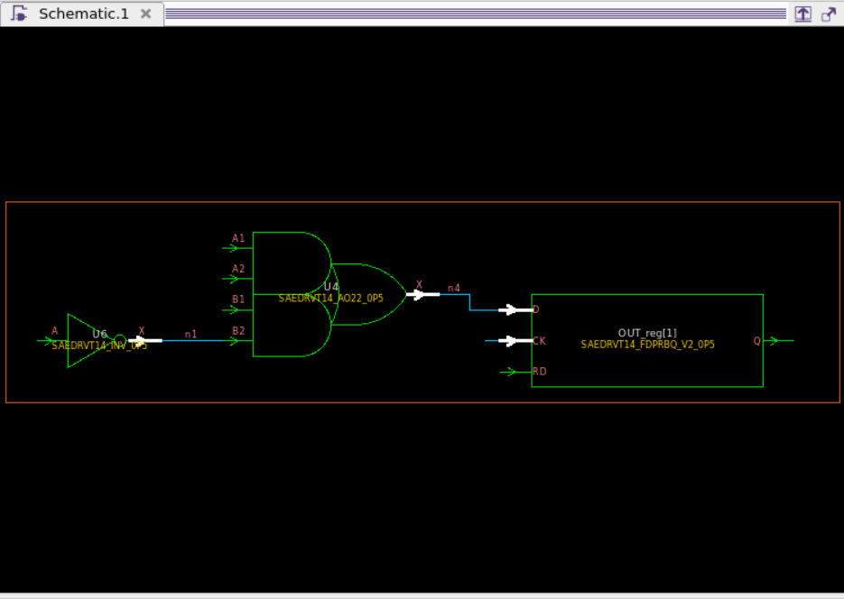

>참고 자료 : 교수님 강의 자료
>
>사용 툴 : Quartus, mobaxterm

sequential logic 배울 때 전재조건. clock은 모든 flipflop에 동시에 도달해야함. 

저번 시간에 배운거는 STA(Static Timing Analysis)인데, 이거는 셀 외부의 조건을 조작하는것. 이번에는 셀 내부에서 조작하는것을 설명.

모든 clock은 정의 되어야함. 그래서 generated clock. 

우선 CNT4B.v를 만들었다.

```verilog
module CNT4B(/*AUTOARG*/
             // Outputs
             OUT,
             // Inputs
             CLK, RSTN, EN, IN
             );
   input CLK;
   input RSTN;
   input EN;
   input [3:0] IN;
   output reg [3:0] OUT;
   reg [3:0]        NEXT_OUT;
   //synchronous single clock design
   always@(posedge CLK, negedge RSTN) begin
      if (!RSTN) begin
         OUT <= 4'd0;
      end
      else begin
         OUT <= NEXT_OUT;
      end
   end
   always@(*) begin
      NEXT_OUT = 4'd0;
      if(EN) begin
         if(OUT==IN) begin
            NEXT_OUT = 4'd0;
         end
         else begin
            NEXT_OUT = OUT + 4'd1;
         end
      end
      else begin
         NEXT_OUT=OUT;
      end
   end
endmodule
```

이걸 ripple counter를 사용한 CNT4BGENCLK를 만들었다.

```verilog
module CNT4BGENCLK(/*AUTOARG*/
                   // Outputs
                   OUT,
                   // Inputs
                   CLK, RSTN, EN, IN
                   );
   input CLK;
   input RSTN;
   input EN;
   input [3:0] IN;
   output reg [3:0] OUT;
   reg [3:0]        NEXT_OUT;
   reg              EQUAL;
   always@(*) begin
      EQUAL = 1'b0;
      if(OUT == IN) EQUAL = 1'b0;
      else EQUAL = 1'b0;
   end
   always@(negedge OUT[0], negedge RSTN) begin
      if(!RSTN)begin
         OUT[1] <= 1'b0;
      end
      else begin
         if(EN) begin
            if(EQUAL)begin
               OUT[1] <= 1'b0;
            end
            else begin
               OUT[1] <= ~OUT[1];
            end
         else begin
            OUT[1] <= OUT[1];
         end
      end
   end

   always@(negedge OUT[1], negedge RSTN) begin
      if(!RSTN)begin
         OUT[2] <= 1'b0;
      end
      else begin
         if(EN) begin
            if(EQUAL)begin
               OUT[2] <= 1'b0;
            end
            else begin
               OUT[2] <= ~OUT[2];
            end
         else begin
            OUT[2] <= OUT[2];
         end
      end
   end

   always@(negedge OUT[2], negedge RSTN) begin
      if(!RSTN)begin
         OUT[3] <= 1'b0;
      end
      else begin
         if(EN) begin
            if(EQUAL)begin
               OUT[3] <= 1'b0;
            end
            else begin
               OUT[3] <= ~OUT[3];
            end
         else begin
            OUT[3] <= OUT[3];
         end
      end
   end
endmodule
```

ripple counter처럼 flipflop의 출력이 다음 flipflop의 클락으로 적용되도록 짜줬다. 그래서 각 포인트마다 클락 선언을 해줘야하는데 얘네는 클락 소스가 CLOCK이다. CLOCK으로부터 파생되므로 generated_clock을 선언해주면 된다.

TB_CNT4B를 만들었다.

```verilog
`define TCK 1
`define ASYNDEL 0

module TB_CNT4B;
   /*AUTOREGINPUT*/
   // Beginning of automatic reg inputs (for undeclared instantiated-module inputs)
   reg         CLK;        // To DUT of CNT4B.v
   reg         EN;         // To DUT of CNT4B.v
   reg [3:0]      IN;         // To DUT of CNT4B.v
   reg         RSTN;       // To DUT of CNT4B.v
   // End of automatics
   /*AUTOWIRE*/
   // Beginning of automatic wires (for undeclared instantiated-module outputs)
   wire [3:0]     OUT;        // From DUT of CNT4B.v
   // End of automatics
   CNT4B
     DUT
       (/*AUTOINST*/
   // Outputs
   .OUT              (OUT[3:0]),
   // Inputs
   .CLK              (CLK),
   .RSTN             (RSTN),
   .EN               (EN),
   .IN               (IN[3:0]));
   initial begin

   CLK = 0;       // To DUT of CNT4B.v
   EN = 0;        // To DUT of CNT4B.v
   IN = 4'd10;       // To DUT of CNT4B.v
   RSTN = 0;         // To DUT of CNT4B.v
   #(`TCK*3);
   @(negedge CLK)
      RSTN = 1;
   #(`TCK*5);
   @(negedge CLK)
   EN = 1;
   #(`TCK*30);
   @(negedge CLK)
   EN = 0;
   @(`TCK*2);
   $finish;

   end
always #(`TCK*0.5) CLK = ~CLK;

endmodule
```

TCK처럼 매크로 셀을 만들면 클락 스피드를 쉽게 만들어줄 수 있고, 1로 만들어 줬으니 지금은 현재 클럭은 1GHz, 1ns주기의 회로가 된다. max speed 만들 때 한 번 짜고 조정만하면 된다.

```
ls ./../rtl/* > list.f
```

sim 폴더로 이동한 후 list.f 파일에 rtl에 파일들을 넣어준다.

그 중 우선 CNT4B만 우선 사용한다.

```
vcs_sub -f list.f -t TB_CNT4B -o result.fsdb
```

내 moba에서는 시뮬이 돌아가지 않아서 영상 참고. 다음과 같이 verdi가 나온다.


클락은 1n로 토글하고 있는것을 확인할 수 있다.


combinational logic은 값이 변하자 마자 바로 바뀌고 next out은 입력값이 세팅되자 마자 바로 잡히는것을 볼 수 있다. 그리고 a일때 리셋이된다.


만약 코드를 짜서 자동으로 테스트하는 블럭을 만들고싶다면, 이 시점에 tck를 계산하고, 몇 tck 뒤에 output 출력이 a 가되고 그 다음에 0으로 바뀌는지 해당 tck마다 output 값을 가져와서 expected data랑 비교해서 성공하면 s 실패하면 fail이라 print하도록 로그 남기면서 프로그래밍 하면 자동으로 테스트벤치를 auto로 짤 수 있다. 그래서 tck값만 바꾸면서 sweep을 하면 max speed를 찾을 수 있다. 지금 얘는 ideal값이라 edge 뜨면 바로 dumping 되어 들어옴. back annotation된 후 값은 나중에 확인.

이후 syn폴더로 들어가서 dc_shell로 들어간다.

tcl문법 확인하려면 

dc_shell에서 

```
man read_file
```

 하면 read_file에 대한 내용들이 다 나온다.


example을 보면서 공부하면 좋음.

```
#set TOPDESIGN LAB2_FF
#set TOPDESIGN LAB1_IFELSE
#set TOPDESIGN CNT10B
set TOPDESIGN CNT4B
set RTL_FILES { \
		  "CNT4B.v" \
}
read_file -format verilog $RTL_FILES
current_design $TOPDESIGN
analyze -format verilog $RTL_FILES
elaborate ${TOPDESIGN}
link
check_design
source ./sdc/${TOPDESIGN}.sdc -verbose
check_timing
#write_file -format ddc -output ./outputs/${TOPDESIGN}_unmapped.ddc
compile
return
report_constraint -all_violators
write_file -format verilog -output ./outputs/${TOPDESIGN}_gate.v
write_file -format ddc -output ./outputs/${TOPDESIGN}_gate.ddc
write_sdf ./outputs/${TOPDESIGN}_gate.sdf
```

run.tcl은 line by line 으로 되어있어서 그 한줄한줄 이해하면 됨

read_file은 베릴로그 파일읽고
current_design 파일 여러개니 탑 디자인 선택한 다음에
analyze 이게 합성이 되는지 확인하고
elaborate 블락끼리 연결했을 때 문제가 없는지 확인. 
여기까지가 베릴로그 밑작업

link 타이밍 라이브러리 셀과 여러 셀들과 연결해줌. 프리셋업된 애들하고 연결함.
check_design 지금까지 수행한 작업 중에 게이트 레벨로 맵핑했을 때 문제가 될 부분을 찾아줌
source ./sdc/{$TOPDESIGN}.sdc -verbose sdc파일 안에 들어가서 라인바이라인으로 하나씩 실행해도 된다는 의미. 여기서부터 쭉 sdc 하고 런티클 하면된단 얘기. 디자인적으로 elaborate까지 문제 없으니깐 timing constraint 입혀준것. 
check_timing 하면 이 제대로 입혀졌는지 확인하는 것이고, 이상한 에러가 뜨면 해결 한 후 compile 할것.
라이센스가 빵빵하면 compile_ultra 치라고함.. 뭔얘기지?

source run.tcl하면 라인바이라인으로 실행을 하는데 return 이 되면 끝남.

그 이후에 하는것이 report인데 타이밍적으로 문제가 있는지 확인해주는 작업. 

이게 다 끝나면 .v 뽑고 .ddc 저장해주고 wirte_sdf를 해줌. 

그래서 최종적으로 나온 결과물을 _gate.v 게이트레벨로 합성된 netlist 파일, _gate.ddc , 이 차일로 시뮬을 돌리면 됨.

그래서 return 을 지운 후 

```
source run.tcl
```

 아 sdc를 안 만들어줘서.

```
###################################################################
# CLOCK
###################################################################
#MAINCLOCK
create_clock -name "CLOCK" -period 1 -waveform {0 0.5} [get_ports CLK]
set_clock_latency 1 [get_clock CLOCK]
set_clock_uncertainty -setup 0.1 [get_clock CLOCK]
set_clock_uncertainty -hold 0.05 [get_clock CLOCK]
set_clock_transition 0.05 [get_clock CLOCK]

#RESET
set_ideal_network [get_port RSTN]

###################################################################
# INPUT
###################################################################
set_input_delay 1.5 -clock [get_clock CLOCK] [remove_from_collection [all_inputs] [get_port {CLK RSTN}]]
#set_input_delay 1.5 -clock [get_clock CLOCK] [get_port {EN IN[3] IN[2] IN[1] IN[0]}]
#set_input_delay 0.3 -clock [get_clock CLOCK] [get_ports EN]

###################################################################
# OUTPUT
###################################################################
set_output_delay 3.5 -clock [get_clock CLOCK] [all_outputs]
#set_output_delay 0.4 -clock [get_clock CLOCKX64] [all_outputs]
#set_load [expr 3 * [load_of saed14rvt_ss0p72v125c/SAEDRVT14_INV_1/A]] [all_outputs]
set_load 0.1 [all_outputs]

```

위와 같이 CNT4B.sdc를 만들어줬다. period를 1, {0 0.5}로 많이 줄인 상태다.

이 후 source run.tcl을 해주면 


 violated라는게 뜨는데 report_constraints -all violator에 해당하는 부분이다. max delay setup이 났는데, end point는 port고, requierd time은 -1.6인데 실제로는 1.06이 라 slack이 -2.66만큼 났다. 

```
report_timing 
report_timing -path_type full_clock <<이거로 하면 더 자세히 나온다고 함
```

이걸 통해 확인을 해본다.


clock은 ck핀까지는 1나노 먹고, ck에서 q로 가서  out까지 가는데 걸리는 딜레이가 1.06이다. 출력은 network delay 1하고 uncertainty가 0.1나노 먹음. 이거의 문제는 지금 input output delay를 5나노 기준으로 맞춰줬는데, 마지막에 1나노로 바꾸고 inout delay를 안 바꿔줘서 그렇다. 그래서 input은 0.3 output은 0.7로 바꾼 후 report_timing을 실행하면


위와같이나오고 140p 남아있고 실제로 0.86ns까지 작동할 수 있음을 보여준다.

dc_shell을 나가서 outputs 폴더에 들어가 확인해보면 gate.ddc,sdf,v파일이 나와있다.


gate.v파일은 다음과같다.

```verilog
/////////////////////////////////////////////////////////////
// Created by: Synopsys DC Expert(TM) in wire load mode
// Version   : S-2021.06-SP4
// Date      : Mon Jun  9 11:04:44 2025
/////////////////////////////////////////////////////////////


module CNT4B ( OUT, CLK, RSTN, EN, IN );
  output [3:0] OUT;
  input [3:0] IN;
  input CLK, RSTN, EN;
  wire   n7, n8, n9, n10, n11, n12, n13, n14, n15, n16, n17, n18, n19, n20,
         n21, n22, n23, n24, n25;

  SAEDRVT14_FDPRBQ_V2_0P5 \OUT_reg[0]  ( .D(n24), .CK(CLK), .RD(RSTN), .Q(
        OUT[0]) );
  SAEDRVT14_FDPRBQ_V2_0P5 \OUT_reg[1]  ( .D(n23), .CK(CLK), .RD(RSTN), .Q(
        OUT[1]) );
  SAEDRVT14_FDPRBQ_V2_0P5 \OUT_reg[2]  ( .D(n22), .CK(CLK), .RD(RSTN), .Q(
        OUT[2]) );
  SAEDRVT14_FDPRBQ_V2_0P5 \OUT_reg[3]  ( .D(n21), .CK(CLK), .RD(RSTN), .Q(
        OUT[3]) );
  SAEDRVT14_OR4_1 U4 ( .A1(n8), .A2(n9), .A3(OUT[3]), .A4(n10), .X(n7) );
  SAEDRVT14_AO32_1 U7 ( .A1(OUT[1]), .A2(n10), .A3(n13), .B1(OUT[2]), .B2(n12),
        .X(n22) );
  SAEDRVT14_AO21B_0P5 U8 ( .A1(n8), .A2(n11), .B(n14), .X(n12) );
  SAEDRVT14_INV_0P5 U9 ( .A(OUT[2]), .X(n10) );
  SAEDRVT14_OAI22_0P5 U10 ( .A1(n14), .A2(n8), .B1(OUT[1]), .B2(n9), .X(n23)
         );
  SAEDRVT14_INV_0P5 U11 ( .A(n13), .X(n9) );
  SAEDRVT14_AN3_0P5 U12 ( .A1(n11), .A2(OUT[0]), .A3(EN), .X(n13) );
  SAEDRVT14_INV_0P5 U13 ( .A(OUT[1]), .X(n8) );
  SAEDRVT14_AOI21_0P5 U14 ( .A1(n15), .A2(n11), .B(n16), .X(n14) );
  SAEDRVT14_AO32_1 U15 ( .A1(n11), .A2(n15), .A3(EN), .B1(OUT[0]), .B2(n16),
        .X(n24) );
  SAEDRVT14_INV_0P5 U16 ( .A(EN), .X(n16) );
  SAEDRVT14_INV_0P5 U17 ( .A(OUT[0]), .X(n15) );
  SAEDRVT14_OR4_1 U18 ( .A1(n17), .A2(n18), .A3(n19), .A4(n20), .X(n11) );
  SAEDRVT14_EO2_V1_0P75 U19 ( .A1(OUT[2]), .A2(IN[2]), .X(n20) );
  SAEDRVT14_EO2_V1_0P75 U20 ( .A1(OUT[3]), .A2(IN[3]), .X(n19) );
  SAEDRVT14_EO2_V1_0P75 U21 ( .A1(OUT[0]), .A2(IN[0]), .X(n18) );
  SAEDRVT14_EO2_V1_0P75 U22 ( .A1(OUT[1]), .A2(IN[1]), .X(n17) );
  SAEDRVT14_AO21B_0P5 U24 ( .A1(n25), .A2(OUT[3]), .B(n7), .X(n21) );
  SAEDRVT14_AO21_1 U25 ( .A1(n11), .A2(n10), .B(n12), .X(n25) );
endmodule

```

sdf는 다음과같다.

```
(DELAYFILE
  2 (SDFVERSION "OVI 2.1")
  3 (DESIGN "CNT4B")
  4 (DATE "Mon Jun  9 11:04:44 2025")
  5 (VENDOR "saed14rvt_ss0p72v125c")
  6 (PROGRAM "Synopsys Design Compiler cmos")
  7 (VERSION "S-2021.06-SP4")
  8 (DIVIDER /)
  9 (VOLTAGE 0.72:0.72:0.72)
 10 (PROCESS "ss0p72v125c")
 11 (TEMPERATURE 125.00:125.00:125.00)
 12 (TIMESCALE 1ns)
 13 (CELL
 14   (CELLTYPE "CNT4B")
 15   (INSTANCE)
 16   (DELAY
 17     (ABSOLUTE
 18     (INTERCONNECT U18/X U25/A1 (0.013:0.013:0.013))
 19     (INTERCONNECT U9/X U25/A2 (0.012:0.012:0.012))
 20     (INTERCONNECT U8/X U25/B (0.011:0.011:0.011))
 21     (INTERCONNECT U25/X U24/A1 (0.008:0.008:0.008))
 22     (INTERCONNECT OUT_reg\[3\]/Q U24/A2 (0.011:0.011:0.011))
 23     (INTERCONNECT U4/X U24/B (0.008:0.008:0.008))
 24     (INTERCONNECT OUT_reg\[1\]/Q U22/A1 (0.017:0.017:0.017))
 25     (INTERCONNECT IN[1] U22/A2 (0.014:0.014:0.014))
 26     (INTERCONNECT OUT_reg\[0\]/Q U21/A1 (0.017:0.017:0.017))
 27     (INTERCONNECT IN[0] U21/A2 (0.014:0.014:0.014))
 28     (INTERCONNECT OUT_reg\[3\]/Q U20/A1 (0.016:0.016:0.016))
 29     (INTERCONNECT IN[3] U20/A2 (0.014:0.014:0.014))
 30     (INTERCONNECT OUT_reg\[2\]/Q U19/A1 (0.016:0.016:0.016))
 31     (INTERCONNECT IN[2] U19/A2 (0.014:0.014:0.014))
 32     (INTERCONNECT U22/X U18/A1 (0.009:0.009:0.009))
 33     (INTERCONNECT U21/X U18/A2 (0.011:0.011:0.011))
 34     (INTERCONNECT U20/X U18/A3 (0.010:0.010:0.010))
 35     (INTERCONNECT U19/X U18/A4 (0.009:0.009:0.009))
 36     (INTERCONNECT OUT_reg\[0\]/Q U17/A (0.011:0.011:0.011))
 37     (INTERCONNECT EN U16/A (0.009:0.009:0.009))
 38     (INTERCONNECT U18/X U15/A1 (0.011:0.011:0.011))
 39     (INTERCONNECT U17/X U15/A2 (0.012:0.012:0.012))
 40     (INTERCONNECT EN U15/A3 (0.011:0.011:0.011))
 41     (INTERCONNECT OUT_reg\[0\]/Q U15/B1 (0.013:0.013:0.013))
 42     (INTERCONNECT U16/X U15/B2 (0.010:0.010:0.010))
 43     (INTERCONNECT U17/X U14/A1 (0.010:0.010:0.010))
 44     (INTERCONNECT U18/X U14/A2 (0.013:0.013:0.013))

```

대충 이런식인데 너무 길어서 이것만 담았다. 여기서 보면 connection line 마다 delay를 다 적어줬다. v파일과 sdf 파일을 같이 물려주면 각 인스턴스마다 딜레이를 얼마나 먹는지를 알 수 있고 이걸 해서 시뮬을 돌려주면결과가 달라진다.

sim 폴더로 돌아가서 rtl폴더를 만들어 다 넣어주고 gate파일을 만들어 list.f파일에 syn에서 만들어진 CNT4B_gate.v경로를 만들어주고, TB_CNT4B.v파일을 복사해서 TB_CNT4B_gate.v파일을 만든다. 그 후 sdf_annotate 하나 넣어줬고 절대경로로 넣고 인스턴스 지정해주었다. 

 

그 다음에 스텐다드 셀의 베릴로그를 추가해주면 된다.

그리고 edk에 대한 경로를 list.f에 추가해주고 시뮬레이션을 돌린다.


돌린 결과 엣지가 떴지만 데이터가 68ps 이후에 나오는 것을 확인할 수 있다.

------

이제 syn폴더로 돌아와서 sdc폴더의 CNT4BGENCLK.sdc파일을 만들어준다. cp CNT4B.sdc로 복사하면 편하다.


CLK는 선언이 되어있지만, 클락처럼 활용한 OUT[0:2]는 선언이 되어있지 않아 generate clock를 해줘야한다.

```
create_generated_clock [-name clock_name] -source master_pin [-edges edge_list] [-divide_by factor] [-multiply_by factor] [-duty_cycle percent] [-invert] [-edge_shift shift_list] [-add] [-
master_clock clock] [-combinational] source_objects
```

이름선언하고, source clock은 이걸 기반으로 만든다라는 뜻이고, 이 클락의 출발점을 써주고, 보통은 flipflop의 q핀이다. 아니면 substance의 포트를 넣던가 둘중 하나.	

그래서 아직 바꾸진 않고 dc_shell로 들어가서 GENCLK로 TOPDESIGN을 바꿔주고, check design 다음에 return을 넣어준 후 source ./run.tcl을 해 준다. 

그 후 start_gui를 켜준 후에, get_nets OUT[0]으로 포트를 잡아준다.


얘가 존재하고 켜져 있는걸 확인했고, 얘를 잡아야하니까 [get_nets OUT[0]] return, 대괄호 하면 리턴이 되고, 애를 선택할거니깐 change_selection

```
change_selection [get_nets OUT[0]]
```

하면 잡힌다. 이상태에서 gui가 켜져있었는데, 그 and 심볼같은 애를 눌러주면 

이렇게 바로 뜬다. 이중 우리가 잡아야할 부분은 Q이다. 

TOP을 만들면 genclk가 더 많을 텐데, 이때 해야할게 net이름으로 포트를 찾고 change_selection으로 바꿔주고 start_gui켜서 넷을 클릭하면 선택되면서


네이밍 규칙을 확인한 후 q를 선택해준다. 그 다음에 get_selection

``` 
get_selection
```

하면 이거로 선택이 된다.

그러고 dc_shell에서 바로 genclk해줘도 된다. 지금까지 실행한 애들 보려면 history라는 명령어가 있다.

```
history > a
sh gvim a
```

a로 덤핑을 받은 후 텍스트를 열어주면 

이렇게 텍스트로 나오고 원하는 부분만 남기고 사용하면 된다.

```
###################################################################
# CLOCK
###################################################################
#MAINCLOCK
create_clock -name "CLOCK" -period 1 -waveform {0 0.5} [get_ports CLK]
set_clock_latency 1 [get_clock CLOCK]
set_clock_uncertainty -setup 0.1 [get_clock CLOCK]
set_clock_uncertainty -hold 0.05 [get_clock CLOCK]
set_clock_transition 0.05 [get_clock CLOCK]

#GENCLOCK
create_generated_clock -name CLKX2 -edges {1 3 5} -source [get_ports CLK] [get_pins OUT_reg[0]/Q]
create_generated_clock -name CLKX4 -edges {2 4 6} -source [get_pins OUT_reg[0]/Q] [get_pins OUT_reg[1]/Q]
create_generated_clock -name CLKX8 -edges {2 4 7} -source [get_pins OUT_reg[1]/Q] [get_pins OUT_reg[2]/Q]

#RESET
set_ideal_network [get_port RSTN]

###################################################################
# INPUT
###################################################################
set_input_delay 0.3 -clock [get_clock CLOCK] [remove_from_collection [all_inputs] [get_port {CLK RSTN}]]
#set_input_delay 1.5 -clock [get_clock CLOCK] [get_port {EN IN[3] IN[2] IN[1] IN[0]}]
#set_input_delay 0.3 -clock [get_clock CLOCK] [get_ports EN]

###################################################################
# OUTPUT
###################################################################
set_output_delay 0.7 -clock [get_clock CLOCK] [all_outputs]
#set_output_delay 0.4 -clock [get_clock CLOCKX64] [all_outputs]
#set_load [expr 3 * [load_of saed14rvt_ss0p72v125c/SAEDRVT14_INV_1/A]] [all_outputs]
set_load 0.1 [all_outputs]
```

3개의 genclk를 만들어줬다.

이후 dc shell을 다 닫고, 다시 들어간 후 return을 sdc 다음으로 옮겨 준 다음 source run.tcl

클락을 제대로 먹였는지 궁금하면

```
report_clock
```


위에 잘못 한듯 2 4 6 이어야하는데 2 4 7로 돼있음. 그 다음 

```
check_timing
```

잘 나오면 compile

```
compile
```

다 되면

```
report_constraint -all_violators
```


```
report_timing
```


교수님 로그에서는 출발이 CLOCK이라 되어있고 IN[2]로 되어있는게 문제라 하심. 이건 RTL코드가 문제라고 함.


근데 내 코드에서는 EN으로 되어있음.

암튼 rtl문제이니 바꿀거고 다음과 IN하고 EQUAL을 없앴음.

```verilog
module CNT4BGENCLK(/*AUTOARG*/
                   // Outputs
                   OUT,
                   // Inputs
                   CLK, RSTN, EN
                   );
   input CLK;
   input RSTN;
   input EN;
   output reg [3:0] OUT;
   reg [3:0]        NEXT_OUT;

   always@(posedge CLK, negedge RSTN) begin
      if(!RSTN)begin
         OUT[0] <= 1'b0;
      end
      else begin
         if(EN) begin
               OUT[0] <= ~OUT[0];
         end
         else begin
            OUT[0] <= OUT[0];
         end 
      end
   end

   always@(negedge OUT[0], negedge RSTN) begin
      if(!RSTN)begin
         OUT[1] <= 1'b0;
      end
      else begin
         if(EN) begin
               OUT[1] <= ~OUT[1];
         end
         else begin
            OUT[1] <= OUT[1];
         end 
      end
   end

   always@(negedge OUT[1], negedge RSTN) begin
      if(!RSTN)begin
         OUT[2] <= 1'b0;
      end
      else begin
         if(EN) begin
               OUT[2] <= ~OUT[2];
         end
         else begin
            OUT[2] <= OUT[2];
         end 
      end
   end

   always@(negedge OUT[2], negedge RSTN) begin
      if(!RSTN)begin
         OUT[3] <= 1'b0;
      end
      else begin
         if(EN) begin
               OUT[3] <= ~OUT[3];
         end
         else begin
            OUT[3] <= OUT[3];
         end 
      end
   end
endmodule
```

```
source run.tcl
check_timing
compile
report_constraints -all_violants
```


여전히에러가 있긴 함.

```
report_timing
```


문제가 뭔지 알겠어요? period가 1ns인데 x2에서 네트워크 딜레이로 1ns를 먹어버림. 

흠.

```
change_selection [get_cells OUT_reg[3]]
start_gui
```


흠, 예제가 적절치 않은거같아요.

SEQGEN으로 되어있잖아요. 근데 회로에 negedge 를 채는 flipflop이 없잖아요. 그래서 회로가 제대로 안 만들어져요. 그래서 이건 gtek에 있는 셀인데 다른 셀을 보면


이런식으로 나오는데 실제 실물이 존재하는 셀이에요.

compile하고 elaborate하면 rtl이 gtek셀로 바뀌는데 시놉시스에서 대충 behavior function들은 이런 게이트의 일반 제너럴 프로세스로 바뀐다 이건데, SEQGEN은 플립플랍 레치가 짬뽕된 셀, 근데 실물이 없어서 공정사에서 제공하는 셀리스트로 바꿔야하는데, SAEDRVT~이런 애들로 바꿔주는거. 근데 negedge로 채는 ff가 없으니깐 이상하게 생김. 그래서 약을 치거나 코드를 수정해줘야함.


그래서 negedge OUT[*]얘네들 posedge로 바꿔줌.

그리고 sdc수정

```
###################################################################
# CLOCK
###################################################################
#MAINCLOCK
create_clock -name "CLOCK" -period 1 -waveform {0 0.5} [get_ports CLK]
set_clock_latency 1 [get_clock CLOCK]
set_clock_uncertainty -setup 0.1 [get_clock CLOCK]
set_clock_uncertainty -hold 0.05 [get_clock CLOCK]
set_clock_transition 0.05 [get_clock CLOCK]

#GENCLOCK
create_generated_clock -name CLKX2 -edges {1 3 5} -source [get_ports CLK] [get_pins OUT_reg[0]/Q]
set_clock_latency 0.5 [get_clock CLKX2]
set_clock_uncertainty -setup 0.1 [get_clock CLKX2]
set_clock_uncertainty -hold 0.05 [get_clock CLKX2]

create_generated_clock -name CLKX4 -edges {1 3 5} -source [get_pins OUT_reg[0]/Q] [get_pins OUT_reg[1]/Q]
set_clock_latency 0.5 [get_clock CLKX4]
set_clock_uncertainty -setup 0.1 [get_clock CLKX4]
set_clock_uncertainty -hold 0.05 [get_clock CLKX4]

create_generated_clock -name CLKX8 -edges {1 3 5} -source [get_pins OUT_reg[1]/Q] [get_pins OUT_reg[2]/Q]
set_clock_latency 0.5 [get_clock CLKX8]
set_clock_uncertainty -setup 0.1 [get_clock CLKX8]
set_clock_uncertainty -hold 0.05 [get_clock CLKX8]


#RESET
set_ideal_network [get_port RSTN]

###################################################################
# INPUT
###################################################################
set_input_delay 0.3 -clock [get_clock CLOCK] [remove_from_collection [all_inputs] [get_port {CLK RSTN}]]
#set_input_delay 1.5 -clock [get_clock CLOCK] [get_port {EN IN[3] IN[2] IN[1] IN[0]}]
#set_input_delay 0.3 -clock [get_clock CLOCK] [get_ports EN]

###################################################################
# OUTPUT
###################################################################
set_output_delay 0.7 -clock [get_clock CLOCK] [all_outputs]
#set_output_delay 0.4 -clock [get_clock CLOCKX64] [all_outputs]
#set_load [expr 3 * [load_of saed14rvt_ss0p72v125c/SAEDRVT14_INV_1/A]] [all_outputs]
set_load 0.1 [all_outputs]
```

이렇게 수정했고, dc_shell들어가서 source run.tcl


이렇게 뜨는데 violated중에 hold는 무시해라. 왜냐하면 hold는 syntesis상에서 잡을 수 없다. 그래서 hold violation은 무시하는게 맞음.

setup만 클린업 해서 잡음 됩니다.


이 결과, 스케메틱을 보면서 하고싶다. 그러면 

```
report_timing > a
gvim a
```

a로 덤핑한 다음에 켜준다.


이렇게 본다고 하면, 이 텍스트 상자에서

```
:'<,'>!column -t #줄맞춤(줄 선택을 해줘야함)
```

그러고 ctrl+v를 하고 끝까지 가면 선택이 되고 지우면 

내가 보고싶은 pinlist만 남아있는거고 

여기서 

```
:%s/\n/ /g #줄바꿈을 스페이스로
:%s/\  / /g #스페이스 두개를 스페이스 한 개로
```

이렇게 해서 노란 표시가 안 뜰 때까지 해주면 


이렇게 남음

```
change_selection [get_pins -hier {저 핀들}]
```

이렇게 바꿔주고 저장 후 

```
source a
start_gui
```



이렇게 내가 원하는 핀들만 잡아서 보여줌.


------

그러고

```
report_constraints -all_violators > TOP.constraints

write_sdc ./outputs/TOP_gate.sdc

report_power -hierachy > ./outputs/TOP.power

report_area -hierachy > ./outputs/TOP.area
```

이렇게 제출해야하는 파일저장.

