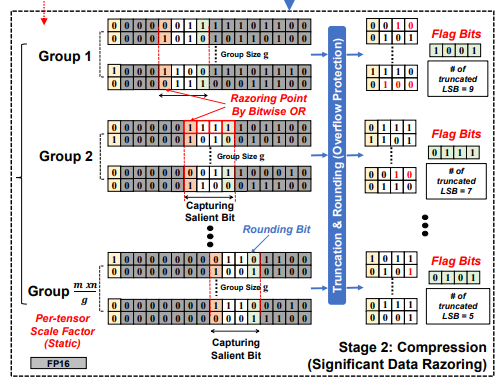

> arXiv 2025. [[Paper](https://arxiv.org/abs/2501.13331)]
>
> Dongyoung Lee, Seungky Choi, Ik Joon Chang
>
> 23 Jan 2025

이 논문에서는 LLM 배포를 위한 경량화 작업 중 양자화로 인한 문제 해결을 위해 **QRazor**를 제안한다. 이는 **추가적인 미세 조정(fine-tuning)이나 추가 학습 없이도 동작**하며, 최첨단 4비트 양자화 기법과 비교했을 때 비슷하거나 더 나은 성능을 보인다. LLaMA2-7B 모델의 zero-shot 추론 작업에서 SmoothQuant 및 QLLM보다 12점 이성, Quarot(RTN)보다 2.9점 이상 높은 정확도를 보였다.

# Introduction

LLM은 NLP 및 자동 텍스트 생성을 비롯한 다양한 분야에서 뛰어난 성능을 발휘하지만 방대한 양의 매개변수로 인해 효율적인 처리를 어렵게 한다. 게다가 막대한 메모리 요구량과 높은 연산 부담은 자원이 제한된 환경에서 LLM 배포를 어렵게 한다. 

 양자화은 이러한 문제를 해결하는 가장 효율적인 방법 중 하나이다. LLM 매개변수의 정밀도를 fp16(floating point 16 bit)에서 fp4(floating point 4bit)로 감소시키면, 추론시 메모리 사용량과 연산의 복잡도를 크게 줄일 수 있다.

 양자화에는 크게 PTQ(Post-Training Quantization)과 QAT(Quantization-Aware Training) 두가지로 나뉘는데, 이 논문에서는 PTQ에 초점을 맞췄다. **PTQ의 주요 과제는 정확도 저하(accurancy drop)다.** 선행 연구에 따르면, 가중치(weight)보다 활성화 값(activiations)을 양자화 하는것이 더 어렵다. 이는 활성화 값이 더 넓은 동적 범위를 가지며, 이상치가 존재하기 때문이다. 이러한 이유로, 여러 연구에서 PTQ 보정 단계에서 활성화 이상치를 식별하고 완화하는 다양한 방법을 제안해왔다.

 **데이터 재분배(data redistribution)**기법은 양자화 오류 최소화를 위해 널리 사용되지만 가중치 활성화 값을 모두 4비트 정수로 양자화 할 경우 여전히 상당한 정확도 저하가 발생한다. **회전 행렬(rotation matrices)**를 활용해 LLM의 가중치와 활성화 값을 4비트 정수로 양자화하면서도 일정 수준 정확도를 유지하는데 성공했고, 특히 **Quarot은 orthogonal Hadamard-based rotations**을 활용해 활성화 값과 KV 캐시의 이상치(outlier)를 억제함으로써 활성화 값의 이상치로 인한 영향을 효과적으로 완화했다. 그러나 이는 오버헤드가 존재하고, 항상 이상치 억제 효과를 보장하지 않는다. 또한, 이런 회전 기법의 효율성은 **데이터 분포에 크게 의존**하므로 MoE 모델과 같이 다양한 데이터 분포를 포함하는 모델에 Quarot을 적용하려면 **상당한 튜닝이 필요**하다.

 이 논문에서는 신뢰할 수 있는 4bit LLM을 구현하는 PTQ 기법인 **QRazor**를 소개한다. 

### Absolute Max Scaling

이 기법은 데이터의 $\vert X_{max} \vert$ (최대의 절댓값)을 이용하여 입력 데이터를 목표한 bit-width 내로 맞추는 방식이다.

양자화 과정은 텐서에서 $\vert X_{max} \vert$를 찾는 것으로 시작되며, 이를 기반으로 scale factor를 계산한다. 예를 들어 8비트 정수 양자화의 경우 quantization및 dequantization 공식은 다음과 같다.
$$
X_q=\text{round}(\frac{127}{\vert X_{max} \vert}\cdot X) \space , \hat{X}=\frac{\vert X_{max}\vert}{127}\cdot X_q \\(X_q:\text{quantized tensor}\space,\space \hat{X}:\text{dequantized tensor})
$$
이 방법을 사용하면 텐서의 모든 값이 8비트 범위 내에서 normalization되며, 허용된 비트 폭 내에서 최대한의 정밀도를 확보할 수 있다.

Qrazor에서는 base precision scenario를 설정할 때 이를 적용한다.

# QRazor

우선 Quantization 단계에서는 FP16 파라미터를 high-bit integers로 양자화 하여 LLM 파라미터를 정확도를 일지 않고 표현한다. 이를 **base precision scenarion**라고 한다. 이 단계에서는 static **quantiziation method**만 사용된다. 

이후 Compression 단계에서는 **SDR(Significant Data Razoring)기법**을 사용해 **더 낮은 비트 데이터로 압축**한다.

다음은 QRazor의 전체적인 구조를 보여주고 있다.

###  1. Quantization Stage: W8A16 or W8A16KV8

이 단계에서는 LLM의 파라미터가 FP16에서 두가지 base precision scenario로 변환되고 KV캐시 압축 적용 여부에 따라 다음과 같이 나뉜다.

- W8A16: 8비트 가중치, 16비트 활성화 값(Activations)
- W8A16KV8: 8비트 가중치, 16비트 활성화값, 8비트 KV 캐시

이러한 base precision은 이후 압축 단계에서 최종적으로 4비트 정수표현으로 변환되기 위한 **원시 데이터 타입(primitive data type) 역할**을 한다.

pre-tensor static quantization을 위한 base precision 선택은, 데이터 재분배나 회전같은 추가적인 기법 없이 텐서 내 이상치를 유지하는 것을 목표로 한다. 

일반적으로 활성화 값은 가중치나 KV캐시보다 더 넓은 동적범위를 가지며, 더 극단적인 이상치가 존재하는 경향이 있다. **활성화값의 효과적인 양자화를 위해서** **16비트 정수와 같은** **높은 정밀도의 형식이 필요**하다. 이를 통해 활성화 값의 전체 값을 포착하면서 정보 손실을 최소화 할 수 있다.

다음은 Pre-tensor static quantization만 적용한 세가지 다른 정밀도 시나리오에서의  LLM 정확도 결과이다.

W8A16 사용시 FP16과 거의 동일한 정확도를 유지했고, W8A8 사용시 정확도가 크게 감소함을 보였다. 

이 결과는 활성화 값이 이상치 가많은 동적 범위를 갖고 있기 때문에, 이를 충분히 포착하기 위해 16비트 정밀도가 필요한 것이다. 반면 8비트 정밀도는 가중치와 KV캐시에는 충분한 것으로 나타났다.

### 2. Compression Stage: Significant Data Razoring

이 단계는 양자화 단계에서 얻은 정수에 SDR을 적용한다. 이는 decompression 없는 연산을 가능하게 하여 diquantization의 부담을 최소화한다.

여기서 SDR 기법은 각 그룹에 대한 razoring point를 식별하는데, 이는 선행하는 비트 위치에 해당한다.

다음은 bitwise OR연산을 이용해 razoring point를 감지하는 SDR 인코딩 방식을 보인 것이다.

그룹 내에서 bitwise OR연산 후 MSB 위치를 식별하고 이 위치를 기준으로 flag bit가 자동으로 생성된다. 또한 razoring point를 기준으로 nearest-to-round방식과 truncation을 결합해 target precision에서 salient bits를 유지한다. 이때 round 과정에서 오버플로우의 위험이 있다. 예를들어 $ 01111_2 $를 반올림 하면 MSB가 바뀔 수 있다.이를 방지하기 위해 salient bit가 모두 1일때는 반올림 대신 flooring을 적용한다.

다음은 위의 과정을 알고리즘으로 설명해 놓은 것이다.

