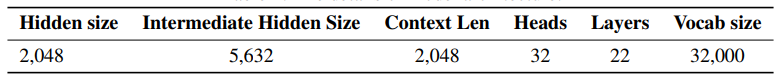
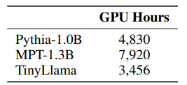
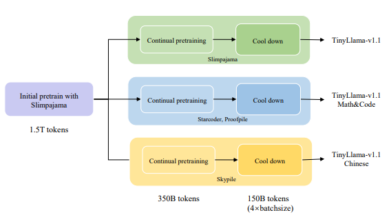
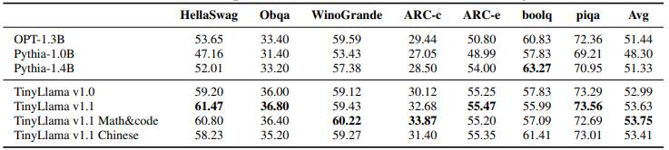
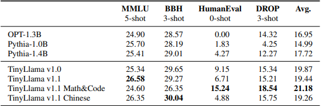
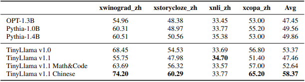

>arXiv 2023. [[Paper](https://arxiv.org/abs/2401.02385)] [[Github](https://github.com/jzhang38/TinyLlama)]
>
>Peiyuan Zhang, Guangtao Zeng, Tianduo Wang, Wei Lu
>
>4 Jan 2024

이 논문에서는 최대 3에폭의 1T 토큰으로 사전학습된 1.1B언어모델을 TinyLlama를 소개하고 있다. TinyLlama의 구조와 토크나이저는 Llama2를 기반으로 하고, FlashAttention, Lit-GPT등의 여러 기술을 오픈소스 커뮤니티에서 가져왔다. 

 TinyLlama는 상대적으로 작은 크기이지만 다양한 다운스트림 작업에서 뛰어난 성능을 발휘하고, 유사한 크기의 기존 오픈소스 언어 모델들을 크게 능가했다.

# Introduction

최근의 NLP는 모델크기의 확장하는 방향으로 발전이 이루어졌다. 많은 양의 corpus로 pre-training된 LLM에서 그 효과가 입증되기도 했다. 이와 다른 연구들은 LLM 스케일링 동작을 모델링하는 데 초점을 맞추고 있다. 

이러한 연구들은 대형 모델을 선호하는 경향이 있지만, **더 큰 데이터셋으로 소형 모델을 학습시키는 가능성**은 아직 충분히 탐구되지 않았다. LLaMA연구에서는 계산 최적화 언어 모델 학습보다 추론 비용의 중요성을 강조했다. 추론 최적화된 언어 모델은 특정한 추론 제약 내에서 최적의 성능을 목표로 하며, 이는 스케일링 법칙이 권장하는것 보다 더 많은 토큰을 사용하여 모델을 학습함으로써 달성된다. LLaMA 연구에서는 소형모델이 더 많은 데이터로 학습될 경우, 더 큰 모델과 동등하거나 심지어 더 나은 성능을 보일 수 있음을 입증했다. 또한 소형 모델을 장기간 학습시키는 상확에서 정확한 예측을 하지 못할 가능성이 있다는 연구가 있다.

이러한 새로운 발견들에 기반해, 스케일링 법칙이 제시하는 것보다 훨씬 더 많은 토큰을 사용하여 소형 모델을 학습할 경우 그 동작이 어떻게 변화하는지를 탐구한다.  

# Pre-training

## 1. Pre-training data

pre-training data로 SlimPajama와 StarCoder Training Dataset을 사용한다.

이 두 데이터 셋을 병합한 후, Llama Tokenizer를 사용해 9500억개의 토큰을 pre-training에 활용할 수 있도로 처리했다. 이후 이 토큰들을 약 3epoch동안 학습해 3조개의 토큰을 처리한다.

훈련데이터의 샘플링 비율을 대략 7:3이다.

## 2. Architecture

Llama모델을 기반으로, decoder-only Transformer를 사용했다. 

다음은 모델 아키텍처의 하이퍼파라미터에 대한 내용이다.

### Positional Embedding

모델에 위치 정보를 주기 위해 RoPE(Rotary Positional Embedding)을 사용했다.

### Pre-norm, RMSNorm

Llama와 동일하게 훈련의 안정성을 높이기 위해 post-norm대신 pre-norm을 적용하여 Transformer의 각 서브레이어 입력을 정규화한다. 또한 RMSNorm 정규화 함수를 활용해 훈련의 효율성을 더욱 향상시켰다.

### SwiGLU

ReLU활성화 함수 대신, Llama에서 사용된 SwiGLU를 채택했다. Swish 활성화 함수와 Gated Linear Unit(GLU)의 조합으로, 모델의 표현력을 강화했다.

### Grouped-Query Attention

메모리 대역폭 오버헤드를 줄이고 추론 속도를 높이기 위해 이를 사용한다. Query attention을 위한 32개의 헤드와 4개의 key-value 그룹을 설정한다. 이 기법으로 여러 헤드에서 key와 value 표현을 공유하면서도 성능 저하를 최소화 할 수 있다.

## 3. Speed Optimization

### Fully Sharded Data Parallel(FSDP)

훈련 과정에서 FSDP3을 통합하여 **멀티-GPU 및 멀티-노드 환경을 효과적으로 활용**할 수 있도록 했다. 이 통합은 훈련 프로세스를 여러 컴퓨터노드에 확장하는 데 필수적이며, 이를 통해 훈련 속도와 효율성을 크게 향상시킬 수 있다.

### FlashAttention

해당 저장소에는 Fused LayerNorm, Fused Cross Entropy Loss, Fused Rotary Positional Embedding기능이 있으며, 이를 통해 계산 처리량을 대폭으로 증가 시킬 수 있다.

### xFormers

기존 SwiGLU모듈을 xFormers 저장소에서 제공하는 Fused SwiGLU모듈로 대체하여 코드베이스의 효율성을 더욱 향상 시켰다. 이런 최적화를 통해 메모리 사용량을 줄이고, 1.1B 모델 훈련시 더 큰 배치 크기를 활용할 수 있다.

### Speed Comparison with Existing Models

이러한 속도향상 모듈을 구현한 결과, A100-40G GPU당 초당 24,000개 토큰의 훈련 처리량을 달성했다.

다음은 훈련 속도를 기존 모델인 Pythia-1.0B 및 MPT-1.3B와 비교하고, 3000억 개의 토큰을 훈련하는데 필요한 GPU시간을 기준으로 평가한 결과이다. 

## 4. Training

Tinyllama는 lit-gpt기반으로 프레임워크를 만들었다. 그리고 Llama2를 바탕으로 자기회귀(autoregressive)언어 모델링을 목표로 사전학습 단계에서 적용했다. 

Llama2의 설정을 따르며, 최적화 기법으로 AdamW optimizer를 사용하며$\beta_1 = 0.9, \space \beta_2=0.95$로 설정했다. 또한 cosine learning rate schedule을 적용하여 최대 학습률 $4.0 \times 10^-4$ 최소학습률 $4.0\times 10^-5$로 설정했다.

최적의 하습을 위해 2,000개의 웜업 스텝을 사용하며, 배치크기는 200만 개의 토큰으로 설정되었다. 또한 weight decay 0.1, gradient clipping threshold 1.0으로 설정해 학습 안정성을 유지했다.

그리고 Tinyllama의 사전학습을 16개의 A100-40G GPU에서 수행했다. 

 다음은 pre-training stage와 specialization 파이프라인이다.

# Result

다음은 Commonsense Reasoning 작업에서의 Zero-shot성능에 대한 결과이다

 

다음은 InstructEval Benchmark의 problem-solving 작업에서 성능에 대한 결과이다.

다음은 Chinese understanding 작업에서 Zero-shot 성능에 대한 결과이다.

# Conclusion

TinyLlama는 컴팩트한 아키텍쳐와 우수한 성능을 바탕으로 모바일 기기에서의 어플리케이션으로 사용 가능하고, 언어 모델과 관련된 아이디어를 테스트할 수 있는 경량화된 플랫폼으로 활용 가능하다.

