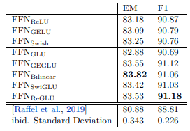

>arXiv 2023. [[Paper](https://arxiv.org/abs/2002.05202)] 
>
>Noam Shazeer
>
>12 Feb 2020

이 논문은 GLU에 대해 소개하고, GLU구성 중 시그모이드 함수 대신 다른 비선형 함수를 사용할 수 있음을 보였다.  Transformer seq2seq 모델의 피드포워드 서브레이어에서 변형을 실험 했고, 일반적으로 사용되는 ReLU또는 GELU 활성화 함수보다 일부 변형이 더 나은 성능을 확인했다.

# Introduction

Transformer seq2seq 모델은 multi-head attention과 position-wise feed forward Networks(FNN)을 번갈아 가며 적용한다.

FFN은 시퀀스 내 특정 위치에 hidden representation x를 입력으로 받아, 두 개의 학습된 선형 변환을 통과시킨다.

이 과정은 가중치 행렬($W_1$,$W_2$)과 편향 벡터($b_1$,$b_2$)로 표현되며, 두 선형 변환 사이에는 ReLU(Rectified Linear Unit)활성화 함수가 적용된다.

다음은 FNN의 기본 형태이다.

$$
FFN(x, W_1, W_2, b_1,b_2)=max(0,xW_1 +b_1)W_2+b_2
$$

다음은 T5 코드베이스를 따라, 편향을 제거한 변형이다.

$$
FFN_{ReLU}(x,W_1,W_2)=max(xW_1,0)W_2
$$

이후 연구에서는 ReLU를 다른 비선형 활성화 함수로 대체하는 방법이 제안되었다. 대표적인 대체 활성화 함수로는 GELU(Gaussian Error Linear Unit) 와 Swish Activation Function이 있다. $GELU(x) = xΦ(x)$, $Swish_\beta(x)=x\sigma(\beta x)$

$$
FFN_{GELU}(x,W_1,W_2)=GELU(xW_1)W_2\\
FFN_{Swish}(x,W_1,W_2)=Swish_1(xW_1)W_2
$$

# Gated Linear Unit (GLU) and Variants

[[Dauphin et al.,2016](https://arxiv.org/abs/1612.08083)]에서 Gated Linear Units을 소개했으며, 이는 입력에 대한 두 개의 선형 변환의 요소별 곱으로 정의되며, 그중 하나는 시그모이드 활성화 함수를 거친다. 또한, 활성화를 생략하는 변형을 제안하며 이를 **이중선형 계층**이라 부른다.

$$
GLU(x,W,V,b,c)=\sigma(xW+b)⊗(xV+c)\\ 
Bilinear(x,W,V,b,c)=(xW+b)⊗(xV+c)
$$

또한, 다른 활성화 함수를 사용하는 GLU 변형을 정의 할 수 있다.

$$
ReGLU(x,W,V,b,c)=max(0,xW+b)⊗(xV+c)\\  
GEGLU(x,W,V,b,c)=GELU(0,xW+b)⊗(xV+c)\\
SwiGLU(x,W,V,b,c)=Swish_\beta(0,xW+b)⊗(xV+c)
$$

이 논문에서는 Transformer FFN계층에서 첫 번쨰 선형 변환과 활성화 함수를 GLU 또는그 변형으로 대체하는 추가적인 변형을 제안한다. 그리고 편향 항을 생략해 식은 다음과 같다. 

$$
FFN_{GLU}(x, W, V, W2) = (σ(xW) ⊗ xV )W_2\\
FFN_{Bilinear}(x, W, V, W2) = (xW ⊗ xV )W_2\\
FFN_{ReGLU}(x, W, V, W2) = (max(0, xW) ⊗ xV )W_2\\
FFN_{GEGLU}(x, W, V, W2) = (GELU(xW) ⊗ xV )W_2\\
FFN_{SwiGLU}(x, W, V, W2) = (Swish_1(xW) ⊗ xV )W_2
$$

이 모든 계층은 기존 FFN의 두 개의 행렬과 달리 세 개의 가중치 행렬을 가진다. 따라서, 파라미터 수와 연산량을 일정하게 유지하기 위해 $W$ 및 $V$의 두 번째 차원과 $W_2$의 첫번째 차원을 기존 대비 $\frac2 3$로 축소한다.

# Experiments on Text-to-Text Transfer Transformer(T5)

Encoder-Decoder transformer 모델을 사라진 문자조각을 예측하는 denoising objective로 학습한 후, 언어이해 작업에 대해 fine-tuning을 수행하였다.

## 1. Model Architecture

이 논문에서는 [[Raffel et al., 2019](https://arxiv.org/abs/1910.10683)]의 기본 모델과 동일한 코드베이스, 모델 아키텍처 및 훈련 작업을 사용했다.

인코더와 디코더는 각 12개 layer로 구성되며, 모델 차원($d_{model}$)은 768이다. Attention layer의 경우, 헤드 수($h$)는 12개, 각 헤드의 차원 ($d_k=d_v$)은 64로 설정했다. FFN layer의 숨겨진 차원($d__{ff}$)은 3072이다.

GLU변형이 적용된 FFN layer는 기존 2개가 아닌 3개의 가중치 행렬을 사용하기 때문에, 기본 모델과 동일한 매개변수 수 및 연산량을 유지하기 위해 hidden layer($d_{ff}$)를 2048로 감소했다.

다음은 사라진 문장 단위 복원 작업에서 Transformer 모델들의 검증 데이터셋에 대한 log-perplexity를 제시했고, 모든 모델은 동일한 매개변수 및 연산량을 기준으로 비교했다.

## 2. Pre-Training and Perplexity Results

 [[Raffel et al., 2019](https://arxiv.org/abs/1910.10683)]과 동일하게, C4 데이터셋에서 Span-filling objective 로 524,288 스텝동안 사전학습을 진행했다.

각 훈련 배치는 128개의 예제로 구성되며, 각 예제는 512개의 입력 토큰과 114개의 출력 토큰을 포함한다.
출력에는 입력에서 삭제된 여러 개의 토큰 스팬이 포함되어 있다.

또한, [[Raffel et al., 2019](https://arxiv.org/abs/1910.10683)]과 유사하게, Adafactor 옵티마이저와 inverse square-root learning rate schedule을 사용했다.
훈련의 마지막 10% 구간에서는 학습률을 선형적으로 감소시켰다.

[[Raffel et al., 2019](https://arxiv.org/abs/1910.10683)]과의 주요 차이점은 사전 학습 중 드롭아웃을 사용 안 한 점이다.

 C4 데이터셋의 heldout shard에서 훈련 목표에 대한 log-perplexity를 측정했고, 이를 모델 품질의 좋은 지표로 간주한다.

각 모델 아키텍처에 대해, 65,536 스텝 동안 추가로 4개의 모델을 훈련하여 inter-run 변동성을 측정하였다.
그 결과는 위 표에 나와 있으며, GEGLU 및 SwiGLU 변형이 가장 낮은 perplexity를 기록하며 우수한 성능을 보인다.

## 3. Fine-Tuning

Fine-tuning 데이터는 Stanford Question-Answering Dataset (SQuAD) 과 GLUE  및 SuperGLUE 벤치마크의 모든 언어 이해 과제를 예제 수 비례(examples-proportional) 방식으로 혼합하여 사용했다.

Fine-tuning은 131,072 스텝 동안 진행되었으며, learning rate는 $10^{-3}$으로 설정되었다. 훈련과 마찬가지로, 각 스텝에서 입력 시퀀스의 총 길이는 약 65,536개 토큰을 유지하였다.

layer 출력, 피드포워드 hidden layer, 어텐션 가중치에 대해 드롭아웃 비율 0.1을 적용하고, embedding matrices은 미세 조정 동안 고정되었다.

다음은 GLUE Language-Understanding Benchmark의 결과다.

다음은 SuperGLUE Language-Understanding Benchmark의 결과다.

다음은 SQuAD의 결과다.

새로운 GLU 변형(GLU-variants)이 대부분의 태스크에서 가장 높은 성능을 기록했다. 이 모델은 $FFN_{ReLU}$ 모델과 동일한 구조를 가지며, 그들의 결과가 낮게 나타나는 것을 바탕으로 사전 학습 중 드롭아웃을 사용을 주요 원인으로 판단했다.

# Conclusions

이 논문은 GLU 계열의 layer를 확장하고 이를 Transformer에 적용하는 방법을 제시했다. Transfer-learning 환경에서, 새로운 GLU변형들은 pre-training에서 사용된 de-noinsing objective에 대해 더 낮은 perplexity를 기록했으며, 여러 다운스트림 언어 이해 태스크에서도 더 나은 성능을 보였다.

이러한 아키텍처들은 구현이 간단하고, 연산적으로도 별 다른 단점이 없는 것으로 보인다. 

